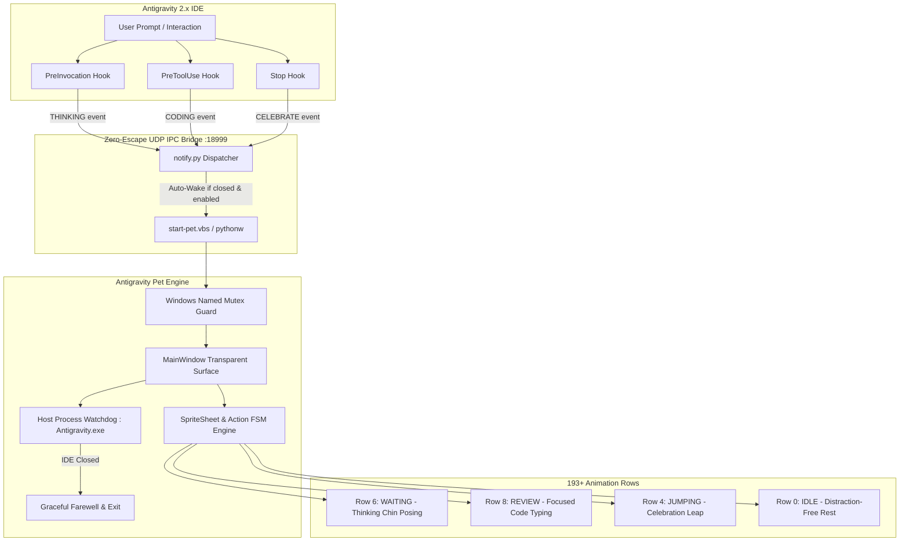

<div align="center">

# 🚀 Awesome Antigravity Pet

### Next-Gen Animated Desktop Companion for Google Antigravity 2.0

English | [简体中文文档](#-简体中文文档)

<p>
  <a href="https://github.com/wangshuaifbj-collab/awesome-antigravity-pet/stargazers"></a>
  <a href="https://github.com/wangshuaifbj-collab/awesome-antigravity-pet/releases"></a>
  <a href="#"></a>
  <a href="#"></a>
  <a href="#"></a>
  <a href="#"></a>
</p>

<p align="center">
  <strong>Bring your Antigravity IDE to life!</strong> Featuring <strong>193+ high-definition anime, game, and manga pixel characters</strong> with real-time reasoning lifecycle synchronization, zero-black-border Windows transparency, and zero-touch auto-wake.
</p>

</div>

---

## 📑 Table of Contents

- [✨ Core Features](#-core-features)
- [🏗️ System Architecture](#️-system-architecture)
- [⚡ Quick Start & Installation](#-quick-start--installation)
- [🎯 Three Ways to Launch](#-three-ways-to-launch)
- [⏸️ Pausing & Resuming (Do Not Disturb)](#️-pausing--resuming-do-not-disturb)
- [🌟 Top Characters Quick-Switch Table](#-top-characters-quick-switch-table)
- [🎮 Mouse & Window Interactions](#-mouse--window-interactions)
- [⚙️ Configuration & Customization](#️-configuration--customization)
- [🇨🇳 简体中文文档](#-简体中文文档)
- [💖 Acknowledgments & Credits](#-acknowledgments--credits)
- [📄 License](#-license)

---

## ✨ Core Features

| Feature | Description |
| :--- | :--- |
| 🎭 **193+ Out-of-the-Box Characters** | Full coverage of *Honkai: Star Rail* (Firefly, Acheron, Black Swan, Sparkle), *Genshin Impact* (Furina, Nahida, Raiden, Klee), *Frieren*, *Black Myth: Wukong*, and 180+ more. |
| 🧠 **Real-Time Reasoning Lifecycle Sync** | **Thinking** (thoughtful chin-holding posing), **Coding** (intense typing & reviewing), and **Delivered** (joyful jump celebrations) mapped directly to Antigravity hooks. |
| 🪟 **Pixel-Perfect Windows Transparency** | Hardware-accelerated PyQt6 layered rendering, zero black borders, zero ghosting artifacts, DirectWrite color Emoji support, and dynamic head-anchored speech bubbles. |
| ⚡ **Zero-Touch Auto-Wake & Auto-Exit** | Automatically wakes up when you talk to Antigravity; automatically bids farewell and exits when you close the IDE. |
| 🤫 **Distraction-Free Focus Mode** | Stays strictly static in normal idle state without moving around or blocking code, activating lively animations only on interaction. |
| 🛡️ **System-Wide Single Instance Mutex** | Windows Named Mutex lock guarantees strictly **one** companion instance on your screen with zero duplicate race conditions. |
| 🌐 **Full Bilingual Localization (i18n)** | Automatically detects system locale (Chinese/English) with instant right-click language switching. |

---

## 🏗️ System Architecture



---

## ⚡ Quick Start & Installation

### Step 1: Clone and Install

```bash
# Clone the repository
git clone https://github.com/wangshuaifbj-collab/awesome-antigravity-pet.git
cd awesome-antigravity-pet

# Install in editable mode
pip install -e .

# Auto-register Antigravity lifecycle hooks (One-time setup)
pet install-hooks
```

That's it! Everything is configured.

---

## 🎯 Three Ways to Launch

### 🌟 Mode 1: Zero-Touch Auto-Wake (Recommended Default)
You **don't need to run any startup command**! 
Just chat with Antigravity normally. As soon as the AI starts reasoning, your desktop pet will automatically wake up and think alongside you.

### 🖱️ Mode 2: One-Click GUI Launcher (`start-pet.vbs`)
- **Project Root**: Double-click [`start-pet.vbs`](./start-pet.vbs) in the project folder.
- **Pure Silent Launch**: Launches `pythonw` directly in the background with **zero black CMD popups**!
- **Desktop Shortcut**: Right-click `start-pet.vbs` -> *Send to* -> *Desktop (create shortcut)* to launch like a native desktop app.

### ⚡ Mode 3: CLI Powerhouse
```bash
pet               # Start default companion (Firefly)
pet acheron       # Launch or hot-switch to Acheron (黄泉)
pet furina        # Hot-switch to Furina (芙宁娜)
pet list          # Print all 193 characters catalog table
pet autostart enable   # Enable Windows startup launch
pet autostart disable  # Disable Windows startup launch
pet disable       # Exit & pause auto-wake (Do Not Disturb)
pet enable        # Re-enable & wake up pet
```

---

## ⏸️ Pausing & Resuming (Do Not Disturb)

We strictly respect user autonomy. If you need a completely clean screen without pets:

### How to Turn Off:
- **Option A (GUI)**: Right-click the pet -> Click **`❌ 退出伴侣 (Exit Companion)`**
- **Option B (CLI)**: Run `pet disable`

> 💡 **Smart Intent Memory**: When you explicitly exit, the system enters **Do Not Disturb Mode** (`enabled: false`). Subsequent chats with Antigravity will **NOT** wake the pet up.

### How to Resume:
- Double-click [`start-pet.vbs`](./start-pet.vbs), or run `pet enable` (or `pet`).
- The pet immediately wakes up and restores automatic lifecycle syncing!

---

## 🌟 Top Characters Quick-Switch Table

You can switch to any character instantly via CLI or right-click menu:

| Character | Chinese Name | Universe / Category | Quick Switch Command |
| :--- | :--- | :--- | :--- |
| **Firefly** | 流萤 | *Honkai: Star Rail* | `pet firefly` |
| **Acheron** | 黄泉 | *Honkai: Star Rail* | `pet acheron` |
| **Furina** | 芙宁娜 | *Genshin Impact* | `pet furina` |
| **Arlecchino** | 仆人 (阿蕾奇诺) | *Genshin Impact* | `pet arlecchino` |
| **Black Swan** | 黑天鹅 | *Honkai: Star Rail* | `pet black-swan` |
| **Frieren** | 芙莉莲 | *Frieren: Beyond Journey's End* | `pet frieren` |
| **Klee** | 可莉 | *Genshin Impact* | `pet klee` |
| **Nahida** | 纳西妲 | *Genshin Impact* | `pet nahida` |
| **Raiden Shogun** | 雷电将军 | *Genshin Impact* | `pet raiden` |
| **Sparkle** | 花火 | *Honkai: Star Rail* | `pet sparkle` |
| **Silver Wolf** | 银狼 | *Honkai: Star Rail* | `pet silver-wolf` |
| **Wukong** | 齐天大圣 | *Black Myth: Wukong* | `pet sun-wukong` |
| **Hutao** | 胡桃 | *Genshin Impact* | `pet hutao` |
| **Herta** | 黑塔 | *Honkai: Star Rail* | `pet herta` |
| **Robin** | 知更鸟 | *Honkai: Star Rail* | `pet robin` |
| **Kafka** | 卡芙卡 | *Honkai: Star Rail* | `pet kafka` |

*(Run `pet list` to browse all 193 characters!)*

---

## 🎮 Mouse & Window Interactions

- **Hover (Mouse In)**: Wave greeting (`WAVING` row) with custom toast.
- **Drag (Left Button)**: Flying locomotion (`RUNNING` row) and safe landing celebration.
- **Double Click**: Quick rotation to the next featured character.
- **Right Click**: Comprehensive Context Menu:
  - 🌟 Featured Characters
  - 📚 Full 193 Character Catalog (Grouped A-E, F-J, K-O, P-T, U-Z)
  - 🎬 Action Demos (Wave, Jump, Think, Review, Run, Fail)
  - 🌐 Language Switcher (🇨🇳 简体中文 / 🇺🇸 English / ⚙️ Auto)
  - 🤫 Toggle Static Idle vs Lively Breathing Mode
  - ❌ Exit & Pause Companion

---

## ⚙️ Configuration & Customization

Configuration is stored in `~/.gemini/antigravity_pet.json`:

```json
{
  "enabled": true,
  "pet_id": "firefly--lingxiaotian",
  "window_size": 160,
  "always_on_top": true,
  "port": 18999,
  "static_idle": true,
  "language": "auto"
}
```

---

<div id="简体中文文档"></div>

# 🇨🇳 简体中文文档

## 🌟 项目简介

**Awesome Antigravity Pet** 是国内首个专为 **Google Antigravity 2.0** 打造的高颜值、高帧率桌面智能伴侣运行引擎！原生收录 **193 款高精度二次元/游戏/动漫全量 SpriteSheet 角色**（涵盖星穹铁道、原神、葬送的芙莉莲、黑神话悟空等）。

通过 Antigravity 的原生生命周期钩子，小宠物能够实时感知 AI 的思考与编码状态，在你提问时托腮沉思、写代码时专注审查、完成任务时欢快跳跃，为你的日常编程带来极致的治愈感与科技感。

---

## 🚀 极速安装与快速上手

```bash
# 1. 克隆代码仓库
git clone https://github.com/wangshuaifbj-collab/awesome-antigravity-pet.git
cd awesome-antigravity-pet

# 2. 安装 Python 依赖与全局命令
pip install -e .

# 3. 一键注入 Antigravity 全生命周期钩子
pet install-hooks
```

---

## 🎯 启动与日常使用（三种模式）

### 🌟 模式一：交互无感自动唤醒（默认推荐）
**安装后你不需要运行任何启动命令！**
直接在 Antigravity 里正常发消息提问，只要 AI 进入思考，小流萤就会在右下角自动醒来陪伴你。

### 🖱️ 模式二：一键双击静默启动（`start-pet.vbs`）
- 仓库根目录内置了 [`start-pet.vbs`](./start-pet.vbs) 脚本；
- 直接双击即可**纯静默在后台拉起小宠物，绝无任何黑框命令行窗口闪烁**；
- 随时可以右键该文件 -> 「发送到桌面快捷方式」，像启动游戏一样随心点击。

### ⚡ 模式三：极简 CLI 终端命令
```bash
pet               # 启动默认宠物（流萤）
pet acheron       # 启动/实时热换装为黄泉
pet furina        # 启动/实时热换装为芙宁娜
pet list          # 终端打印全部 193 款精美角色大图鉴
pet autostart enable   # 开启 Windows 开机自启
pet autostart disable  # 关闭 Windows 开机自启
pet disable       # 退出宠物并开启免打扰
pet enable        # 重新启用并唤醒宠物
```

---

## ⏸️ 彻底关闭与恢复说明（免打扰模式）

我们深度贯彻用户掌控权原则：

1. **不想用时（一键彻底关闭）**：
   - 宠物身上 **右键 -> 点击「❌ 退出伴侣」**（或终端运行 `pet disable`）；
   - 此时小宠物将退出，并**记住免打扰状态**。后续你在 Antigravity 中发消息，小宠物**绝对不会强行跳出来打扰你**。
2. **想恢复使用时**：
   - 双击根目录的 [`start-pet.vbs`](./start-pet.vbs) 或在终端输入 `pet enable`；
   - 伴侣将瞬间重新唤醒，并恢复自动联动！

---

## 💖 Acknowledgments & Credits (致谢与声明)

- 本项目的精灵切片素材（SpriteSheets）、时钟定义与 9 动作行帧规范衍生自社区开源项目 [Awesome Codex Pet](https://github.com/legeling/awesome-codex-pet)（由 **Lingxiaotian** 及广大社区创作者们共同构建）。
- 衷心感谢所有为二次元角色像素素材无私创作与分享的画师与贡献者们！

---

## 📄 License (开源许可证)

- **Code & Engine**: Released under the **[MIT License](./LICENSE)**. Free for modification, development, and distribution.
- **Pet Assets**: Released under **[Creative Commons Attribution-NonCommercial 4.0 International (CC BY-NC 4.0)](./ASSETS-LICENSE.md)**. Non-commercial use only.
