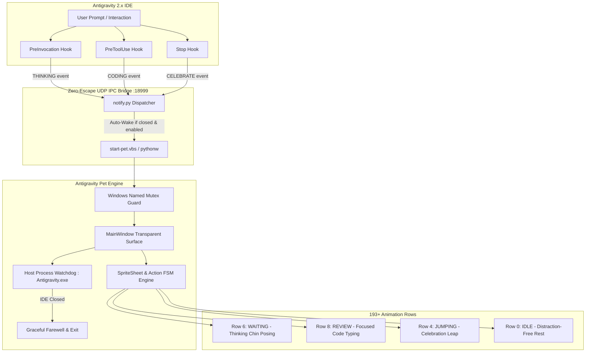

<div align="center">

# 🚀 Awesome Antigravity Pet

English | [简体中文](./docs/zh-CN/README.md)

<p><strong>✨ The native animated desktop companion for Google Antigravity 2.0 with 193+ high-res characters and real-time reasoning lifecycle sync.</strong></p>


<p>
  <a href="https://github.com/wangshuaifbj-collab/awesome-antigravity-pet/stargazers"></a>
  <a href="https://github.com/wangshuaifbj-collab/awesome-antigravity-pet/releases"></a>
  <a href="#"></a>
  <a href="#"></a>
  <a href="#"></a>
  <a href="#"></a>
</p>

</div>

---

## 📸 Live Showcase

<div align="center">
  
  <p><em>✨ Firefly companion floating gracefully in Google Antigravity IDE, reacting in real-time to your coding flow.</em></p>
</div>

---

## ✨ Highlights

- 🎮 **193+ Out-of-the-Box Characters**: Full coverage of *Honkai: Star Rail* (Firefly, Acheron, Black Swan, Sparkle), *Genshin Impact* (Furina, Nahida, Raiden, Klee), *Frieren*, *Black Myth: Wukong*, and 180+ more.
- 🧠 **Real-Time Reasoning Lifecycle Sync**:
  - **Thinking / Planning**: Character enters thoughtful posing (`waiting`) with thinking speech bubble.
  - **Coding / Tool Execution**: Character focuses on typing & reviewing (`review`).
  - **Task Delivered**: Character celebrates with joyful leap animations (`jumping`)!
  - **Idle**: Elegant static standing to keep your workspace distraction-free.
- 🪟 **Pixel-Perfect Windows Transparency**: Hardware-accelerated PyQt6 layered rendering, zero black borders, zero ghosting artifacts, DirectWrite color Emoji support, and dynamic head-anchored speech bubbles.
- ⚡ **Zero-Touch Auto-Wake & Auto-Exit**: Automatically wakes up when you talk to Antigravity; automatically bids farewell and exits when you close the IDE.
- 🌐 **Full Bilingual Localization (i18n)**: Automatically detects system locale (Chinese/English) with instant right-click language switching.

---

## 🏗️ System Architecture



---

## 📋 Prerequisites

- **Python**: `>= 3.9` (Python 3.11 or 3.12 recommended, **Node.js is NOT required for running pets**)
- If Python is not installed yet on your machine, install it quickly:
  ```powershell
  # Windows users can install via winget
  winget install Python.Python.3.12
  ```
  Or download the installer from [python.org](https://www.python.org/downloads/) (*be sure to check `Add python.exe to PATH` during setup*).

---

## ⚡ Quick Start & Installation

```bash
# 1. Clone the repository
git clone https://github.com/wangshuaifbj-collab/awesome-antigravity-pet.git
cd awesome-antigravity-pet

# 2. Install project dependencies and CLI tools
pip install -e .

# 3. Auto-register Antigravity lifecycle hooks (One-time setup)
pet install-hooks
```

> ✨ **Done!** Once dependencies and hooks are installed, please **restart Antigravity IDE**.
> 
> 📌 **Special Note (Auto-Wake Mechanism)**: After opening Antigravity, your desktop companion will **automatically wake up upon your first conversation/prompt trigger** and stay resident on your desktop. Afterwards, it seamlessly syncs in real-time without needing any manual management!

---

## 🎯 Three Ways to Launch

### 🌟 Mode 1: Zero-Touch Auto-Wake (Recommended Default)
You **don't need to run any startup command**! 
Just chat with Antigravity normally. As soon as the AI starts reasoning, your desktop pet will automatically wake up and think alongside you.

### 🖱️ Mode 2: One-Click GUI Launcher
- **🪟 Windows**: Double-click [`start-pet.vbs`](./start-pet.vbs) in the project folder (or create a desktop shortcut). Launches silently with **zero CMD popup windows**!
- **🍎 macOS & 🐧 Linux**: Run `./start-pet.sh` (or double-click [`start-pet.sh`](./start-pet.sh)). Launches smoothly in the background detached from terminal.

### ⚡ Mode 3: CLI Powerhouse
```bash
pet               # Start default companion (Firefly)
pet acheron       # Launch or hot-switch to Acheron (黄泉)
pet furina        # Hot-switch to Furina (芙宁娜)
pet list          # Print all 193 characters catalog table
pet autostart enable   # Enable Windows startup launch
pet autostart disable  # Disable Windows startup launch
pet disable       # Exit & pause auto-wake (Do Not Disturb)
pet enable        # Re-enable & wake up pet
```

---

## ⏸️ Pausing & Resuming (Do Not Disturb)

We strictly respect user autonomy. If you need a completely clean screen without pets:

### How to Turn Off:
- **Option A (GUI)**: Right-click the pet -> Click **`❌ Exit Companion`**
- **Option B (CLI)**: Run `pet disable`

> 💡 **Smart Intent Memory**: When you explicitly exit, the system enters **Do Not Disturb Mode** (`enabled: false`). Subsequent chats with Antigravity will **NOT** wake the pet up.

### How to Resume:
- Double-click [`start-pet.vbs`](./start-pet.vbs), or run `pet enable` (or `pet`).
- The pet immediately wakes up and restores automatic lifecycle syncing!

---

## 🌟 Top Characters Quick-Switch Table

You can switch to any character instantly via CLI or right-click menu:

| Character | Chinese Name | Universe / Category | Quick Switch Command |
| :--- | :--- | :--- | :--- |
| **Firefly** | 流萤 | *Honkai: Star Rail* | `pet firefly` |
| **Acheron** | 黄泉 | *Honkai: Star Rail* | `pet acheron` |
| **Furina** | 芙宁娜 | *Genshin Impact* | `pet furina` |
| **Arlecchino** | 仆人 (阿蕾奇诺) | *Genshin Impact* | `pet arlecchino` |
| **Black Swan** | 黑天鹅 | *Honkai: Star Rail* | `pet black-swan` |
| **Frieren** | 芙莉莲 | *Frieren: Beyond Journey's End* | `pet frieren` |
| **Klee** | 可莉 | *Genshin Impact* | `pet klee` |
| **Nahida** | 纳西妲 | *Genshin Impact* | `pet nahida` |
| **Raiden Shogun** | 雷电将军 | *Genshin Impact* | `pet raiden` |
| **Sparkle** | 花火 | *Honkai: Star Rail* | `pet sparkle` |
| **Silver Wolf** | 银狼 | *Honkai: Star Rail* | `pet silver-wolf` |
| **Wukong** | 齐天大圣 | *Black Myth: Wukong* | `pet sun-wukong` |
| **Hutao** | 胡桃 | *Genshin Impact* | `pet hutao` |
| **Herta** | 黑塔 | *Honkai: Star Rail* | `pet herta` |
| **Robin** | 知更鸟 | *Honkai: Star Rail* | `pet robin` |
| **Kafka** | 卡芙卡 | *Honkai: Star Rail* | `pet kafka` |

*(Run `pet list` to browse all 193 characters!)*

---

## 🌐 Automatic Bilingual Localization (i18n)

The companion automatically detects your operating system language and adapts all **character names**, **speech bubbles**, and **context menus** accordingly (or can be manually switched via right-click menu):

| Scenario / Trigger | 🇨🇳 Chinese System (zh_CN) | 🇺🇸 English & Global Systems (en_US) |
| :--- | :--- | :--- |
| **Character Names** | 流萤 / 黄泉 / 芙宁娜 / 仆人 | Firefly / Acheron / Furina / Arlecchino |
| **Agent Thinking** | `构思最优方案中... 💡` | `Thinking of optimal solutions... 💡` |
| **Agent Coding** | `代码编写中... 💻` | `Writing code... 💻` |
| **Task Delivered** | `✨ 任务已完成！请查收~ 🚀` | `✨ Task complete! Check it out~ 🚀` |
| **Hover Greeting** | `嗨~ ✨` | `Hi there! ✨` |
| **Drag & Flight** | `起飞咯~ 🐾` / `安全着陆！🚀` | `Taking off~ 🐾` / `Landed safely! 🚀` |
| **Switch Character** | `已切换: 流萤 💖` | `Switched to: Firefly 💖` |
| **IDE Closed (Farewell)** | `下次见咯~ 👋` | `See you next time! 👋` |

---

## 🎮 Mouse & Context Menu Interactions

- **Hover (Mouse In)**: Wave greeting (`WAVING` row) with custom toast.
- **Drag (Left Button)**: Flying locomotion (`RUNNING` row) and safe landing celebration.
- **Double Click**: Quick rotation to the next featured character.
- **Right Click**: Comprehensive Context Menu:
  - 🌟 Featured Characters
  - 📚 Full 193 Character Catalog (Grouped A-E, F-J, K-O, P-T, U-Z)
  - 🎬 Action Demos (Wave, Jump, Think, Review, Run, Fail)
  - 🌐 Language Switcher (🇨🇳 简体中文 / 🇺🇸 English / ⚙️ Auto)
  - 🤫 Toggle Static Idle vs Lively Breathing Mode
  - ❌ Exit & Pause Companion

---

## ⚙️ Configuration & Customization

Configuration is stored in `~/.gemini/antigravity_pet.json`:

```json
{
  "enabled": true,
  "pet_id": "firefly--lingxiaotian",
  "window_size": 160,
  "always_on_top": true,
  "port": 18999,
  "static_idle": true,
  "language": "auto"
}
```

---

## 💖 Acknowledgments & Credits

- The character SpriteSheet assets and animation atlas standards are derived from the open-source [Awesome Codex Pet](https://github.com/legeling/awesome-codex-pet) community project (created by **Lingxiaotian** and community artist contributors).
- Heartfelt thanks to all the amazing pixel artists and contributors across the anime/gaming community!

---

## 📄 License

- **Code Engine**: Released under the [MIT License](./LICENSE). Free for development, modification, and redistribution.
- **Pet Assets**: Licensed under [Creative Commons Attribution-NonCommercial 4.0 International (CC BY-NC 4.0)](./ASSETS-LICENSE.md). Non-commercial use only.
