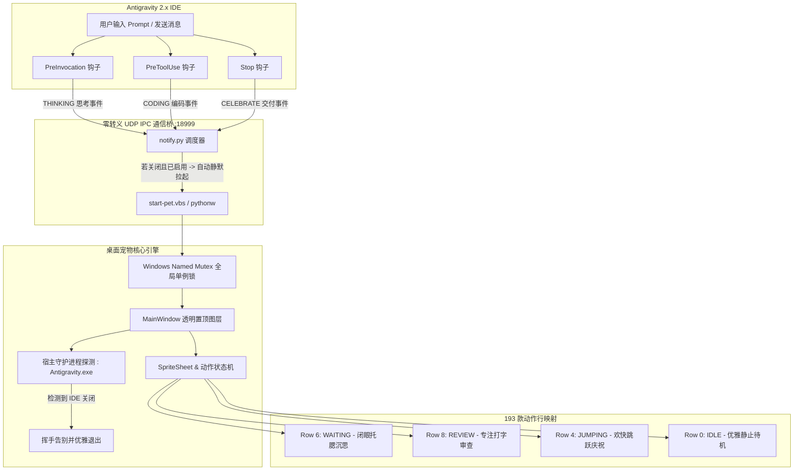

<div align="center">

# 🚀 Awesome Antigravity Pet (桌面智能伴侣)

### 专为 Google Antigravity 2.0 打造的原生二次元高帧率桌面伴侣

[English](../../README.md) | 简体中文

<p><strong>✨ 实时感知 AI 思考构思与编码生命周期，开箱即用 193+ 款二次元/游戏/动漫高精度角色，0 黑边透明置顶悬浮窗。</strong></p>


<p>
  <a href="https://github.com/wangshuaifbj-collab/awesome-antigravity-pet/stargazers"></a>
  <a href="https://github.com/wangshuaifbj-collab/awesome-antigravity-pet/releases"></a>
  <a href="#"></a>
  <a href="#"></a>
  <a href="#"></a>
  <a href="#"></a>
</p>

</div>

---

## 📸 真实效果展示

<div align="center">
  
  <p><em>✨ 流萤伴侣优雅悬浮在 Google Antigravity 2.0 界面中，实时响应你的编程心流与思考。</em></p>
</div>

---

## 🌟 核心亮点

| 核心特性 | 功能描述 |
| :--- | :--- |
| 🎭 **海量 193 款高精度角色现货** | 全面覆盖《崩坏：星穹铁道》（流萤、黄泉、黑天鹅、花火、阮梅）、《原神》（芙宁娜、纳西妲、雷电将军、可莉、仆人）、《葬送的芙莉莲》、《黑神话悟空》等。 |
| 🧠 **Antigravity 全生命周期深度联动** | **思考推理时**：闭眼托腮沉思（`waiting`）；**编写代码时**：专注审查敲代码（`review`）；**任务交付时**：瞬间切换欢快跳跃庆祝（`jumping`）！ |
| 🪟 **原生 Windows 透明悬浮窗** | 硬件加速 PyQt6 分层绘制，0 黑色边框、0 脏矩形残影，支持 DirectWrite 彩色 Emoji 与贴头发顶气泡。 |
| ⚡ **随 IDE 智能启闭与自愈拉起** | 打开 Antigravity 聊天自动唤醒；关闭 Antigravity 挥手告别并优雅退出，不占系统后台。 |
| 🤫 **专注免打扰模式** | 平时待机保持绝对优雅静止，不分散开发心流；鼠标悬停时激活生动招手与微呼吸。 |
| 🛡️ **全局互斥锁单例保障** | Windows Named Mutex 互斥锁，严格保障桌面有且仅有 1 个宠物实例，彻底杜绝并发重影。 |
| 🌐 **全自动多语言中英自适应** | 自动检测系统语言，支持右键自由切换中英文界面。 |

---

## 🏗️ 系统架构图



---

## ⚡ 极速安装与配置

```bash
# 1. 克隆代码仓库
git clone https://github.com/wangshuaifbj-collab/awesome-antigravity-pet.git
cd awesome-antigravity-pet

# 2. 以可编辑模式安装环境与全局短别名
pip install -e .

# 3. 一键注入 Antigravity 全生命周期钩子（仅需执行一次）
pet install-hooks
```

安装完成后即可正常使用！

---

## 🎯 三大启动使用模式

### 🌟 模式一：交互无感自动唤醒（默认推荐体验）
**安装后你不需要手动运行任何启动命令！**
直接在 Antigravity 正常发消息提问，只要 AI 进入思考，小流萤就会在右下角自动醒来陪伴你。

### 🖱️ 模式二：一键双击静默启动
- **🪟 Windows 用户**：直接双击根目录的 [`start-pet.vbs`](../../start-pet.vbs)（支持发送到桌面快捷方式），**纯静默拉起，绝无任何黑框命令行闪烁**；
- **🍎 macOS & 🐧 Linux 用户**：直接执行 `./start-pet.sh` 或在访达中双击 [`start-pet.sh`](../../start-pet.sh)，自动脱离终端后台静默常驻。

### ⚡ 模式三：极简 CLI 终端命令
```bash
pet               # 启动默认出战宠物（流萤）
pet acheron       # 启动/实时热换装为黄泉
pet furina        # 启动/实时热换装为芙宁娜
pet list          # 终端打印全部 193 款精美角色大图鉴
pet autostart enable   # 开启 Windows 开机自启
pet autostart disable  # 关闭 Windows 开机自启
pet disable       # 退出宠物并开启免打扰
pet enable        # 重新启用并唤醒宠物
```

---

## ⏸️ 免打扰模式与彻底关闭/恢复

我们深度贯彻用户掌控权原则：

### 1. 不想用时（一键彻底关闭）：
- **GUI 操作**：宠物身上 **右键 -> 点击「❌ 退出伴侣」**；
- **命令行操作**：终端运行 `pet disable`；
- **效果**：小宠物立即关闭退出，并**记住免打扰状态**。后续你在 Antigravity 中发消息，小宠物**绝对不会强行跳出来打扰你**。

### 2. 想恢复使用时：
- 双击根目录的 [`start-pet.vbs`](../../start-pet.vbs) 或在终端输入 `pet enable`（或 `pet`）；
- 伴侣将瞬间重新唤醒，并恢复随 IDE 自动联动！

---

## 🌟 热门精选角色一键换装速查表

在终端输入 `pet <角色名>` 即可瞬间换装或启动：

| 角色名 (中文) | 角色名 (English) | 原作归属 / 分类 | 极简快捷换装命令 |
| :--- | :--- | :--- | :--- |
| **流萤** | Firefly | 《崩坏：星穹铁道》 | `pet firefly` |
| **黄泉** | Acheron | 《崩坏：星穹铁道》 | `pet acheron` |
| **芙宁娜** | Furina | 《原神》 | `pet furina` |
| **仆人 (阿蕾奇诺)** | Arlecchino | 《原神》 | `pet arlecchino` |
| **黑天鹅** | Black Swan | 《崩坏：星穹铁道》 | `pet black-swan` |
| **芙莉莲** | Frieren | 《葬送的芙莉莲》 | `pet frieren` |
| **可莉** | Klee | 《原神》 | `pet klee` |
| **纳西妲** | Nahida | 《原神》 | `pet nahida` |
| **雷电将军** | Raiden Shogun | 《原神》 | `pet raiden` |
| **花火** | Sparkle | 《崩坏：星穹铁道》 | `pet sparkle` |
| **银狼** | Silver Wolf | 《崩坏：星穹铁道》 | `pet silver-wolf` |
| **齐天大圣** | Sun Wukong | 《黑神话：悟空》 | `pet sun-wukong` |
| **胡桃** | Hutao | 《原神》 | `pet hutao` |
| **黑塔** | Herta | 《崩坏：星穹铁道》 | `pet herta` |
| **知更鸟** | Robin | 《崩坏：星穹铁道》 | `pet robin` |
| **卡芙卡** | Kafka | 《崩坏：星穹铁道》 | `pet kafka` |

*(运行 `pet list` 可查看全量 193 款角色！)*

---

## 🌐 全自动多语言中英自适应 (i18n)

小宠物会自动探测你的操作系统语言环境，并将**角色名字**、**头顶对话气泡**与**右键菜单**自动切换为对应语言（也可以随时在右键菜单中手动切换）：

| 交互场景 / 触发信号 | 🇨🇳 中文操作系统 (zh_CN) | 🇺🇸 英文与海外环境 (en_US) |
| :--- | :--- | :--- |
| **角色展示名称** | 流萤 / 黄泉 / 芙宁娜 / 仆人 | Firefly / Acheron / Furina / Arlecchino |
| **AI 思考构思中** | `构思最优方案中... 💡` | `Thinking of optimal solutions... 💡` |
| **AI 编写代码/执行工具** | `代码编写中... 💻` | `Writing code... 💻` |
| **任务交付完成** | `✨ 任务已完成！请查收~ 🚀` | `✨ Task complete! Check it out~ 🚀` |
| **鼠标悬停打招呼** | `嗨~ ✨` | `Hi there! ✨` |
| **拖拽奔跑与着陆** | `起飞咯~ 🐾` / `安全着陆！🚀` | `Taking off~ 🐾` / `Landed safely! 🚀` |
| **角色换装提示** | `已切换: 流萤 💖` | `Switched to: Firefly 💖` |
| **IDE 退出告别** | `下次见咯~ 👋` | `See you next time! 👋` |

---

## 🎮 鼠标与右键菜单交互指南

- **鼠标悬停 (Hover)**：招手打招呼（`WAVING` 动作），头顶冒出气泡；
- **鼠标左键拖拽 (Drag)**：奔跑起飞与安全着陆；
- **双击左键 (Double Click)**：快速轮换至下一个精选热门角色；
- **右键菜单 (Context Menu)**：
  - 🌟 **精选热门角色**：快速切换高人气角色；
  - 📚 **全量 193 款宠物图鉴**：按 A-Z 首字母分类检索；
  - 🎬 **动作演示**：手动预览招手、跳跃、思考、编码、奔跑、报错；
  - 🌐 **语言切换**：🇨🇳 简体中文 / 🇺🇸 English / ⚙️ 自动检测；
  - 🤫 **专注静止切换**：在绝对静止与动态微呼吸间切换；
  - ❌ **退出伴侣**：退出并进入免打扰模式。

---

## ⚙️ 配置说明

配置文件持久化保存在 `~/.gemini/antigravity_pet.json`：

```json
{
  "enabled": true,
  "pet_id": "firefly--lingxiaotian",
  "window_size": 160,
  "always_on_top": true,
  "port": 18999,
  "static_idle": true,
  "language": "auto"
}
```

---

## 💖 鸣谢与开源致谢

- 本项目的精灵切片素材（SpriteSheets）、时钟定义与 9 动作行帧规范衍生自社区开源项目 [Awesome Codex Pet](https://github.com/legeling/awesome-codex-pet)（由 **Lingxiaotian** 及广大社区创作者们共同构建）。
- 衷心感谢所有为二次元角色像素素材无私创作与分享的画师与贡献者们！

---

## 📄 开源许可证

- **核心代码引擎**：遵循 **[MIT License](../../LICENSE)** 开源协议，允许自由修改、分发与二次开发。
- **宠物精灵素材**：遵循 **[Creative Commons Attribution-NonCommercial 4.0 International (CC BY-NC 4.0)](../../ASSETS-LICENSE.md)** 协议，仅限非商业性个人与开源使用。
