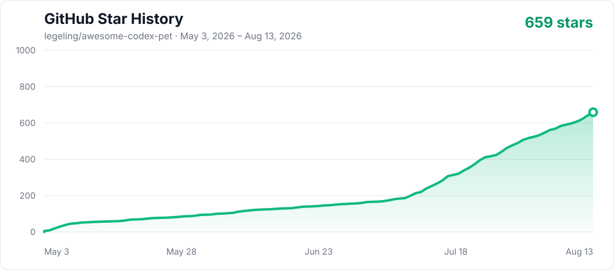

<div align="center">

# Awesome Codex Pet

[English](../../README.md) | 简体中文 | [한국어](../ko/README.md) | [日本語](../ja/README.md) | [Español](../es/README.md)

<h2><a href="https://codexpet.top">免费浏览并安装 Codex 小宠物：codexpet.top →</a></h2>

<p><strong>Awesome Codex Pet 是免费的社区小宠物画廊。</strong>像逛宠物商店一样查看完整动画并一键安装；没有喜欢的角色时，还可以免费提交申请，社区贡献者可能会志愿制作。</p>

<p><a href="https://codexpet.top"><strong>挑选宠物</strong></a> · <a href="https://codexpet.top/zh/install"><strong>安装宠物</strong></a> · <a href="https://codexpet.top/zh/request"><strong>申请喜欢的角色</strong></a></p>

<a href="https://codexpet.top"></a>

      [](https://github.com/legeling/awesome-codex-pet/actions/workflows/pet-previews.yml)

</div>

本仓库是 [codexpet.top](https://codexpet.top) 背后的宠物目录，负责保存可安装成品、作者与来源信息、合集元数据、校验工具和贡献记录。挑选与安装宠物时，请优先使用网站。

## 亮点

- **一条命令安装** — 不需要克隆仓库，macOS / Linux / Windows 全平台支持
- **免费社区画廊** — [codexpet.top](https://codexpet.top) 提供完整动作预览、合集、作者主页、基于安装与点赞的每周榜单、便捷分享和社区统计
- **免费角色申请** — 不需要自己制作 spritesheet；提交角色和参考资料后，社区贡献者可能会志愿制作，但不承诺交付
- **AI 优先投稿** — 贡献者可在 Codex 中制作、修复并提交自己的宠物，熟悉 Git 的用户也可以直接提交 PR
- **非商用原则** — 正式许可证可选；没有正式许可证时必须明确禁止商用

每只宠物都是一个很小的可分享包：

```text
pets/<pet-slug>--<author-slug>/
├── submission.json
├── pet.json
└── spritesheet.webp
```

预览图会作为本地或 CI 构建产物生成到 `assets/previews/<pet-id>/`，不会塞进宠物目录。

仓库级作品系列与主题系列统一维护在 `collections.json`：`kind: franchise` 表示来自同一原作的作品系列，`kind: theme` 表示按题材、风格或伙伴类型组织的跨作品主题系列。宠物通过 `submission.json.collections` 声明归属，目录与网站都会从这些元数据自动生成。归属信息会立即记录，但只有达到至少 3 只宠物的合集才会在网站公开展示。

`submission.json.name` 是必填的默认名称。投稿者可以省略 `localized_names`，只使用一种语言；也可以选择双语，并同时填写 `localized_names.en` 与 `localized_names.zh`。网站会跟随访客选择的语言展示，不会擅自生成翻译。

## Pet 版本

| 版本 | 图集                      | 运行时元数据                          | 用途                           |
| ---- | ------------------------- | ------------------------------------- | ------------------------------ |
| v1   | `1536x1872`，8 列 × 9 行  | 省略 `spriteVersionNumber` 或设为 `1` | 已有的标准动作宠物             |
| v2   | `1536x2288`，8 列 × 11 行 | 设置 `spriteVersionNumber: 2`         | 标准动作加 16 个顺时针环视方向 |

两个版本都可以安装。维护已有九行动画时使用 v1；需要环视动作的新宠物或升级宠物使用 v2。

## 快速安装

无需 clone，按你的系统选一条命令：

```bash
# macOS / Linux
curl -fsSL --proto '=https' --tlsv1.2 https://raw.githubusercontent.com/legeling/awesome-codex-pet/main/scripts/install-pet.sh | bash -s -- --raw-base https://raw.githubusercontent.com/legeling/awesome-codex-pet/main firefly--lingxiaotian
```

```powershell
# Windows PowerShell
powershell -NoProfile -ExecutionPolicy Bypass -Command "iwr -UseB -MaximumRedirection 5 -TimeoutSec 120 https://raw.githubusercontent.com/legeling/awesome-codex-pet/main/scripts/install-pet.ps1 | iex; Install-CodexPet firefly--lingxiaotian -RawBase 'https://raw.githubusercontent.com/legeling/awesome-codex-pet/main'"
```

```bash
# 在本地仓库中使用 Node.js
npm run install:pet -- firefly--lingxiaotian
```

列出可安装的宠物：

```bash
curl -fsSL --proto '=https' --tlsv1.2 https://raw.githubusercontent.com/legeling/awesome-codex-pet/main/scripts/install-pet.sh | bash -s -- --raw-base https://raw.githubusercontent.com/legeling/awesome-codex-pet/main --list
```

默认安装位置：

- macOS / Linux：`~/.codex/pets/<pet-id>/`
- Windows：`%USERPROFILE%\.codex\pets\<pet-id>\`

可通过 `CODEX_HOME` 自定义安装路径，或者设置 `AWESOME_CODEX_PET_NO_STATS=1` 关闭匿名安装计数。安装器会校验仓库清单与 SHA-256，先在临时目录准备完整文件再切换；替换已有宠物时需要显式添加 `--force`。如需可复现安装，请把两处 URL 中的 `main` 替换为不可变的 commit 或 tag。

## 升级已有 v1 宠物

1. 打开 Codex 的**设置 → 宠物**。
2. 找到已安装的自定义宠物，点击**更新**。
3. Codex 会打开 Hatch Pet 任务。当前 v2 流程会校验并保留原有九行动画，只生成四个方向锚点和 16 个环视方向，然后写出带 `spriteVersionNumber: 2` 的十一行图集。
4. 接受替换前，检查生成的 contact sheet 和方向预览。

这里的**更新**是 AI 辅助的 v1 → v2 转换，不是本仓库发出了新版下载通知。它只更新 `~/.codex/pets/` 下的本地包，不会自动修改或提交 GitHub 仓库里的版本。

## 宠物收录

### 游戏角色

<table>
<tr><th>名称</th><td colspan="5"><a href="../../pets/firefly--lingxiaotian">流萤</a> · 作者 <a href="https://github.com/legeling">@legeling</a> · 游戏角色 · v1</td></tr>
<tr><th>安装</th><td colspan="5"><code>curl -fsSL --proto '=https' --tlsv1.2 https://raw.githubusercontent.com/legeling/awesome-codex-pet/main/scripts/install-pet.sh | bash -s -- --raw-base https://raw.githubusercontent.com/legeling/awesome-codex-pet/main firefly--lingxiaotian</code></td></tr>
<tr><th>动作</th><td><strong>待机</strong></td><td><strong>挥手</strong></td><td><strong>奔跑</strong></td><td><strong>等待</strong></td><td><strong>审阅</strong></td></tr>
<tr><th>预览</th><td></td><td></td><td></td><td></td><td></td></tr>
</table>

<table>
<tr><th>名称</th><td colspan="5"><a href="../../pets/acheron--lingxiaotian">黄泉</a> · 作者 <a href="https://github.com/legeling">@legeling</a> · 游戏角色 · v1</td></tr>
<tr><th>安装</th><td colspan="5"><code>curl -fsSL --proto '=https' --tlsv1.2 https://raw.githubusercontent.com/legeling/awesome-codex-pet/main/scripts/install-pet.sh | bash -s -- --raw-base https://raw.githubusercontent.com/legeling/awesome-codex-pet/main acheron--lingxiaotian</code></td></tr>
<tr><th>动作</th><td><strong>待机</strong></td><td><strong>挥手</strong></td><td><strong>奔跑</strong></td><td><strong>等待</strong></td><td><strong>审阅</strong></td></tr>
<tr><th>预览</th><td></td><td></td><td></td><td></td><td></td></tr>
</table>

<table>
<tr><th>名称</th><td colspan="5"><a href="../../pets/arlecchino--lingxiaotian">阿蕾奇诺</a> · 作者 <a href="https://github.com/legeling">@legeling</a> · 游戏角色 · v1</td></tr>
<tr><th>安装</th><td colspan="5"><code>curl -fsSL --proto '=https' --tlsv1.2 https://raw.githubusercontent.com/legeling/awesome-codex-pet/main/scripts/install-pet.sh | bash -s -- --raw-base https://raw.githubusercontent.com/legeling/awesome-codex-pet/main arlecchino--lingxiaotian</code></td></tr>
<tr><th>动作</th><td><strong>待机</strong></td><td><strong>挥手</strong></td><td><strong>奔跑</strong></td><td><strong>等待</strong></td><td><strong>审阅</strong></td></tr>
<tr><th>预览</th><td></td><td></td><td></td><td></td><td></td></tr>
</table>

<table>
<tr><th>名称</th><td colspan="5"><a href="../../pets/black-swan--lingxiaotian">黑天鹅</a> · 作者 <a href="https://github.com/legeling">@legeling</a> · 游戏角色 · v1</td></tr>
<tr><th>安装</th><td colspan="5"><code>curl -fsSL --proto '=https' --tlsv1.2 https://raw.githubusercontent.com/legeling/awesome-codex-pet/main/scripts/install-pet.sh | bash -s -- --raw-base https://raw.githubusercontent.com/legeling/awesome-codex-pet/main black-swan--lingxiaotian</code></td></tr>
<tr><th>动作</th><td><strong>待机</strong></td><td><strong>挥手</strong></td><td><strong>奔跑</strong></td><td><strong>等待</strong></td><td><strong>审阅</strong></td></tr>
<tr><th>预览</th><td></td><td></td><td></td><td></td><td></td></tr>
</table>

<table>
<tr><th>名称</th><td colspan="5"><a href="../../pets/buba--yurcek">Buba</a> · 作者 @yurcek · 游戏角色 · v1</td></tr>
<tr><th>安装</th><td colspan="5"><code>curl -fsSL --proto '=https' --tlsv1.2 https://raw.githubusercontent.com/legeling/awesome-codex-pet/main/scripts/install-pet.sh | bash -s -- --raw-base https://raw.githubusercontent.com/legeling/awesome-codex-pet/main buba--yurcek</code></td></tr>
<tr><th>动作</th><td><strong>待机</strong></td><td><strong>挥手</strong></td><td><strong>奔跑</strong></td><td><strong>等待</strong></td><td><strong>审阅</strong></td></tr>
<tr><th>预览</th><td></td><td></td><td></td><td></td><td></td></tr>
</table>

<table>
<tr><th>名称</th><td colspan="5"><a href="../../pets/castorice--lingxiaotian">遐蝶</a> · 作者 <a href="https://github.com/legeling">@legeling</a> · 游戏角色 · v1</td></tr>
<tr><th>安装</th><td colspan="5"><code>curl -fsSL --proto '=https' --tlsv1.2 https://raw.githubusercontent.com/legeling/awesome-codex-pet/main/scripts/install-pet.sh | bash -s -- --raw-base https://raw.githubusercontent.com/legeling/awesome-codex-pet/main castorice--lingxiaotian</code></td></tr>
<tr><th>动作</th><td><strong>待机</strong></td><td><strong>挥手</strong></td><td><strong>奔跑</strong></td><td><strong>等待</strong></td><td><strong>审阅</strong></td></tr>
<tr><th>预览</th><td></td><td></td><td></td><td></td><td></td></tr>
</table>

<table>
<tr><th>名称</th><td colspan="5"><a href="../../pets/chen--chenxin-dlut">陈</a> · 作者 <a href="https://github.com/chenxin-dlut">@chenxin-dlut</a> · 游戏角色 · v1</td></tr>
<tr><th>安装</th><td colspan="5"><code>curl -fsSL --proto '=https' --tlsv1.2 https://raw.githubusercontent.com/legeling/awesome-codex-pet/main/scripts/install-pet.sh | bash -s -- --raw-base https://raw.githubusercontent.com/legeling/awesome-codex-pet/main chen--chenxin-dlut</code></td></tr>
<tr><th>动作</th><td><strong>待机</strong></td><td><strong>挥手</strong></td><td><strong>奔跑</strong></td><td><strong>等待</strong></td><td><strong>审阅</strong></td></tr>
<tr><th>预览</th><td></td><td></td><td></td><td></td><td></td></tr>
</table>

<table>
<tr><th>名称</th><td colspan="5"><a href="../../pets/citlali--zaytsevzy">茜特菈莉</a> · 作者 <a href="https://github.com/ZaytsevZY">@ZaytsevZY</a> · 游戏角色 · v2</td></tr>
<tr><th>安装</th><td colspan="5"><code>curl -fsSL --proto '=https' --tlsv1.2 https://raw.githubusercontent.com/legeling/awesome-codex-pet/main/scripts/install-pet.sh | bash -s -- --raw-base https://raw.githubusercontent.com/legeling/awesome-codex-pet/main citlali--zaytsevzy</code></td></tr>
<tr><th>动作</th><td><strong>待机</strong></td><td><strong>挥手</strong></td><td><strong>奔跑</strong></td><td><strong>等待</strong></td><td><strong>审阅</strong></td></tr>
<tr><th>预览</th><td></td><td></td><td></td><td></td><td></td></tr>
</table>

<table>
<tr><th>名称</th><td colspan="5"><a href="../../pets/cyrene--lingxiaotian">昔涟</a> · 作者 <a href="https://github.com/legeling">@legeling</a> · 游戏角色 · v1</td></tr>
<tr><th>安装</th><td colspan="5"><code>curl -fsSL --proto '=https' --tlsv1.2 https://raw.githubusercontent.com/legeling/awesome-codex-pet/main/scripts/install-pet.sh | bash -s -- --raw-base https://raw.githubusercontent.com/legeling/awesome-codex-pet/main cyrene--lingxiaotian</code></td></tr>
<tr><th>动作</th><td><strong>待机</strong></td><td><strong>挥手</strong></td><td><strong>奔跑</strong></td><td><strong>等待</strong></td><td><strong>审阅</strong></td></tr>
<tr><th>预览</th><td></td><td></td><td></td><td></td><td></td></tr>
</table>

<table>
<tr><th>名称</th><td colspan="5"><a href="../../pets/dimo-stand--god-wu">Dimo</a> · 作者 @god-wu · 游戏角色 · v1</td></tr>
<tr><th>安装</th><td colspan="5"><code>curl -fsSL --proto '=https' --tlsv1.2 https://raw.githubusercontent.com/legeling/awesome-codex-pet/main/scripts/install-pet.sh | bash -s -- --raw-base https://raw.githubusercontent.com/legeling/awesome-codex-pet/main dimo-stand--god-wu</code></td></tr>
<tr><th>动作</th><td><strong>待机</strong></td><td><strong>挥手</strong></td><td><strong>奔跑</strong></td><td><strong>等待</strong></td><td><strong>审阅</strong></td></tr>
<tr><th>预览</th><td></td><td></td><td></td><td></td><td></td></tr>
</table>

<table>
<tr><th>名称</th><td colspan="5"><a href="../../pets/doro--lingxiaotian">桃乐丝（Doro）</a> · 作者 <a href="https://github.com/legeling">@legeling</a> · 游戏角色 · v1</td></tr>
<tr><th>安装</th><td colspan="5"><code>curl -fsSL --proto '=https' --tlsv1.2 https://raw.githubusercontent.com/legeling/awesome-codex-pet/main/scripts/install-pet.sh | bash -s -- --raw-base https://raw.githubusercontent.com/legeling/awesome-codex-pet/main doro--lingxiaotian</code></td></tr>
<tr><th>动作</th><td><strong>待机</strong></td><td><strong>挥手</strong></td><td><strong>奔跑</strong></td><td><strong>等待</strong></td><td><strong>审阅</strong></td></tr>
<tr><th>预览</th><td></td><td></td><td></td><td></td><td></td></tr>
</table>

<table>
<tr><th>名称</th><td colspan="5"><a href="../../pets/feixiao--lingxiaotian">飞霄</a> · 作者 <a href="https://github.com/legeling">@legeling</a> · 游戏角色 · v1</td></tr>
<tr><th>安装</th><td colspan="5"><code>curl -fsSL --proto '=https' --tlsv1.2 https://raw.githubusercontent.com/legeling/awesome-codex-pet/main/scripts/install-pet.sh | bash -s -- --raw-base https://raw.githubusercontent.com/legeling/awesome-codex-pet/main feixiao--lingxiaotian</code></td></tr>
<tr><th>动作</th><td><strong>待机</strong></td><td><strong>挥手</strong></td><td><strong>奔跑</strong></td><td><strong>等待</strong></td><td><strong>审阅</strong></td></tr>
<tr><th>预览</th><td></td><td></td><td></td><td></td><td></td></tr>
</table>

<table>
<tr><th>名称</th><td colspan="5"><a href="../../pets/furina--lingxiaotian">芙宁娜</a> · 作者 <a href="https://github.com/legeling">@legeling</a> · 游戏角色 · v1</td></tr>
<tr><th>安装</th><td colspan="5"><code>curl -fsSL --proto '=https' --tlsv1.2 https://raw.githubusercontent.com/legeling/awesome-codex-pet/main/scripts/install-pet.sh | bash -s -- --raw-base https://raw.githubusercontent.com/legeling/awesome-codex-pet/main furina--lingxiaotian</code></td></tr>
<tr><th>动作</th><td><strong>待机</strong></td><td><strong>挥手</strong></td><td><strong>奔跑</strong></td><td><strong>等待</strong></td><td><strong>审阅</strong></td></tr>
<tr><th>预览</th><td></td><td></td><td></td><td></td><td></td></tr>
</table>

<table>
<tr><th>名称</th><td colspan="5"><a href="../../pets/ganyu--chenxin-dlut">甘雨</a> · 作者 <a href="https://github.com/chenxin-dlut">@chenxin-dlut</a> · 游戏角色 · v1</td></tr>
<tr><th>安装</th><td colspan="5"><code>curl -fsSL --proto '=https' --tlsv1.2 https://raw.githubusercontent.com/legeling/awesome-codex-pet/main/scripts/install-pet.sh | bash -s -- --raw-base https://raw.githubusercontent.com/legeling/awesome-codex-pet/main ganyu--chenxin-dlut</code></td></tr>
<tr><th>动作</th><td><strong>待机</strong></td><td><strong>挥手</strong></td><td><strong>奔跑</strong></td><td><strong>等待</strong></td><td><strong>审阅</strong></td></tr>
<tr><th>预览</th><td></td><td></td><td></td><td></td><td></td></tr>
</table>

<table>
<tr><th>名称</th><td colspan="5"><a href="../../pets/hu-tao--lingxiaotian">胡桃</a> · 作者 <a href="https://github.com/legeling">@legeling</a> · 游戏角色 · v1</td></tr>
<tr><th>安装</th><td colspan="5"><code>curl -fsSL --proto '=https' --tlsv1.2 https://raw.githubusercontent.com/legeling/awesome-codex-pet/main/scripts/install-pet.sh | bash -s -- --raw-base https://raw.githubusercontent.com/legeling/awesome-codex-pet/main hu-tao--lingxiaotian</code></td></tr>
<tr><th>动作</th><td><strong>待机</strong></td><td><strong>挥手</strong></td><td><strong>奔跑</strong></td><td><strong>等待</strong></td><td><strong>审阅</strong></td></tr>
<tr><th>预览</th><td></td><td></td><td></td><td></td><td></td></tr>
</table>

<table>
<tr><th>名称</th><td colspan="5"><a href="../../pets/hyacine--kurisu">风堇</a> · 作者 <a href="https://github.com/kurisu994">@kurisu994</a> · 游戏角色 · v2</td></tr>
<tr><th>安装</th><td colspan="5"><code>curl -fsSL --proto '=https' --tlsv1.2 https://raw.githubusercontent.com/legeling/awesome-codex-pet/main/scripts/install-pet.sh | bash -s -- --raw-base https://raw.githubusercontent.com/legeling/awesome-codex-pet/main hyacine--kurisu</code></td></tr>
<tr><th>动作</th><td><strong>待机</strong></td><td><strong>挥手</strong></td><td><strong>奔跑</strong></td><td><strong>等待</strong></td><td><strong>审阅</strong></td></tr>
<tr><th>预览</th><td></td><td></td><td></td><td></td><td></td></tr>
</table>

<table>
<tr><th>名称</th><td colspan="5"><a href="../../pets/isaac--foggy-whale">Isaac</a> · 作者 <a href="https://github.com/Foggy-whale">@Foggy-whale</a> · 游戏角色 · v2</td></tr>
<tr><th>安装</th><td colspan="5"><code>curl -fsSL --proto '=https' --tlsv1.2 https://raw.githubusercontent.com/legeling/awesome-codex-pet/main/scripts/install-pet.sh | bash -s -- --raw-base https://raw.githubusercontent.com/legeling/awesome-codex-pet/main isaac--foggy-whale</code></td></tr>
<tr><th>动作</th><td><strong>待机</strong></td><td><strong>挥手</strong></td><td><strong>奔跑</strong></td><td><strong>等待</strong></td><td><strong>审阅</strong></td></tr>
<tr><th>预览</th><td></td><td></td><td></td><td></td><td></td></tr>
</table>

<table>
<tr><th>名称</th><td colspan="5"><a href="../../pets/kamisato-ayaka--lingxiaotian">神里绫华</a> · 作者 <a href="https://github.com/legeling">@legeling</a> · 游戏角色 · v1</td></tr>
<tr><th>安装</th><td colspan="5"><code>curl -fsSL --proto '=https' --tlsv1.2 https://raw.githubusercontent.com/legeling/awesome-codex-pet/main/scripts/install-pet.sh | bash -s -- --raw-base https://raw.githubusercontent.com/legeling/awesome-codex-pet/main kamisato-ayaka--lingxiaotian</code></td></tr>
<tr><th>动作</th><td><strong>待机</strong></td><td><strong>挥手</strong></td><td><strong>奔跑</strong></td><td><strong>等待</strong></td><td><strong>审阅</strong></td></tr>
<tr><th>预览</th><td></td><td></td><td></td><td></td><td></td></tr>
</table>

<table>
<tr><th>名称</th><td colspan="5"><a href="../../pets/klee--chenxin-dlut">可莉</a> · 作者 <a href="https://github.com/chenxin-dlut">@chenxin-dlut</a> · 游戏角色 · v1</td></tr>
<tr><th>安装</th><td colspan="5"><code>curl -fsSL --proto '=https' --tlsv1.2 https://raw.githubusercontent.com/legeling/awesome-codex-pet/main/scripts/install-pet.sh | bash -s -- --raw-base https://raw.githubusercontent.com/legeling/awesome-codex-pet/main klee--chenxin-dlut</code></td></tr>
<tr><th>动作</th><td><strong>待机</strong></td><td><strong>挥手</strong></td><td><strong>奔跑</strong></td><td><strong>等待</strong></td><td><strong>审阅</strong></td></tr>
<tr><th>预览</th><td></td><td></td><td></td><td></td><td></td></tr>
</table>

<table>
<tr><th>名称</th><td colspan="5"><a href="../../pets/kuro-chibi--kuroneko-night">Kuro Q版</a> · 作者 <a href="https://github.com/KuroNeko-night">@KuroNeko-night</a> · 游戏角色 · v2</td></tr>
<tr><th>安装</th><td colspan="5"><code>curl -fsSL --proto '=https' --tlsv1.2 https://raw.githubusercontent.com/legeling/awesome-codex-pet/main/scripts/install-pet.sh | bash -s -- --raw-base https://raw.githubusercontent.com/legeling/awesome-codex-pet/main kuro-chibi--kuroneko-night</code></td></tr>
<tr><th>动作</th><td><strong>待机</strong></td><td><strong>挥手</strong></td><td><strong>奔跑</strong></td><td><strong>等待</strong></td><td><strong>审阅</strong></td></tr>
<tr><th>预览</th><td></td><td></td><td></td><td></td><td></td></tr>
</table>

<table>
<tr><th>名称</th><td colspan="5"><a href="../../pets/lappland--chenxin-dlut">拉普兰德</a> · 作者 <a href="https://github.com/chenxin-dlut">@chenxin-dlut</a> · 游戏角色 · v1</td></tr>
<tr><th>安装</th><td colspan="5"><code>curl -fsSL --proto '=https' --tlsv1.2 https://raw.githubusercontent.com/legeling/awesome-codex-pet/main/scripts/install-pet.sh | bash -s -- --raw-base https://raw.githubusercontent.com/legeling/awesome-codex-pet/main lappland--chenxin-dlut</code></td></tr>
<tr><th>动作</th><td><strong>待机</strong></td><td><strong>挥手</strong></td><td><strong>奔跑</strong></td><td><strong>等待</strong></td><td><strong>审阅</strong></td></tr>
<tr><th>预览</th><td></td><td></td><td></td><td></td><td></td></tr>
</table>

<table>
<tr><th>名称</th><td colspan="5"><a href="../../pets/little-black-mage--libertis">Little Black Mage</a> · 作者 @libertis · 游戏角色 · v1</td></tr>
<tr><th>安装</th><td colspan="5"><code>curl -fsSL --proto '=https' --tlsv1.2 https://raw.githubusercontent.com/legeling/awesome-codex-pet/main/scripts/install-pet.sh | bash -s -- --raw-base https://raw.githubusercontent.com/legeling/awesome-codex-pet/main little-black-mage--libertis</code></td></tr>
<tr><th>动作</th><td><strong>待机</strong></td><td><strong>挥手</strong></td><td><strong>奔跑</strong></td><td><strong>等待</strong></td><td><strong>审阅</strong></td></tr>
<tr><th>预览</th><td></td><td></td><td></td><td></td><td></td></tr>
</table>

<table>
<tr><th>名称</th><td colspan="5"><a href="../../pets/march-7th--chenxin-dlut">三月七</a> · 作者 <a href="https://github.com/chenxin-dlut">@chenxin-dlut</a> · 游戏角色 · v1</td></tr>
<tr><th>安装</th><td colspan="5"><code>curl -fsSL --proto '=https' --tlsv1.2 https://raw.githubusercontent.com/legeling/awesome-codex-pet/main/scripts/install-pet.sh | bash -s -- --raw-base https://raw.githubusercontent.com/legeling/awesome-codex-pet/main march-7th--chenxin-dlut</code></td></tr>
<tr><th>动作</th><td><strong>待机</strong></td><td><strong>挥手</strong></td><td><strong>奔跑</strong></td><td><strong>等待</strong></td><td><strong>审阅</strong></td></tr>
<tr><th>预览</th><td></td><td></td><td></td><td></td><td></td></tr>
</table>

<table>
<tr><th>名称</th><td colspan="5"><a href="../../pets/miyabi--eric-terminal">星见雅</a> · 作者 <a href="https://codex-pets.net/users/eric-terminal">@eric-terminal</a> · 游戏角色 · v1</td></tr>
<tr><th>安装</th><td colspan="5"><code>curl -fsSL --proto '=https' --tlsv1.2 https://raw.githubusercontent.com/legeling/awesome-codex-pet/main/scripts/install-pet.sh | bash -s -- --raw-base https://raw.githubusercontent.com/legeling/awesome-codex-pet/main miyabi--eric-terminal</code></td></tr>
<tr><th>动作</th><td><strong>待机</strong></td><td><strong>挥手</strong></td><td><strong>奔跑</strong></td><td><strong>等待</strong></td><td><strong>审阅</strong></td></tr>
<tr><th>预览</th><td></td><td></td><td></td><td></td><td></td></tr>
</table>

<table>
<tr><th>名称</th><td colspan="5"><a href="../../pets/nahida--lingxiaotian">纳西妲</a> · 作者 <a href="https://github.com/legeling">@legeling</a> · 游戏角色 · v1</td></tr>
<tr><th>安装</th><td colspan="5"><code>curl -fsSL --proto '=https' --tlsv1.2 https://raw.githubusercontent.com/legeling/awesome-codex-pet/main/scripts/install-pet.sh | bash -s -- --raw-base https://raw.githubusercontent.com/legeling/awesome-codex-pet/main nahida--lingxiaotian</code></td></tr>
<tr><th>动作</th><td><strong>待机</strong></td><td><strong>挥手</strong></td><td><strong>奔跑</strong></td><td><strong>等待</strong></td><td><strong>审阅</strong></td></tr>
<tr><th>预览</th><td></td><td></td><td></td><td></td><td></td></tr>
</table>

<table>
<tr><th>名称</th><td colspan="5"><a href="../../pets/navia--lingxiaotian">娜维娅</a> · 作者 <a href="https://github.com/legeling">@legeling</a> · 游戏角色 · v1</td></tr>
<tr><th>安装</th><td colspan="5"><code>curl -fsSL --proto '=https' --tlsv1.2 https://raw.githubusercontent.com/legeling/awesome-codex-pet/main/scripts/install-pet.sh | bash -s -- --raw-base https://raw.githubusercontent.com/legeling/awesome-codex-pet/main navia--lingxiaotian</code></td></tr>
<tr><th>动作</th><td><strong>待机</strong></td><td><strong>挥手</strong></td><td><strong>奔跑</strong></td><td><strong>等待</strong></td><td><strong>审阅</strong></td></tr>
<tr><th>预览</th><td></td><td></td><td></td><td></td><td></td></tr>
</table>

<table>
<tr><th>名称</th><td colspan="5"><a href="../../pets/paimon--lingxiaotian">派蒙</a> · 作者 <a href="https://github.com/legeling">@legeling</a> · 游戏角色 · v1</td></tr>
<tr><th>安装</th><td colspan="5"><code>curl -fsSL --proto '=https' --tlsv1.2 https://raw.githubusercontent.com/legeling/awesome-codex-pet/main/scripts/install-pet.sh | bash -s -- --raw-base https://raw.githubusercontent.com/legeling/awesome-codex-pet/main paimon--lingxiaotian</code></td></tr>
<tr><th>动作</th><td><strong>待机</strong></td><td><strong>挥手</strong></td><td><strong>奔跑</strong></td><td><strong>等待</strong></td><td><strong>审阅</strong></td></tr>
<tr><th>预览</th><td></td><td></td><td></td><td></td><td></td></tr>
</table>

<table>
<tr><th>名称</th><td colspan="5"><a href="../../pets/phoebe--chenxin-dlut">菲比</a> · 作者 <a href="https://github.com/chenxin-dlut">@chenxin-dlut</a> · 游戏角色 · v1</td></tr>
<tr><th>安装</th><td colspan="5"><code>curl -fsSL --proto '=https' --tlsv1.2 https://raw.githubusercontent.com/legeling/awesome-codex-pet/main/scripts/install-pet.sh | bash -s -- --raw-base https://raw.githubusercontent.com/legeling/awesome-codex-pet/main phoebe--chenxin-dlut</code></td></tr>
<tr><th>动作</th><td><strong>待机</strong></td><td><strong>挥手</strong></td><td><strong>奔跑</strong></td><td><strong>等待</strong></td><td><strong>审阅</strong></td></tr>
<tr><th>预览</th><td></td><td></td><td></td><td></td><td></td></tr>
</table>

<table>
<tr><th>名称</th><td colspan="5"><a href="../../pets/raiden-shogun--lingxiaotian">雷电将军</a> · 作者 <a href="https://github.com/legeling">@legeling</a> · 游戏角色 · v1</td></tr>
<tr><th>安装</th><td colspan="5"><code>curl -fsSL --proto '=https' --tlsv1.2 https://raw.githubusercontent.com/legeling/awesome-codex-pet/main/scripts/install-pet.sh | bash -s -- --raw-base https://raw.githubusercontent.com/legeling/awesome-codex-pet/main raiden-shogun--lingxiaotian</code></td></tr>
<tr><th>动作</th><td><strong>待机</strong></td><td><strong>挥手</strong></td><td><strong>奔跑</strong></td><td><strong>等待</strong></td><td><strong>审阅</strong></td></tr>
<tr><th>预览</th><td></td><td></td><td></td><td></td><td></td></tr>
</table>

<table>
<tr><th>名称</th><td colspan="5"><a href="../../pets/reimu--lingxiaotian">博丽灵梦</a> · 作者 <a href="https://github.com/legeling">@legeling</a> · 游戏角色 · v1</td></tr>
<tr><th>安装</th><td colspan="5"><code>curl -fsSL --proto '=https' --tlsv1.2 https://raw.githubusercontent.com/legeling/awesome-codex-pet/main/scripts/install-pet.sh | bash -s -- --raw-base https://raw.githubusercontent.com/legeling/awesome-codex-pet/main reimu--lingxiaotian</code></td></tr>
<tr><th>动作</th><td><strong>待机</strong></td><td><strong>挥手</strong></td><td><strong>奔跑</strong></td><td><strong>等待</strong></td><td><strong>审阅</strong></td></tr>
<tr><th>预览</th><td></td><td></td><td></td><td></td><td></td></tr>
</table>

<table>
<tr><th>名称</th><td colspan="5"><a href="../../pets/remielle-dan--erlla">蕾米埃尔·丹 / 蕾米</a> · 作者 <a href="https://github.com/Erlla">@Erlla</a> · 游戏角色 · v2</td></tr>
<tr><th>安装</th><td colspan="5"><code>curl -fsSL --proto '=https' --tlsv1.2 https://raw.githubusercontent.com/legeling/awesome-codex-pet/main/scripts/install-pet.sh | bash -s -- --raw-base https://raw.githubusercontent.com/legeling/awesome-codex-pet/main remielle-dan--erlla</code></td></tr>
<tr><th>动作</th><td><strong>待机</strong></td><td><strong>挥手</strong></td><td><strong>奔跑</strong></td><td><strong>等待</strong></td><td><strong>审阅</strong></td></tr>
<tr><th>预览</th><td></td><td></td><td></td><td></td><td></td></tr>
</table>

<table>
<tr><th>名称</th><td colspan="5"><a href="../../pets/robin--lingxiaotian">知更鸟</a> · 作者 <a href="https://github.com/legeling">@legeling</a> · 游戏角色 · v1</td></tr>
<tr><th>安装</th><td colspan="5"><code>curl -fsSL --proto '=https' --tlsv1.2 https://raw.githubusercontent.com/legeling/awesome-codex-pet/main/scripts/install-pet.sh | bash -s -- --raw-base https://raw.githubusercontent.com/legeling/awesome-codex-pet/main robin--lingxiaotian</code></td></tr>
<tr><th>动作</th><td><strong>待机</strong></td><td><strong>挥手</strong></td><td><strong>奔跑</strong></td><td><strong>等待</strong></td><td><strong>审阅</strong></td></tr>
<tr><th>预览</th><td></td><td></td><td></td><td></td><td></td></tr>
</table>

<table>
<tr><th>名称</th><td colspan="5"><a href="../../pets/ruan-mei--lingxiaotian">阮·梅</a> · 作者 <a href="https://github.com/legeling">@legeling</a> · 游戏角色 · v1</td></tr>
<tr><th>安装</th><td colspan="5"><code>curl -fsSL --proto '=https' --tlsv1.2 https://raw.githubusercontent.com/legeling/awesome-codex-pet/main/scripts/install-pet.sh | bash -s -- --raw-base https://raw.githubusercontent.com/legeling/awesome-codex-pet/main ruan-mei--lingxiaotian</code></td></tr>
<tr><th>动作</th><td><strong>待机</strong></td><td><strong>挥手</strong></td><td><strong>奔跑</strong></td><td><strong>等待</strong></td><td><strong>审阅</strong></td></tr>
<tr><th>预览</th><td></td><td></td><td></td><td></td><td></td></tr>
</table>

<table>
<tr><th>名称</th><td colspan="5"><a href="../../pets/silver-wolf--lingxiaotian">银狼</a> · 作者 <a href="https://github.com/legeling">@legeling</a> · 游戏角色 · v1</td></tr>
<tr><th>安装</th><td colspan="5"><code>curl -fsSL --proto '=https' --tlsv1.2 https://raw.githubusercontent.com/legeling/awesome-codex-pet/main/scripts/install-pet.sh | bash -s -- --raw-base https://raw.githubusercontent.com/legeling/awesome-codex-pet/main silver-wolf--lingxiaotian</code></td></tr>
<tr><th>动作</th><td><strong>待机</strong></td><td><strong>挥手</strong></td><td><strong>奔跑</strong></td><td><strong>等待</strong></td><td><strong>审阅</strong></td></tr>
<tr><th>预览</th><td></td><td></td><td></td><td></td><td></td></tr>
</table>

<table>
<tr><th>名称</th><td colspan="5"><a href="../../pets/sonetto--chenxin-dlut">十四行诗</a> · 作者 <a href="https://github.com/chenxin-dlut">@chenxin-dlut</a> · 游戏角色 · v1</td></tr>
<tr><th>安装</th><td colspan="5"><code>curl -fsSL --proto '=https' --tlsv1.2 https://raw.githubusercontent.com/legeling/awesome-codex-pet/main/scripts/install-pet.sh | bash -s -- --raw-base https://raw.githubusercontent.com/legeling/awesome-codex-pet/main sonetto--chenxin-dlut</code></td></tr>
<tr><th>动作</th><td><strong>待机</strong></td><td><strong>挥手</strong></td><td><strong>奔跑</strong></td><td><strong>等待</strong></td><td><strong>审阅</strong></td></tr>
<tr><th>预览</th><td></td><td></td><td></td><td></td><td></td></tr>
</table>

<table>
<tr><th>名称</th><td colspan="5"><a href="../../pets/sparkle--lingxiaotian">花火</a> · 作者 <a href="https://github.com/legeling">@legeling</a> · 游戏角色 · v1</td></tr>
<tr><th>安装</th><td colspan="5"><code>curl -fsSL --proto '=https' --tlsv1.2 https://raw.githubusercontent.com/legeling/awesome-codex-pet/main/scripts/install-pet.sh | bash -s -- --raw-base https://raw.githubusercontent.com/legeling/awesome-codex-pet/main sparkle--lingxiaotian</code></td></tr>
<tr><th>动作</th><td><strong>待机</strong></td><td><strong>挥手</strong></td><td><strong>奔跑</strong></td><td><strong>等待</strong></td><td><strong>审阅</strong></td></tr>
<tr><th>预览</th><td></td><td></td><td></td><td></td><td></td></tr>
</table>

<table>
<tr><th>名称</th><td colspan="5"><a href="../../pets/susuta--xiangzi529">羞羞獭</a> · 作者 <a href="https://github.com/Xiangzi529">@Xiangzi529</a> · 游戏角色 · v2</td></tr>
<tr><th>安装</th><td colspan="5"><code>curl -fsSL --proto '=https' --tlsv1.2 https://raw.githubusercontent.com/legeling/awesome-codex-pet/main/scripts/install-pet.sh | bash -s -- --raw-base https://raw.githubusercontent.com/legeling/awesome-codex-pet/main susuta--xiangzi529</code></td></tr>
<tr><th>动作</th><td><strong>待机</strong></td><td><strong>挥手</strong></td><td><strong>奔跑</strong></td><td><strong>等待</strong></td><td><strong>审阅</strong></td></tr>
<tr><th>预览</th><td></td><td></td><td></td><td></td><td></td></tr>
</table>

<table>
<tr><th>名称</th><td colspan="5"><a href="../../pets/tingyun--lingxiaotian">停云</a> · 作者 <a href="https://github.com/legeling">@legeling</a> · 游戏角色 · v1</td></tr>
<tr><th>安装</th><td colspan="5"><code>curl -fsSL --proto '=https' --tlsv1.2 https://raw.githubusercontent.com/legeling/awesome-codex-pet/main/scripts/install-pet.sh | bash -s -- --raw-base https://raw.githubusercontent.com/legeling/awesome-codex-pet/main tingyun--lingxiaotian</code></td></tr>
<tr><th>动作</th><td><strong>待机</strong></td><td><strong>挥手</strong></td><td><strong>奔跑</strong></td><td><strong>等待</strong></td><td><strong>审阅</strong></td></tr>
<tr><th>预览</th><td></td><td></td><td></td><td></td><td></td></tr>
</table>

<table>
<tr><th>名称</th><td colspan="5"><a href="../../pets/vertin--chenxin-dlut">维尔汀</a> · 作者 <a href="https://github.com/chenxin-dlut">@chenxin-dlut</a> · 游戏角色 · v1</td></tr>
<tr><th>安装</th><td colspan="5"><code>curl -fsSL --proto '=https' --tlsv1.2 https://raw.githubusercontent.com/legeling/awesome-codex-pet/main/scripts/install-pet.sh | bash -s -- --raw-base https://raw.githubusercontent.com/legeling/awesome-codex-pet/main vertin--chenxin-dlut</code></td></tr>
<tr><th>动作</th><td><strong>待机</strong></td><td><strong>挥手</strong></td><td><strong>奔跑</strong></td><td><strong>等待</strong></td><td><strong>审阅</strong></td></tr>
<tr><th>预览</th><td></td><td></td><td></td><td></td><td></td></tr>
</table>

<table>
<tr><th>名称</th><td colspan="5"><a href="../../pets/yoimiya--chenxin-dlut">宵宫</a> · 作者 <a href="https://github.com/chenxin-dlut">@chenxin-dlut</a> · 游戏角色 · v1</td></tr>
<tr><th>安装</th><td colspan="5"><code>curl -fsSL --proto '=https' --tlsv1.2 https://raw.githubusercontent.com/legeling/awesome-codex-pet/main/scripts/install-pet.sh | bash -s -- --raw-base https://raw.githubusercontent.com/legeling/awesome-codex-pet/main yoimiya--chenxin-dlut</code></td></tr>
<tr><th>动作</th><td><strong>待机</strong></td><td><strong>挥手</strong></td><td><strong>奔跑</strong></td><td><strong>等待</strong></td><td><strong>审阅</strong></td></tr>
<tr><th>预览</th><td></td><td></td><td></td><td></td><td></td></tr>
</table>

<table>
<tr><th>名称</th><td colspan="5"><a href="../../pets/zani--chenxin-dlut">赞妮</a> · 作者 <a href="https://github.com/chenxin-dlut">@chenxin-dlut</a> · 游戏角色 · v1</td></tr>
<tr><th>安装</th><td colspan="5"><code>curl -fsSL --proto '=https' --tlsv1.2 https://raw.githubusercontent.com/legeling/awesome-codex-pet/main/scripts/install-pet.sh | bash -s -- --raw-base https://raw.githubusercontent.com/legeling/awesome-codex-pet/main zani--chenxin-dlut</code></td></tr>
<tr><th>动作</th><td><strong>待机</strong></td><td><strong>挥手</strong></td><td><strong>奔跑</strong></td><td><strong>等待</strong></td><td><strong>审阅</strong></td></tr>
<tr><th>预览</th><td></td><td></td><td></td><td></td><td></td></tr>
</table>

<table>
<tr><th>名称</th><td colspan="5"><a href="../../pets/yae-miko--legeling">八重神子</a> · 作者 <a href="https://github.com/legeling">@legeling</a> · 游戏角色 · v2</td></tr>
<tr><th>安装</th><td colspan="5"><code>curl -fsSL --proto '=https' --tlsv1.2 https://raw.githubusercontent.com/legeling/awesome-codex-pet/main/scripts/install-pet.sh | bash -s -- --raw-base https://raw.githubusercontent.com/legeling/awesome-codex-pet/main yae-miko--legeling</code></td></tr>
<tr><th>动作</th><td><strong>待机</strong></td><td><strong>挥手</strong></td><td><strong>奔跑</strong></td><td><strong>等待</strong></td><td><strong>审阅</strong></td></tr>
<tr><th>预览</th><td></td><td></td><td></td><td></td><td></td></tr>
</table>

<table>
<tr><th>名称</th><td colspan="5"><a href="../../pets/dnf-female-ammo--qunboo">女弹药Q</a> · 作者 <a href="https://github.com/QunBoo">@QunBoo</a> · 游戏角色 · v1</td></tr>
<tr><th>安装</th><td colspan="5"><code>curl -fsSL --proto '=https' --tlsv1.2 https://raw.githubusercontent.com/legeling/awesome-codex-pet/main/scripts/install-pet.sh | bash -s -- --raw-base https://raw.githubusercontent.com/legeling/awesome-codex-pet/main dnf-female-ammo--qunboo</code></td></tr>
<tr><th>动作</th><td><strong>待机</strong></td><td><strong>挥手</strong></td><td><strong>奔跑</strong></td><td><strong>等待</strong></td><td><strong>审阅</strong></td></tr>
<tr><th>预览</th><td></td><td></td><td></td><td></td><td></td></tr>
</table>

<table>
<tr><th>名称</th><td colspan="5"><a href="../../pets/doudizhu-laonongmin--chenyijing131-art">斗地主老农民</a> · 作者 <a href="https://github.com/chenyijing131-art">@chenyijing131-art</a> · 游戏角色 · v2</td></tr>
<tr><th>安装</th><td colspan="5"><code>curl -fsSL --proto '=https' --tlsv1.2 https://raw.githubusercontent.com/legeling/awesome-codex-pet/main/scripts/install-pet.sh | bash -s -- --raw-base https://raw.githubusercontent.com/legeling/awesome-codex-pet/main doudizhu-laonongmin--chenyijing131-art</code></td></tr>
<tr><th>动作</th><td><strong>待机</strong></td><td><strong>挥手</strong></td><td><strong>奔跑</strong></td><td><strong>等待</strong></td><td><strong>审阅</strong></td></tr>
<tr><th>预览</th><td></td><td></td><td></td><td></td><td></td></tr>
</table>

<table>
<tr><th>名称</th><td colspan="5"><a href="../../pets/new-covenant-exusiai--chenxin-dlut">新约能天使</a> · 作者 <a href="https://github.com/chenxin-dlut">@chenxin-dlut</a> · 游戏角色 · v1</td></tr>
<tr><th>安装</th><td colspan="5"><code>curl -fsSL --proto '=https' --tlsv1.2 https://raw.githubusercontent.com/legeling/awesome-codex-pet/main/scripts/install-pet.sh | bash -s -- --raw-base https://raw.githubusercontent.com/legeling/awesome-codex-pet/main new-covenant-exusiai--chenxin-dlut</code></td></tr>
<tr><th>动作</th><td><strong>待机</strong></td><td><strong>挥手</strong></td><td><strong>奔跑</strong></td><td><strong>等待</strong></td><td><strong>审阅</strong></td></tr>
<tr><th>预览</th><td></td><td></td><td></td><td></td><td></td></tr>
</table>

<table>
<tr><th>名称</th><td colspan="5"><a href="../../pets/regulus-star-antimony--chenxin-dlut">星锑</a> · 作者 <a href="https://github.com/chenxin-dlut">@chenxin-dlut</a> · 游戏角色 · v1</td></tr>
<tr><th>安装</th><td colspan="5"><code>curl -fsSL --proto '=https' --tlsv1.2 https://raw.githubusercontent.com/legeling/awesome-codex-pet/main/scripts/install-pet.sh | bash -s -- --raw-base https://raw.githubusercontent.com/legeling/awesome-codex-pet/main regulus-star-antimony--chenxin-dlut</code></td></tr>
<tr><th>动作</th><td><strong>待机</strong></td><td><strong>挥手</strong></td><td><strong>奔跑</strong></td><td><strong>等待</strong></td><td><strong>审阅</strong></td></tr>
<tr><th>预览</th><td></td><td></td><td></td><td></td><td></td></tr>
</table>

<table>
<tr><th>名称</th><td colspan="5"><a href="../../pets/youmu--ai-generated">魂魄妖梦</a> · 作者 @ai-generated · 游戏角色 · v2</td></tr>
<tr><th>安装</th><td colspan="5"><code>curl -fsSL --proto '=https' --tlsv1.2 https://raw.githubusercontent.com/legeling/awesome-codex-pet/main/scripts/install-pet.sh | bash -s -- --raw-base https://raw.githubusercontent.com/legeling/awesome-codex-pet/main youmu--ai-generated</code></td></tr>
<tr><th>动作</th><td><strong>待机</strong></td><td><strong>挥手</strong></td><td><strong>奔跑</strong></td><td><strong>等待</strong></td><td><strong>审阅</strong></td></tr>
<tr><th>预览</th><td></td><td></td><td></td><td></td><td></td></tr>
</table>

### 动漫角色

<table>
<tr><th>名称</th><td colspan="5"><a href="../../pets/zero-two--mingqingmozhao">02</a> · 作者 @mingqingmozhao · 动漫角色 · v1</td></tr>
<tr><th>安装</th><td colspan="5"><code>curl -fsSL --proto '=https' --tlsv1.2 https://raw.githubusercontent.com/legeling/awesome-codex-pet/main/scripts/install-pet.sh | bash -s -- --raw-base https://raw.githubusercontent.com/legeling/awesome-codex-pet/main zero-two--mingqingmozhao</code></td></tr>
<tr><th>动作</th><td><strong>待机</strong></td><td><strong>挥手</strong></td><td><strong>奔跑</strong></td><td><strong>等待</strong></td><td><strong>审阅</strong></td></tr>
<tr><th>预览</th><td></td><td></td><td></td><td></td><td></td></tr>
</table>

<table>
<tr><th>名称</th><td colspan="5"><a href="../../pets/anya--chenxin-dlut">阿尼亚</a> · 作者 <a href="https://github.com/chenxin-dlut">@chenxin-dlut</a> · 动漫角色 · v1</td></tr>
<tr><th>安装</th><td colspan="5"><code>curl -fsSL --proto '=https' --tlsv1.2 https://raw.githubusercontent.com/legeling/awesome-codex-pet/main/scripts/install-pet.sh | bash -s -- --raw-base https://raw.githubusercontent.com/legeling/awesome-codex-pet/main anya--chenxin-dlut</code></td></tr>
<tr><th>动作</th><td><strong>待机</strong></td><td><strong>挥手</strong></td><td><strong>奔跑</strong></td><td><strong>等待</strong></td><td><strong>审阅</strong></td></tr>
<tr><th>预览</th><td></td><td></td><td></td><td></td><td></td></tr>
</table>

<table>
<tr><th>名称</th><td colspan="5"><a href="../../pets/asuka--maxg24">明日香</a> · 作者 <a href="https://codex-pets.net/users/maxg24">@maxg24</a> · 动漫角色 · v1</td></tr>
<tr><th>安装</th><td colspan="5"><code>curl -fsSL --proto '=https' --tlsv1.2 https://raw.githubusercontent.com/legeling/awesome-codex-pet/main/scripts/install-pet.sh | bash -s -- --raw-base https://raw.githubusercontent.com/legeling/awesome-codex-pet/main asuka--maxg24</code></td></tr>
<tr><th>动作</th><td><strong>待机</strong></td><td><strong>挥手</strong></td><td><strong>奔跑</strong></td><td><strong>等待</strong></td><td><strong>审阅</strong></td></tr>
<tr><th>预览</th><td></td><td></td><td></td><td></td><td></td></tr>
</table>

<table>
<tr><th>名称</th><td colspan="5"><a href="../../pets/chibi-rei-pet--bendy">绫波丽</a> · 作者 @Bendy · 动漫角色 · v1</td></tr>
<tr><th>安装</th><td colspan="5"><code>curl -fsSL --proto '=https' --tlsv1.2 https://raw.githubusercontent.com/legeling/awesome-codex-pet/main/scripts/install-pet.sh | bash -s -- --raw-base https://raw.githubusercontent.com/legeling/awesome-codex-pet/main chibi-rei-pet--bendy</code></td></tr>
<tr><th>动作</th><td><strong>待机</strong></td><td><strong>挥手</strong></td><td><strong>奔跑</strong></td><td><strong>等待</strong></td><td><strong>审阅</strong></td></tr>
<tr><th>预览</th><td></td><td></td><td></td><td></td><td></td></tr>
</table>

<table>
<tr><th>名称</th><td colspan="5"><a href="../../pets/chotu--makriman">Chotu</a> · 作者 <a href="https://github.com/makriman">@makriman</a> · 动漫角色 · v2</td></tr>
<tr><th>安装</th><td colspan="5"><code>curl -fsSL --proto '=https' --tlsv1.2 https://raw.githubusercontent.com/legeling/awesome-codex-pet/main/scripts/install-pet.sh | bash -s -- --raw-base https://raw.githubusercontent.com/legeling/awesome-codex-pet/main chotu--makriman</code></td></tr>
<tr><th>动作</th><td><strong>待机</strong></td><td><strong>挥手</strong></td><td><strong>奔跑</strong></td><td><strong>等待</strong></td><td><strong>审阅</strong></td></tr>
<tr><th>预览</th><td></td><td></td><td></td><td></td><td></td></tr>
</table>

<table>
<tr><th>名称</th><td colspan="5"><a href="../../pets/conan--chenxin-dlut">江户川柯南</a> · 作者 <a href="https://github.com/chenxin-dlut">@chenxin-dlut</a> · 动漫角色 · v1</td></tr>
<tr><th>安装</th><td colspan="5"><code>curl -fsSL --proto '=https' --tlsv1.2 https://raw.githubusercontent.com/legeling/awesome-codex-pet/main/scripts/install-pet.sh | bash -s -- --raw-base https://raw.githubusercontent.com/legeling/awesome-codex-pet/main conan--chenxin-dlut</code></td></tr>
<tr><th>动作</th><td><strong>待机</strong></td><td><strong>挥手</strong></td><td><strong>奔跑</strong></td><td><strong>等待</strong></td><td><strong>审阅</strong></td></tr>
<tr><th>预览</th><td></td><td></td><td></td><td></td><td></td></tr>
</table>

<table>
<tr><th>名称</th><td colspan="5"><a href="../../pets/doraemon--xueshi">哆啦A梦</a> · 作者 <a href="https://codex-pets.net/users/xueshi">@xueshi</a> · 动漫角色 · v1</td></tr>
<tr><th>安装</th><td colspan="5"><code>curl -fsSL --proto '=https' --tlsv1.2 https://raw.githubusercontent.com/legeling/awesome-codex-pet/main/scripts/install-pet.sh | bash -s -- --raw-base https://raw.githubusercontent.com/legeling/awesome-codex-pet/main doraemon--xueshi</code></td></tr>
<tr><th>动作</th><td><strong>待机</strong></td><td><strong>挥手</strong></td><td><strong>奔跑</strong></td><td><strong>等待</strong></td><td><strong>审阅</strong></td></tr>
<tr><th>预览</th><td></td><td></td><td></td><td></td><td></td></tr>
</table>

<table>
<tr><th>名称</th><td colspan="5"><a href="../../pets/elaina--nyakku-shigure">伊蕾娜</a> · 作者 <a href="https://codex-pets.net/users/nyakku-shigure">@nyakku-shigure</a> · 动漫角色 · v1</td></tr>
<tr><th>安装</th><td colspan="5"><code>curl -fsSL --proto '=https' --tlsv1.2 https://raw.githubusercontent.com/legeling/awesome-codex-pet/main/scripts/install-pet.sh | bash -s -- --raw-base https://raw.githubusercontent.com/legeling/awesome-codex-pet/main elaina--nyakku-shigure</code></td></tr>
<tr><th>动作</th><td><strong>待机</strong></td><td><strong>挥手</strong></td><td><strong>奔跑</strong></td><td><strong>等待</strong></td><td><strong>审阅</strong></td></tr>
<tr><th>预览</th><td></td><td></td><td></td><td></td><td></td></tr>
</table>

<table>
<tr><th>名称</th><td colspan="5"><a href="../../pets/eren--ash-sw">艾伦</a> · 作者 <a href="https://codex-pets.net/users/ash-sw">@ash-sw</a> · 动漫角色 · v1</td></tr>
<tr><th>安装</th><td colspan="5"><code>curl -fsSL --proto '=https' --tlsv1.2 https://raw.githubusercontent.com/legeling/awesome-codex-pet/main/scripts/install-pet.sh | bash -s -- --raw-base https://raw.githubusercontent.com/legeling/awesome-codex-pet/main eren--ash-sw</code></td></tr>
<tr><th>动作</th><td><strong>待机</strong></td><td><strong>挥手</strong></td><td><strong>奔跑</strong></td><td><strong>等待</strong></td><td><strong>审阅</strong></td></tr>
<tr><th>预览</th><td></td><td></td><td></td><td></td><td></td></tr>
</table>

<table>
<tr><th>名称</th><td colspan="5"><a href="../../pets/frieren--lingxiaotian">芙莉莲</a> · 作者 <a href="https://github.com/legeling">@legeling</a> · 动漫角色 · v1</td></tr>
<tr><th>安装</th><td colspan="5"><code>curl -fsSL --proto '=https' --tlsv1.2 https://raw.githubusercontent.com/legeling/awesome-codex-pet/main/scripts/install-pet.sh | bash -s -- --raw-base https://raw.githubusercontent.com/legeling/awesome-codex-pet/main frieren--lingxiaotian</code></td></tr>
<tr><th>动作</th><td><strong>待机</strong></td><td><strong>挥手</strong></td><td><strong>奔跑</strong></td><td><strong>等待</strong></td><td><strong>审阅</strong></td></tr>
<tr><th>预览</th><td></td><td></td><td></td><td></td><td></td></tr>
</table>

<table>
<tr><th>名称</th><td colspan="5"><a href="../../pets/gojo--lilokhalikfa">五条悟</a> · 作者 <a href="https://codex-pets.net/users/lilokhalikfa">@lilokhalikfa</a> · 动漫角色 · v1</td></tr>
<tr><th>安装</th><td colspan="5"><code>curl -fsSL --proto '=https' --tlsv1.2 https://raw.githubusercontent.com/legeling/awesome-codex-pet/main/scripts/install-pet.sh | bash -s -- --raw-base https://raw.githubusercontent.com/legeling/awesome-codex-pet/main gojo--lilokhalikfa</code></td></tr>
<tr><th>动作</th><td><strong>待机</strong></td><td><strong>挥手</strong></td><td><strong>奔跑</strong></td><td><strong>等待</strong></td><td><strong>审阅</strong></td></tr>
<tr><th>预览</th><td></td><td></td><td></td><td></td><td></td></tr>
</table>

<table>
<tr><th>名称</th><td colspan="5"><a href="../../pets/ikaros--icarus-alpha">伊卡洛斯</a> · 作者 <a href="https://codex-pets.net/users/icarus-alpha">@icarus-alpha</a> · 动漫角色 · v1</td></tr>
<tr><th>安装</th><td colspan="5"><code>curl -fsSL --proto '=https' --tlsv1.2 https://raw.githubusercontent.com/legeling/awesome-codex-pet/main/scripts/install-pet.sh | bash -s -- --raw-base https://raw.githubusercontent.com/legeling/awesome-codex-pet/main ikaros--icarus-alpha</code></td></tr>
<tr><th>动作</th><td><strong>待机</strong></td><td><strong>挥手</strong></td><td><strong>奔跑</strong></td><td><strong>等待</strong></td><td><strong>审阅</strong></td></tr>
<tr><th>预览</th><td></td><td></td><td></td><td></td><td></td></tr>
</table>

<table>
<tr><th>名称</th><td colspan="5"><a href="../../pets/isekaijoucho--siiverash">Isekaijoucho</a> · 作者 <a href="https://github.com/SiIverAsh">@SiIverAsh</a> · 动漫角色 · v1</td></tr>
<tr><th>安装</th><td colspan="5"><code>curl -fsSL --proto '=https' --tlsv1.2 https://raw.githubusercontent.com/legeling/awesome-codex-pet/main/scripts/install-pet.sh | bash -s -- --raw-base https://raw.githubusercontent.com/legeling/awesome-codex-pet/main isekaijoucho--siiverash</code></td></tr>
<tr><th>动作</th><td><strong>待机</strong></td><td><strong>挥手</strong></td><td><strong>奔跑</strong></td><td><strong>等待</strong></td><td><strong>审阅</strong></td></tr>
<tr><th>预览</th><td></td><td></td><td></td><td></td><td></td></tr>
</table>

<table>
<tr><th>名称</th><td colspan="5"><a href="../../pets/jolyne-cujoh--d2682787206-sys">徐伦</a> · 作者 <a href="https://github.com/d2682787206-sys">@d2682787206-sys</a> · 动漫角色 · v2</td></tr>
<tr><th>安装</th><td colspan="5"><code>curl -fsSL --proto '=https' --tlsv1.2 https://raw.githubusercontent.com/legeling/awesome-codex-pet/main/scripts/install-pet.sh | bash -s -- --raw-base https://raw.githubusercontent.com/legeling/awesome-codex-pet/main jolyne-cujoh--d2682787206-sys</code></td></tr>
<tr><th>动作</th><td><strong>待机</strong></td><td><strong>挥手</strong></td><td><strong>奔跑</strong></td><td><strong>等待</strong></td><td><strong>审阅</strong></td></tr>
<tr><th>预览</th><td></td><td></td><td></td><td></td><td></td></tr>
</table>

<table>
<tr><th>名称</th><td colspan="5"><a href="../../pets/kaguya-luna--enclairfarron">辉夜姬</a> · 作者 <a href="https://github.com/enclairfarron">@enclairfarron</a> · 动漫角色 · v2</td></tr>
<tr><th>安装</th><td colspan="5"><code>curl -fsSL --proto '=https' --tlsv1.2 https://raw.githubusercontent.com/legeling/awesome-codex-pet/main/scripts/install-pet.sh | bash -s -- --raw-base https://raw.githubusercontent.com/legeling/awesome-codex-pet/main kaguya-luna--enclairfarron</code></td></tr>
<tr><th>动作</th><td><strong>待机</strong></td><td><strong>挥手</strong></td><td><strong>奔跑</strong></td><td><strong>等待</strong></td><td><strong>审阅</strong></td></tr>
<tr><th>预览</th><td></td><td></td><td></td><td></td><td></td></tr>
</table>

<table>
<tr><th>名称</th><td colspan="5"><a href="../../pets/kaiju-no-8--terry878">怪獸8號</a> · 作者 @TERRY878 · 动漫角色 · v2</td></tr>
<tr><th>安装</th><td colspan="5"><code>curl -fsSL --proto '=https' --tlsv1.2 https://raw.githubusercontent.com/legeling/awesome-codex-pet/main/scripts/install-pet.sh | bash -s -- --raw-base https://raw.githubusercontent.com/legeling/awesome-codex-pet/main kaiju-no-8--terry878</code></td></tr>
<tr><th>动作</th><td><strong>待机</strong></td><td><strong>挥手</strong></td><td><strong>奔跑</strong></td><td><strong>等待</strong></td><td><strong>审阅</strong></td></tr>
<tr><th>预览</th><td></td><td></td><td></td><td></td><td></td></tr>
</table>

<table>
<tr><th>名称</th><td colspan="5"><a href="../../pets/kid--chenxin-dlut">怪盗基德</a> · 作者 <a href="https://github.com/chenxin-dlut">@chenxin-dlut</a> · 动漫角色 · v1</td></tr>
<tr><th>安装</th><td colspan="5"><code>curl -fsSL --proto '=https' --tlsv1.2 https://raw.githubusercontent.com/legeling/awesome-codex-pet/main/scripts/install-pet.sh | bash -s -- --raw-base https://raw.githubusercontent.com/legeling/awesome-codex-pet/main kid--chenxin-dlut</code></td></tr>
<tr><th>动作</th><td><strong>待机</strong></td><td><strong>挥手</strong></td><td><strong>奔跑</strong></td><td><strong>等待</strong></td><td><strong>审阅</strong></td></tr>
<tr><th>预览</th><td></td><td></td><td></td><td></td><td></td></tr>
</table>

<table>
<tr><th>名称</th><td colspan="5"><a href="../../pets/kid-goku--julianhuang">小悟空</a> · 作者 <a href="https://codex-pets.net/users/julianhuang">@julianhuang</a> · 动漫角色 · v1</td></tr>
<tr><th>安装</th><td colspan="5"><code>curl -fsSL --proto '=https' --tlsv1.2 https://raw.githubusercontent.com/legeling/awesome-codex-pet/main/scripts/install-pet.sh | bash -s -- --raw-base https://raw.githubusercontent.com/legeling/awesome-codex-pet/main kid-goku--julianhuang</code></td></tr>
<tr><th>动作</th><td><strong>待机</strong></td><td><strong>挥手</strong></td><td><strong>奔跑</strong></td><td><strong>等待</strong></td><td><strong>审阅</strong></td></tr>
<tr><th>预览</th><td></td><td></td><td></td><td></td><td></td></tr>
</table>

<table>
<tr><th>名称</th><td colspan="5"><a href="../../pets/levi--emrecb">利威尔</a> · 作者 <a href="https://codex-pets.net/users/emrecb">@emrecb</a> · 动漫角色 · v1</td></tr>
<tr><th>安装</th><td colspan="5"><code>curl -fsSL --proto '=https' --tlsv1.2 https://raw.githubusercontent.com/legeling/awesome-codex-pet/main/scripts/install-pet.sh | bash -s -- --raw-base https://raw.githubusercontent.com/legeling/awesome-codex-pet/main levi--emrecb</code></td></tr>
<tr><th>动作</th><td><strong>待机</strong></td><td><strong>挥手</strong></td><td><strong>奔跑</strong></td><td><strong>等待</strong></td><td><strong>审阅</strong></td></tr>
<tr><th>预览</th><td></td><td></td><td></td><td></td><td></td></tr>
</table>

<table>
<tr><th>名称</th><td colspan="5"><a href="../../pets/luffy-gear-5--jordsshmords1">五档路飞</a> · 作者 <a href="https://codex-pets.net/users/jordsshmords1">@jordsshmords1</a> · 动漫角色 · v1</td></tr>
<tr><th>安装</th><td colspan="5"><code>curl -fsSL --proto '=https' --tlsv1.2 https://raw.githubusercontent.com/legeling/awesome-codex-pet/main/scripts/install-pet.sh | bash -s -- --raw-base https://raw.githubusercontent.com/legeling/awesome-codex-pet/main luffy-gear-5--jordsshmords1</code></td></tr>
<tr><th>动作</th><td><strong>待机</strong></td><td><strong>挥手</strong></td><td><strong>奔跑</strong></td><td><strong>等待</strong></td><td><strong>审阅</strong></td></tr>
<tr><th>预览</th><td></td><td></td><td></td><td></td><td></td></tr>
</table>

<table>
<tr><th>名称</th><td colspan="5"><a href="../../pets/mahiro--lingxiaotian">绪山真寻</a> · 作者 <a href="https://github.com/legeling">@legeling</a> · 动漫角色 · v1</td></tr>
<tr><th>安装</th><td colspan="5"><code>curl -fsSL --proto '=https' --tlsv1.2 https://raw.githubusercontent.com/legeling/awesome-codex-pet/main/scripts/install-pet.sh | bash -s -- --raw-base https://raw.githubusercontent.com/legeling/awesome-codex-pet/main mahiro--lingxiaotian</code></td></tr>
<tr><th>动作</th><td><strong>待机</strong></td><td><strong>挥手</strong></td><td><strong>奔跑</strong></td><td><strong>等待</strong></td><td><strong>审阅</strong></td></tr>
<tr><th>预览</th><td></td><td></td><td></td><td></td><td></td></tr>
</table>

<table>
<tr><th>名称</th><td colspan="5"><a href="../../pets/makima-coat--yuyuabc1">玛奇玛（外套）</a> · 作者 <a href="https://github.com/yuyuabc1">@yuyuabc1</a> · 动漫角色 · v2</td></tr>
<tr><th>安装</th><td colspan="5"><code>curl -fsSL --proto '=https' --tlsv1.2 https://raw.githubusercontent.com/legeling/awesome-codex-pet/main/scripts/install-pet.sh | bash -s -- --raw-base https://raw.githubusercontent.com/legeling/awesome-codex-pet/main makima-coat--yuyuabc1</code></td></tr>
<tr><th>动作</th><td><strong>待机</strong></td><td><strong>挥手</strong></td><td><strong>奔跑</strong></td><td><strong>等待</strong></td><td><strong>审阅</strong></td></tr>
<tr><th>预览</th><td></td><td></td><td></td><td></td><td></td></tr>
</table>

<table>
<tr><th>名称</th><td colspan="5"><a href="../../pets/makimamini--1sh1ro">玛奇玛</a> · 作者 @1sh1ro · 动漫角色 · v1</td></tr>
<tr><th>安装</th><td colspan="5"><code>curl -fsSL --proto '=https' --tlsv1.2 https://raw.githubusercontent.com/legeling/awesome-codex-pet/main/scripts/install-pet.sh | bash -s -- --raw-base https://raw.githubusercontent.com/legeling/awesome-codex-pet/main makimamini--1sh1ro</code></td></tr>
<tr><th>动作</th><td><strong>待机</strong></td><td><strong>挥手</strong></td><td><strong>奔跑</strong></td><td><strong>等待</strong></td><td><strong>审阅</strong></td></tr>
<tr><th>预览</th><td></td><td></td><td></td><td></td><td></td></tr>
</table>

<table>
<tr><th>名称</th><td colspan="5"><a href="../../pets/makisekurisu--m1gr4ine">牧濑红莉栖</a> · 作者 @m1gr4ine · 动漫角色 · v1</td></tr>
<tr><th>安装</th><td colspan="5"><code>curl -fsSL --proto '=https' --tlsv1.2 https://raw.githubusercontent.com/legeling/awesome-codex-pet/main/scripts/install-pet.sh | bash -s -- --raw-base https://raw.githubusercontent.com/legeling/awesome-codex-pet/main makisekurisu--m1gr4ine</code></td></tr>
<tr><th>动作</th><td><strong>待机</strong></td><td><strong>挥手</strong></td><td><strong>奔跑</strong></td><td><strong>等待</strong></td><td><strong>审阅</strong></td></tr>
<tr><th>预览</th><td></td><td></td><td></td><td></td><td></td></tr>
</table>

<table>
<tr><th>名称</th><td colspan="5"><a href="../../pets/mihari--hyoni1129">Mihari</a> · 作者 <a href="https://github.com/Hyoni1129">@Hyoni1129</a> · 动漫角色 · v1</td></tr>
<tr><th>安装</th><td colspan="5"><code>curl -fsSL --proto '=https' --tlsv1.2 https://raw.githubusercontent.com/legeling/awesome-codex-pet/main/scripts/install-pet.sh | bash -s -- --raw-base https://raw.githubusercontent.com/legeling/awesome-codex-pet/main mihari--hyoni1129</code></td></tr>
<tr><th>动作</th><td><strong>待机</strong></td><td><strong>挥手</strong></td><td><strong>奔跑</strong></td><td><strong>等待</strong></td><td><strong>审阅</strong></td></tr>
<tr><th>预览</th><td></td><td></td><td></td><td></td><td></td></tr>
</table>

<table>
<tr><th>名称</th><td colspan="5"><a href="../../pets/mikoto--lingxiaotian">御坂美琴</a> · 作者 <a href="https://github.com/legeling">@legeling</a> · 动漫角色 · v1</td></tr>
<tr><th>安装</th><td colspan="5"><code>curl -fsSL --proto '=https' --tlsv1.2 https://raw.githubusercontent.com/legeling/awesome-codex-pet/main/scripts/install-pet.sh | bash -s -- --raw-base https://raw.githubusercontent.com/legeling/awesome-codex-pet/main mikoto--lingxiaotian</code></td></tr>
<tr><th>动作</th><td><strong>待机</strong></td><td><strong>挥手</strong></td><td><strong>奔跑</strong></td><td><strong>等待</strong></td><td><strong>审阅</strong></td></tr>
<tr><th>预览</th><td></td><td></td><td></td><td></td><td></td></tr>
</table>

<table>
<tr><th>名称</th><td colspan="5"><a href="../../pets/miku--lingxiaotian">初音未来</a> · 作者 <a href="https://github.com/legeling">@legeling</a> · 动漫角色 · v1</td></tr>
<tr><th>安装</th><td colspan="5"><code>curl -fsSL --proto '=https' --tlsv1.2 https://raw.githubusercontent.com/legeling/awesome-codex-pet/main/scripts/install-pet.sh | bash -s -- --raw-base https://raw.githubusercontent.com/legeling/awesome-codex-pet/main miku--lingxiaotian</code></td></tr>
<tr><th>动作</th><td><strong>待机</strong></td><td><strong>挥手</strong></td><td><strong>奔跑</strong></td><td><strong>等待</strong></td><td><strong>审阅</strong></td></tr>
<tr><th>预览</th><td></td><td></td><td></td><td></td><td></td></tr>
</table>

<table>
<tr><th>名称</th><td colspan="5"><a href="../../pets/misaka-network--ldl1234">御坂网络</a> · 作者 <a href="https://github.com/ldl1234">@ldl1234</a> · 动漫角色 · v2</td></tr>
<tr><th>安装</th><td colspan="5"><code>curl -fsSL --proto '=https' --tlsv1.2 https://raw.githubusercontent.com/legeling/awesome-codex-pet/main/scripts/install-pet.sh | bash -s -- --raw-base https://raw.githubusercontent.com/legeling/awesome-codex-pet/main misaka-network--ldl1234</code></td></tr>
<tr><th>动作</th><td><strong>待机</strong></td><td><strong>挥手</strong></td><td><strong>奔跑</strong></td><td><strong>等待</strong></td><td><strong>审阅</strong></td></tr>
<tr><th>预览</th><td></td><td></td><td></td><td></td><td></td></tr>
</table>

<table>
<tr><th>名称</th><td colspan="5"><a href="../../pets/nimbus--soraberu">筋斗云悟空</a> · 作者 <a href="https://codex-pets.net/users/soraberu">@soraberu</a> · 动漫角色 · v1</td></tr>
<tr><th>安装</th><td colspan="5"><code>curl -fsSL --proto '=https' --tlsv1.2 https://raw.githubusercontent.com/legeling/awesome-codex-pet/main/scripts/install-pet.sh | bash -s -- --raw-base https://raw.githubusercontent.com/legeling/awesome-codex-pet/main nimbus--soraberu</code></td></tr>
<tr><th>动作</th><td><strong>待机</strong></td><td><strong>挥手</strong></td><td><strong>奔跑</strong></td><td><strong>等待</strong></td><td><strong>审阅</strong></td></tr>
<tr><th>预览</th><td></td><td></td><td></td><td></td><td></td></tr>
</table>

<table>
<tr><th>名称</th><td colspan="5"><a href="../../pets/rem--l1">蕾姆</a> · 作者 <a href="https://codex-pets.net/users/l1">@l1</a> · 动漫角色 · v1</td></tr>
<tr><th>安装</th><td colspan="5"><code>curl -fsSL --proto '=https' --tlsv1.2 https://raw.githubusercontent.com/legeling/awesome-codex-pet/main/scripts/install-pet.sh | bash -s -- --raw-base https://raw.githubusercontent.com/legeling/awesome-codex-pet/main rem--l1</code></td></tr>
<tr><th>动作</th><td><strong>待机</strong></td><td><strong>挥手</strong></td><td><strong>奔跑</strong></td><td><strong>等待</strong></td><td><strong>审阅</strong></td></tr>
<tr><th>预览</th><td></td><td></td><td></td><td></td><td></td></tr>
</table>

<table>
<tr><th>名称</th><td colspan="5"><a href="../../pets/rinami--siiverash">Rinami Himesaki</a> · 作者 <a href="https://github.com/SiIverAsh">@SiIverAsh</a> · 动漫角色 · v1</td></tr>
<tr><th>安装</th><td colspan="5"><code>curl -fsSL --proto '=https' --tlsv1.2 https://raw.githubusercontent.com/legeling/awesome-codex-pet/main/scripts/install-pet.sh | bash -s -- --raw-base https://raw.githubusercontent.com/legeling/awesome-codex-pet/main rinami--siiverash</code></td></tr>
<tr><th>动作</th><td><strong>待机</strong></td><td><strong>挥手</strong></td><td><strong>奔跑</strong></td><td><strong>等待</strong></td><td><strong>审阅</strong></td></tr>
<tr><th>预览</th><td></td><td></td><td></td><td></td><td></td></tr>
</table>

<table>
<tr><th>名称</th><td colspan="5"><a href="../../pets/roxy-pixel--gravity">Roxy Pixel</a> · 作者 @gravity · 动漫角色 · v1</td></tr>
<tr><th>安装</th><td colspan="5"><code>curl -fsSL --proto '=https' --tlsv1.2 https://raw.githubusercontent.com/legeling/awesome-codex-pet/main/scripts/install-pet.sh | bash -s -- --raw-base https://raw.githubusercontent.com/legeling/awesome-codex-pet/main roxy-pixel--gravity</code></td></tr>
<tr><th>动作</th><td><strong>待机</strong></td><td><strong>挥手</strong></td><td><strong>奔跑</strong></td><td><strong>等待</strong></td><td><strong>审阅</strong></td></tr>
<tr><th>预览</th><td></td><td></td><td></td><td></td><td></td></tr>
</table>

<table>
<tr><th>名称</th><td colspan="5"><a href="../../pets/saber--petdex-zhenyou-ling">阿尔托莉雅</a> · 作者 @真宵 绫. · 动漫角色 · v1</td></tr>
<tr><th>安装</th><td colspan="5"><code>curl -fsSL --proto '=https' --tlsv1.2 https://raw.githubusercontent.com/legeling/awesome-codex-pet/main/scripts/install-pet.sh | bash -s -- --raw-base https://raw.githubusercontent.com/legeling/awesome-codex-pet/main saber--petdex-zhenyou-ling</code></td></tr>
<tr><th>动作</th><td><strong>待机</strong></td><td><strong>挥手</strong></td><td><strong>奔跑</strong></td><td><strong>等待</strong></td><td><strong>审阅</strong></td></tr>
<tr><th>预览</th><td></td><td></td><td></td><td></td><td></td></tr>
</table>

<table>
<tr><th>名称</th><td colspan="5"><a href="../../pets/gintoki-pixel--yuu-m">坂田银时</a> · 作者 @Yuu M. · 动漫角色 · v1</td></tr>
<tr><th>安装</th><td colspan="5"><code>curl -fsSL --proto '=https' --tlsv1.2 https://raw.githubusercontent.com/legeling/awesome-codex-pet/main/scripts/install-pet.sh | bash -s -- --raw-base https://raw.githubusercontent.com/legeling/awesome-codex-pet/main gintoki-pixel--yuu-m</code></td></tr>
<tr><th>动作</th><td><strong>待机</strong></td><td><strong>挥手</strong></td><td><strong>奔跑</strong></td><td><strong>等待</strong></td><td><strong>审阅</strong></td></tr>
<tr><th>预览</th><td></td><td></td><td></td><td></td><td></td></tr>
</table>

<table>
<tr><th>名称</th><td colspan="5"><a href="../../pets/shinchan--chenxin-dlut">野原新之助</a> · 作者 <a href="https://github.com/chenxin-dlut">@chenxin-dlut</a> · 动漫角色 · v1</td></tr>
<tr><th>安装</th><td colspan="5"><code>curl -fsSL --proto '=https' --tlsv1.2 https://raw.githubusercontent.com/legeling/awesome-codex-pet/main/scripts/install-pet.sh | bash -s -- --raw-base https://raw.githubusercontent.com/legeling/awesome-codex-pet/main shinchan--chenxin-dlut</code></td></tr>
<tr><th>动作</th><td><strong>待机</strong></td><td><strong>挥手</strong></td><td><strong>奔跑</strong></td><td><strong>等待</strong></td><td><strong>审阅</strong></td></tr>
<tr><th>预览</th><td></td><td></td><td></td><td></td><td></td></tr>
</table>

<table>
<tr><th>名称</th><td colspan="5"><a href="../../pets/takamatsu-tomori--a1wace-dev">高松灯</a> · 作者 @A1wace-dev · 动漫角色 · v2</td></tr>
<tr><th>安装</th><td colspan="5"><code>curl -fsSL --proto '=https' --tlsv1.2 https://raw.githubusercontent.com/legeling/awesome-codex-pet/main/scripts/install-pet.sh | bash -s -- --raw-base https://raw.githubusercontent.com/legeling/awesome-codex-pet/main takamatsu-tomori--a1wace-dev</code></td></tr>
<tr><th>动作</th><td><strong>待机</strong></td><td><strong>挥手</strong></td><td><strong>奔跑</strong></td><td><strong>等待</strong></td><td><strong>审阅</strong></td></tr>
<tr><th>预览</th><td></td><td></td><td></td><td></td><td></td></tr>
</table>

<table>
<tr><th>名称</th><td colspan="5"><a href="../../pets/togawa-sakiko--enclairfarron">丰川祥子</a> · 作者 <a href="https://github.com/enclairfarron">@enclairfarron</a> · 动漫角色 · v2</td></tr>
<tr><th>安装</th><td colspan="5"><code>curl -fsSL --proto '=https' --tlsv1.2 https://raw.githubusercontent.com/legeling/awesome-codex-pet/main/scripts/install-pet.sh | bash -s -- --raw-base https://raw.githubusercontent.com/legeling/awesome-codex-pet/main togawa-sakiko--enclairfarron</code></td></tr>
<tr><th>动作</th><td><strong>待机</strong></td><td><strong>挥手</strong></td><td><strong>奔跑</strong></td><td><strong>等待</strong></td><td><strong>审阅</strong></td></tr>
<tr><th>预览</th><td></td><td></td><td></td><td></td><td></td></tr>
</table>

<table>
<tr><th>名称</th><td colspan="5"><a href="../../pets/toyama-kasumi--lsmd23">户山香澄</a> · 作者 <a href="https://github.com/lsmd23">@lsmd23</a> · 动漫角色 · v2</td></tr>
<tr><th>安装</th><td colspan="5"><code>curl -fsSL --proto '=https' --tlsv1.2 https://raw.githubusercontent.com/legeling/awesome-codex-pet/main/scripts/install-pet.sh | bash -s -- --raw-base https://raw.githubusercontent.com/legeling/awesome-codex-pet/main toyama-kasumi--lsmd23</code></td></tr>
<tr><th>动作</th><td><strong>待机</strong></td><td><strong>挥手</strong></td><td><strong>奔跑</strong></td><td><strong>等待</strong></td><td><strong>审阅</strong></td></tr>
<tr><th>预览</th><td></td><td></td><td></td><td></td><td></td></tr>
</table>

<table>
<tr><th>名称</th><td colspan="5"><a href="../../pets/violet--lazenca">薇尔莉特</a> · 作者 <a href="https://codex-pets.net/users/lazenca">@lazenca</a> · 动漫角色 · v1</td></tr>
<tr><th>安装</th><td colspan="5"><code>curl -fsSL --proto '=https' --tlsv1.2 https://raw.githubusercontent.com/legeling/awesome-codex-pet/main/scripts/install-pet.sh | bash -s -- --raw-base https://raw.githubusercontent.com/legeling/awesome-codex-pet/main violet--lazenca</code></td></tr>
<tr><th>动作</th><td><strong>待机</strong></td><td><strong>挥手</strong></td><td><strong>奔跑</strong></td><td><strong>等待</strong></td><td><strong>审阅</strong></td></tr>
<tr><th>预览</th><td></td><td></td><td></td><td></td><td></td></tr>
</table>

<table>
<tr><th>名称</th><td colspan="5"><a href="../../pets/wakaba-mutsumi--carambola">若叶睦</a> · 作者 @Carambola · 动漫角色 · v2</td></tr>
<tr><th>安装</th><td colspan="5"><code>curl -fsSL --proto '=https' --tlsv1.2 https://raw.githubusercontent.com/legeling/awesome-codex-pet/main/scripts/install-pet.sh | bash -s -- --raw-base https://raw.githubusercontent.com/legeling/awesome-codex-pet/main wakaba-mutsumi--carambola</code></td></tr>
<tr><th>动作</th><td><strong>待机</strong></td><td><strong>挥手</strong></td><td><strong>奔跑</strong></td><td><strong>等待</strong></td><td><strong>审阅</strong></td></tr>
<tr><th>预览</th><td></td><td></td><td></td><td></td><td></td></tr>
</table>

<table>
<tr><th>名称</th><td colspan="5"><a href="../../pets/inosuke-hashibira--wangfan002">嘴平伊之助</a> · 作者 @wangfan002 · 动漫角色 · v1</td></tr>
<tr><th>安装</th><td colspan="5"><code>curl -fsSL --proto '=https' --tlsv1.2 https://raw.githubusercontent.com/legeling/awesome-codex-pet/main/scripts/install-pet.sh | bash -s -- --raw-base https://raw.githubusercontent.com/legeling/awesome-codex-pet/main inosuke-hashibira--wangfan002</code></td></tr>
<tr><th>动作</th><td><strong>待机</strong></td><td><strong>挥手</strong></td><td><strong>奔跑</strong></td><td><strong>等待</strong></td><td><strong>审阅</strong></td></tr>
<tr><th>预览</th><td></td><td></td><td></td><td></td><td></td></tr>
</table>

<table>
<tr><th>名称</th><td colspan="5"><a href="../../pets/nangong-wan--bpup">南宫婉</a> · 作者 <a href="https://github.com/bpup">@bpup</a> · 动漫角色 · v2</td></tr>
<tr><th>安装</th><td colspan="5"><code>curl -fsSL --proto '=https' --tlsv1.2 https://raw.githubusercontent.com/legeling/awesome-codex-pet/main/scripts/install-pet.sh | bash -s -- --raw-base https://raw.githubusercontent.com/legeling/awesome-codex-pet/main nangong-wan--bpup</code></td></tr>
<tr><th>动作</th><td><strong>待机</strong></td><td><strong>挥手</strong></td><td><strong>奔跑</strong></td><td><strong>等待</strong></td><td><strong>审阅</strong></td></tr>
<tr><th>预览</th><td></td><td></td><td></td><td></td><td></td></tr>
</table>

<table>
<tr><th>名称</th><td colspan="5"><a href="../../pets/zenitsu-agatsuma--wangfan002">我妻善逸</a> · 作者 @wangfan002 · 动漫角色 · v1</td></tr>
<tr><th>安装</th><td colspan="5"><code>curl -fsSL --proto '=https' --tlsv1.2 https://raw.githubusercontent.com/legeling/awesome-codex-pet/main/scripts/install-pet.sh | bash -s -- --raw-base https://raw.githubusercontent.com/legeling/awesome-codex-pet/main zenitsu-agatsuma--wangfan002</code></td></tr>
<tr><th>动作</th><td><strong>待机</strong></td><td><strong>挥手</strong></td><td><strong>奔跑</strong></td><td><strong>等待</strong></td><td><strong>审阅</strong></td></tr>
<tr><th>预览</th><td></td><td></td><td></td><td></td><td></td></tr>
</table>

<table>
<tr><th>名称</th><td colspan="5"><a href="../../pets/giyu-tomioka--wangfan002">富冈义勇</a> · 作者 @wangfan002 · 动漫角色 · v1</td></tr>
<tr><th>安装</th><td colspan="5"><code>curl -fsSL --proto '=https' --tlsv1.2 https://raw.githubusercontent.com/legeling/awesome-codex-pet/main/scripts/install-pet.sh | bash -s -- --raw-base https://raw.githubusercontent.com/legeling/awesome-codex-pet/main giyu-tomioka--wangfan002</code></td></tr>
<tr><th>动作</th><td><strong>待机</strong></td><td><strong>挥手</strong></td><td><strong>奔跑</strong></td><td><strong>等待</strong></td><td><strong>审阅</strong></td></tr>
<tr><th>预览</th><td></td><td></td><td></td><td></td><td></td></tr>
</table>

<table>
<tr><th>名称</th><td colspan="5"><a href="../../pets/muichiro-tokito--wangfan002">时透无一郎</a> · 作者 @wangfan002 · 动漫角色 · v1</td></tr>
<tr><th>安装</th><td colspan="5"><code>curl -fsSL --proto '=https' --tlsv1.2 https://raw.githubusercontent.com/legeling/awesome-codex-pet/main/scripts/install-pet.sh | bash -s -- --raw-base https://raw.githubusercontent.com/legeling/awesome-codex-pet/main muichiro-tokito--wangfan002</code></td></tr>
<tr><th>动作</th><td><strong>待机</strong></td><td><strong>挥手</strong></td><td><strong>奔跑</strong></td><td><strong>等待</strong></td><td><strong>审阅</strong></td></tr>
<tr><th>预览</th><td></td><td></td><td></td><td></td><td></td></tr>
</table>

<table>
<tr><th>名称</th><td colspan="5"><a href="../../pets/tanjiro-kamado--wangfan002">灶门炭治郎</a> · 作者 @wangfan002 · 动漫角色 · v1</td></tr>
<tr><th>安装</th><td colspan="5"><code>curl -fsSL --proto '=https' --tlsv1.2 https://raw.githubusercontent.com/legeling/awesome-codex-pet/main/scripts/install-pet.sh | bash -s -- --raw-base https://raw.githubusercontent.com/legeling/awesome-codex-pet/main tanjiro-kamado--wangfan002</code></td></tr>
<tr><th>动作</th><td><strong>待机</strong></td><td><strong>挥手</strong></td><td><strong>奔跑</strong></td><td><strong>等待</strong></td><td><strong>审阅</strong></td></tr>
<tr><th>预览</th><td></td><td></td><td></td><td></td><td></td></tr>
</table>

<table>
<tr><th>名称</th><td colspan="5"><a href="../../pets/nezuko-kamado--wangfan002">灶门祢豆子</a> · 作者 @wangfan002 · 动漫角色 · v1</td></tr>
<tr><th>安装</th><td colspan="5"><code>curl -fsSL --proto '=https' --tlsv1.2 https://raw.githubusercontent.com/legeling/awesome-codex-pet/main/scripts/install-pet.sh | bash -s -- --raw-base https://raw.githubusercontent.com/legeling/awesome-codex-pet/main nezuko-kamado--wangfan002</code></td></tr>
<tr><th>动作</th><td><strong>待机</strong></td><td><strong>挥手</strong></td><td><strong>奔跑</strong></td><td><strong>等待</strong></td><td><strong>审阅</strong></td></tr>
<tr><th>预览</th><td></td><td></td><td></td><td></td><td></td></tr>
</table>

<table>
<tr><th>名称</th><td colspan="5"><a href="../../pets/fujiwara-chika--klmklmnb">藤原千花</a> · 作者 <a href="https://github.com/klmklmnb">@klmklmnb</a> · 动漫角色 · v2</td></tr>
<tr><th>安装</th><td colspan="5"><code>curl -fsSL --proto '=https' --tlsv1.2 https://raw.githubusercontent.com/legeling/awesome-codex-pet/main/scripts/install-pet.sh | bash -s -- --raw-base https://raw.githubusercontent.com/legeling/awesome-codex-pet/main fujiwara-chika--klmklmnb</code></td></tr>
<tr><th>动作</th><td><strong>待机</strong></td><td><strong>挥手</strong></td><td><strong>奔跑</strong></td><td><strong>等待</strong></td><td><strong>审阅</strong></td></tr>
<tr><th>预览</th><td></td><td></td><td></td><td></td><td></td></tr>
</table>

<table>
<tr><th>名称</th><td colspan="5"><a href="../../pets/shinobu-kocho--wangfan002">蝴蝶忍</a> · 作者 @wangfan002 · 动漫角色 · v1</td></tr>
<tr><th>安装</th><td colspan="5"><code>curl -fsSL --proto '=https' --tlsv1.2 https://raw.githubusercontent.com/legeling/awesome-codex-pet/main/scripts/install-pet.sh | bash -s -- --raw-base https://raw.githubusercontent.com/legeling/awesome-codex-pet/main shinobu-kocho--wangfan002</code></td></tr>
<tr><th>动作</th><td><strong>待机</strong></td><td><strong>挥手</strong></td><td><strong>奔跑</strong></td><td><strong>等待</strong></td><td><strong>审阅</strong></td></tr>
<tr><th>预览</th><td></td><td></td><td></td><td></td><td></td></tr>
</table>

<table>
<tr><th>名称</th><td colspan="5"><a href="../../pets/bocchi--lingxiaotian">后藤独</a> · 作者 <a href="https://github.com/legeling">@legeling</a> · 动漫角色 · v1</td></tr>
<tr><th>安装</th><td colspan="5"><code>curl -fsSL --proto '=https' --tlsv1.2 https://raw.githubusercontent.com/legeling/awesome-codex-pet/main/scripts/install-pet.sh | bash -s -- --raw-base https://raw.githubusercontent.com/legeling/awesome-codex-pet/main bocchi--lingxiaotian</code></td></tr>
<tr><th>动作</th><td><strong>待机</strong></td><td><strong>挥手</strong></td><td><strong>奔跑</strong></td><td><strong>等待</strong></td><td><strong>审阅</strong></td></tr>
<tr><th>预览</th><td></td><td></td><td></td><td></td><td></td></tr>
</table>

### 原创角色

<table>
<tr><th>名称</th><td colspan="5"><a href="../../pets/aiko--chenxin-dlut">爱子</a> · 作者 <a href="https://github.com/chenxin-dlut">@chenxin-dlut</a> · 原创角色 · v1</td></tr>
<tr><th>安装</th><td colspan="5"><code>curl -fsSL --proto '=https' --tlsv1.2 https://raw.githubusercontent.com/legeling/awesome-codex-pet/main/scripts/install-pet.sh | bash -s -- --raw-base https://raw.githubusercontent.com/legeling/awesome-codex-pet/main aiko--chenxin-dlut</code></td></tr>
<tr><th>动作</th><td><strong>待机</strong></td><td><strong>挥手</strong></td><td><strong>奔跑</strong></td><td><strong>等待</strong></td><td><strong>审阅</strong></td></tr>
<tr><th>预览</th><td></td><td></td><td></td><td></td><td></td></tr>
</table>

<table>
<tr><th>名称</th><td colspan="5"><a href="../../pets/chud-codex--jorge-cuevas90003">Chud Codex</a> · 作者 <a href="https://github.com/Jorge-Cuevas90003">@Jorge-Cuevas90003</a> · 原创角色 · v2</td></tr>
<tr><th>安装</th><td colspan="5"><code>curl -fsSL --proto '=https' --tlsv1.2 https://raw.githubusercontent.com/legeling/awesome-codex-pet/main/scripts/install-pet.sh | bash -s -- --raw-base https://raw.githubusercontent.com/legeling/awesome-codex-pet/main chud-codex--jorge-cuevas90003</code></td></tr>
<tr><th>动作</th><td><strong>待机</strong></td><td><strong>挥手</strong></td><td><strong>奔跑</strong></td><td><strong>等待</strong></td><td><strong>审阅</strong></td></tr>
<tr><th>预览</th><td></td><td></td><td></td><td></td><td></td></tr>
</table>

<table>
<tr><th>名称</th><td colspan="5"><a href="../../pets/diana--am">Diana</a> · 作者 @am · 原创角色 · v1</td></tr>
<tr><th>安装</th><td colspan="5"><code>curl -fsSL --proto '=https' --tlsv1.2 https://raw.githubusercontent.com/legeling/awesome-codex-pet/main/scripts/install-pet.sh | bash -s -- --raw-base https://raw.githubusercontent.com/legeling/awesome-codex-pet/main diana--am</code></td></tr>
<tr><th>动作</th><td><strong>待机</strong></td><td><strong>挥手</strong></td><td><strong>奔跑</strong></td><td><strong>等待</strong></td><td><strong>审阅</strong></td></tr>
<tr><th>预览</th><td></td><td></td><td></td><td></td><td></td></tr>
</table>

<table>
<tr><th>名称</th><td colspan="5"><a href="../../pets/hajimi--zeyuwang1999">Hajimi</a> · 作者 <a href="https://github.com/zeyuwang1999">@zeyuwang1999</a> · 原创角色 · v1</td></tr>
<tr><th>安装</th><td colspan="5"><code>curl -fsSL --proto '=https' --tlsv1.2 https://raw.githubusercontent.com/legeling/awesome-codex-pet/main/scripts/install-pet.sh | bash -s -- --raw-base https://raw.githubusercontent.com/legeling/awesome-codex-pet/main hajimi--zeyuwang1999</code></td></tr>
<tr><th>动作</th><td><strong>待机</strong></td><td><strong>挥手</strong></td><td><strong>奔跑</strong></td><td><strong>等待</strong></td><td><strong>审阅</strong></td></tr>
<tr><th>预览</th><td></td><td></td><td></td><td></td><td></td></tr>
</table>

<table>
<tr><th>名称</th><td colspan="5"><a href="../../pets/hamo--haipengzzz">Hamo</a> · 作者 <a href="https://github.com/haipengzzz">@haipengzzz</a> · 原创角色 · v2</td></tr>
<tr><th>安装</th><td colspan="5"><code>curl -fsSL --proto '=https' --tlsv1.2 https://raw.githubusercontent.com/legeling/awesome-codex-pet/main/scripts/install-pet.sh | bash -s -- --raw-base https://raw.githubusercontent.com/legeling/awesome-codex-pet/main hamo--haipengzzz</code></td></tr>
<tr><th>动作</th><td><strong>待机</strong></td><td><strong>挥手</strong></td><td><strong>奔跑</strong></td><td><strong>等待</strong></td><td><strong>审阅</strong></td></tr>
<tr><th>预览</th><td></td><td></td><td></td><td></td><td></td></tr>
</table>

<table>
<tr><th>名称</th><td colspan="5"><a href="../../pets/hana2--initiatione">Hana2</a> · 作者 <a href="https://github.com/initiatione">@initiatione</a> · 原创角色 · v1</td></tr>
<tr><th>安装</th><td colspan="5"><code>curl -fsSL --proto '=https' --tlsv1.2 https://raw.githubusercontent.com/legeling/awesome-codex-pet/main/scripts/install-pet.sh | bash -s -- --raw-base https://raw.githubusercontent.com/legeling/awesome-codex-pet/main hana2--initiatione</code></td></tr>
<tr><th>动作</th><td><strong>待机</strong></td><td><strong>挥手</strong></td><td><strong>奔跑</strong></td><td><strong>等待</strong></td><td><strong>审阅</strong></td></tr>
<tr><th>预览</th><td></td><td></td><td></td><td></td><td></td></tr>
</table>

<table>
<tr><th>名称</th><td colspan="5"><a href="../../pets/iris--yau-427">Iris</a> · 作者 <a href="https://github.com/Yau-427">@Yau-427</a> · 原创角色 · v2</td></tr>
<tr><th>安装</th><td colspan="5"><code>curl -fsSL --proto '=https' --tlsv1.2 https://raw.githubusercontent.com/legeling/awesome-codex-pet/main/scripts/install-pet.sh | bash -s -- --raw-base https://raw.githubusercontent.com/legeling/awesome-codex-pet/main iris--yau-427</code></td></tr>
<tr><th>动作</th><td><strong>待机</strong></td><td><strong>挥手</strong></td><td><strong>奔跑</strong></td><td><strong>等待</strong></td><td><strong>审阅</strong></td></tr>
<tr><th>预览</th><td></td><td></td><td></td><td></td><td></td></tr>
</table>

<table>
<tr><th>名称</th><td colspan="5"><a href="../../pets/jesse-the-fox--itjesse">阿博</a> · 作者 <a href="https://github.com/ITJesse">@ITJesse</a> · 原创角色 · v2</td></tr>
<tr><th>安装</th><td colspan="5"><code>curl -fsSL --proto '=https' --tlsv1.2 https://raw.githubusercontent.com/legeling/awesome-codex-pet/main/scripts/install-pet.sh | bash -s -- --raw-base https://raw.githubusercontent.com/legeling/awesome-codex-pet/main jesse-the-fox--itjesse</code></td></tr>
<tr><th>动作</th><td><strong>待机</strong></td><td><strong>挥手</strong></td><td><strong>奔跑</strong></td><td><strong>等待</strong></td><td><strong>审阅</strong></td></tr>
<tr><th>预览</th><td></td><td></td><td></td><td></td><td></td></tr>
</table>

<table>
<tr><th>名称</th><td colspan="5"><a href="../../pets/joker--oytyo">Joker</a> · 作者 @oytyo · 原创角色 · v2</td></tr>
<tr><th>安装</th><td colspan="5"><code>curl -fsSL --proto '=https' --tlsv1.2 https://raw.githubusercontent.com/legeling/awesome-codex-pet/main/scripts/install-pet.sh | bash -s -- --raw-base https://raw.githubusercontent.com/legeling/awesome-codex-pet/main joker--oytyo</code></td></tr>
<tr><th>动作</th><td><strong>待机</strong></td><td><strong>挥手</strong></td><td><strong>奔跑</strong></td><td><strong>等待</strong></td><td><strong>审阅</strong></td></tr>
<tr><th>预览</th><td></td><td></td><td></td><td></td><td></td></tr>
</table>

<table>
<tr><th>名称</th><td colspan="5"><a href="../../pets/linnea--nyakku-shigure">Linnea</a> · 作者 @nyakku-shigure · 原创角色 · v1</td></tr>
<tr><th>安装</th><td colspan="5"><code>curl -fsSL --proto '=https' --tlsv1.2 https://raw.githubusercontent.com/legeling/awesome-codex-pet/main/scripts/install-pet.sh | bash -s -- --raw-base https://raw.githubusercontent.com/legeling/awesome-codex-pet/main linnea--nyakku-shigure</code></td></tr>
<tr><th>动作</th><td><strong>待机</strong></td><td><strong>挥手</strong></td><td><strong>奔跑</strong></td><td><strong>等待</strong></td><td><strong>审阅</strong></td></tr>
<tr><th>预览</th><td></td><td></td><td></td><td></td><td></td></tr>
</table>

<table>
<tr><th>名称</th><td colspan="5"><a href="../../pets/lumei--dagwbl">噜妹</a> · 作者 <a href="https://github.com/Dagwbl">@Dagwbl</a> · 原创角色 · v2</td></tr>
<tr><th>安装</th><td colspan="5"><code>curl -fsSL --proto '=https' --tlsv1.2 https://raw.githubusercontent.com/legeling/awesome-codex-pet/main/scripts/install-pet.sh | bash -s -- --raw-base https://raw.githubusercontent.com/legeling/awesome-codex-pet/main lumei--dagwbl</code></td></tr>
<tr><th>动作</th><td><strong>待机</strong></td><td><strong>挥手</strong></td><td><strong>奔跑</strong></td><td><strong>等待</strong></td><td><strong>审阅</strong></td></tr>
<tr><th>预览</th><td></td><td></td><td></td><td></td><td></td></tr>
</table>

<table>
<tr><th>名称</th><td colspan="5"><a href="../../pets/mika--rotl24">Mika</a> · 作者 <a href="https://github.com/ROTl24">@ROTl24</a> · 原创角色 · v1</td></tr>
<tr><th>安装</th><td colspan="5"><code>curl -fsSL --proto '=https' --tlsv1.2 https://raw.githubusercontent.com/legeling/awesome-codex-pet/main/scripts/install-pet.sh | bash -s -- --raw-base https://raw.githubusercontent.com/legeling/awesome-codex-pet/main mika--rotl24</code></td></tr>
<tr><th>动作</th><td><strong>待机</strong></td><td><strong>挥手</strong></td><td><strong>奔跑</strong></td><td><strong>等待</strong></td><td><strong>审阅</strong></td></tr>
<tr><th>预览</th><td></td><td></td><td></td><td></td><td></td></tr>
</table>

<table>
<tr><th>名称</th><td colspan="5"><a href="../../pets/minty--somnusochi">Minty</a> · 作者 <a href="https://github.com/Somnusochi">@Somnusochi</a> · 原创角色 · v2</td></tr>
<tr><th>安装</th><td colspan="5"><code>curl -fsSL --proto '=https' --tlsv1.2 https://raw.githubusercontent.com/legeling/awesome-codex-pet/main/scripts/install-pet.sh | bash -s -- --raw-base https://raw.githubusercontent.com/legeling/awesome-codex-pet/main minty--somnusochi</code></td></tr>
<tr><th>动作</th><td><strong>待机</strong></td><td><strong>挥手</strong></td><td><strong>奔跑</strong></td><td><strong>等待</strong></td><td><strong>审阅</strong></td></tr>
<tr><th>预览</th><td></td><td></td><td></td><td></td><td></td></tr>
</table>

<table>
<tr><th>名称</th><td colspan="5"><a href="../../pets/ruruka--ltmcliao-cmyk">RuRuKa</a> · 作者 <a href="https://github.com/ltmcliao-cmyk">@ltmcliao-cmyk</a> · 原创角色 · v1</td></tr>
<tr><th>安装</th><td colspan="5"><code>curl -fsSL --proto '=https' --tlsv1.2 https://raw.githubusercontent.com/legeling/awesome-codex-pet/main/scripts/install-pet.sh | bash -s -- --raw-base https://raw.githubusercontent.com/legeling/awesome-codex-pet/main ruruka--ltmcliao-cmyk</code></td></tr>
<tr><th>动作</th><td><strong>待机</strong></td><td><strong>挥手</strong></td><td><strong>奔跑</strong></td><td><strong>等待</strong></td><td><strong>审阅</strong></td></tr>
<tr><th>预览</th><td></td><td></td><td></td><td></td><td></td></tr>
</table>

<table>
<tr><th>名称</th><td colspan="5"><a href="../../pets/shian-helper--mistyshen">Shian</a> · 作者 <a href="https://github.com/mistyShen">@mistyShen</a> · 原创角色 · v1</td></tr>
<tr><th>安装</th><td colspan="5"><code>curl -fsSL --proto '=https' --tlsv1.2 https://raw.githubusercontent.com/legeling/awesome-codex-pet/main/scripts/install-pet.sh | bash -s -- --raw-base https://raw.githubusercontent.com/legeling/awesome-codex-pet/main shian-helper--mistyshen</code></td></tr>
<tr><th>动作</th><td><strong>待机</strong></td><td><strong>挥手</strong></td><td><strong>奔跑</strong></td><td><strong>等待</strong></td><td><strong>审阅</strong></td></tr>
<tr><th>预览</th><td></td><td></td><td></td><td></td><td></td></tr>
</table>

<table>
<tr><th>名称</th><td colspan="5"><a href="../../pets/yier--gbn666">Yi Er</a> · 作者 <a href="https://github.com/gbn666">@gbn666</a> · 原创角色 · v1</td></tr>
<tr><th>安装</th><td colspan="5"><code>curl -fsSL --proto '=https' --tlsv1.2 https://raw.githubusercontent.com/legeling/awesome-codex-pet/main/scripts/install-pet.sh | bash -s -- --raw-base https://raw.githubusercontent.com/legeling/awesome-codex-pet/main yier--gbn666</code></td></tr>
<tr><th>动作</th><td><strong>待机</strong></td><td><strong>挥手</strong></td><td><strong>奔跑</strong></td><td><strong>等待</strong></td><td><strong>审阅</strong></td></tr>
<tr><th>预览</th><td></td><td></td><td></td><td></td><td></td></tr>
</table>

<table>
<tr><th>名称</th><td colspan="5"><a href="../../pets/yume-boundary--andy-meow">Yume</a> · 作者 @andy-meow · 原创角色 · v1</td></tr>
<tr><th>安装</th><td colspan="5"><code>curl -fsSL --proto '=https' --tlsv1.2 https://raw.githubusercontent.com/legeling/awesome-codex-pet/main/scripts/install-pet.sh | bash -s -- --raw-base https://raw.githubusercontent.com/legeling/awesome-codex-pet/main yume-boundary--andy-meow</code></td></tr>
<tr><th>动作</th><td><strong>待机</strong></td><td><strong>挥手</strong></td><td><strong>奔跑</strong></td><td><strong>等待</strong></td><td><strong>审阅</strong></td></tr>
<tr><th>预览</th><td></td><td></td><td></td><td></td><td></td></tr>
</table>

<table>
<tr><th>名称</th><td colspan="5"><a href="../../pets/yuzubou--keseras34938976">Yuzubou</a> · 作者 <a href="https://github.com/Keseras34938976">@Keseras34938976</a> · 原创角色 · v1</td></tr>
<tr><th>安装</th><td colspan="5"><code>curl -fsSL --proto '=https' --tlsv1.2 https://raw.githubusercontent.com/legeling/awesome-codex-pet/main/scripts/install-pet.sh | bash -s -- --raw-base https://raw.githubusercontent.com/legeling/awesome-codex-pet/main yuzubou--keseras34938976</code></td></tr>
<tr><th>动作</th><td><strong>待机</strong></td><td><strong>挥手</strong></td><td><strong>奔跑</strong></td><td><strong>等待</strong></td><td><strong>审阅</strong></td></tr>
<tr><th>预览</th><td></td><td></td><td></td><td></td><td></td></tr>
</table>

<table>
<tr><th>名称</th><td colspan="5"><a href="../../pets/gudong--rank">咕咚</a> · 作者 @Rank · 原创角色 · v2</td></tr>
<tr><th>安装</th><td colspan="5"><code>curl -fsSL --proto '=https' --tlsv1.2 https://raw.githubusercontent.com/legeling/awesome-codex-pet/main/scripts/install-pet.sh | bash -s -- --raw-base https://raw.githubusercontent.com/legeling/awesome-codex-pet/main gudong--rank</code></td></tr>
<tr><th>动作</th><td><strong>待机</strong></td><td><strong>挥手</strong></td><td><strong>奔跑</strong></td><td><strong>等待</strong></td><td><strong>审阅</strong></td></tr>
<tr><th>预览</th><td></td><td></td><td></td><td></td><td></td></tr>
</table>

<table>
<tr><th>名称</th><td colspan="5"><a href="../../pets/liubao--killyer">榴宝</a> · 作者 @killyer · 原创角色 · v2</td></tr>
<tr><th>安装</th><td colspan="5"><code>curl -fsSL --proto '=https' --tlsv1.2 https://raw.githubusercontent.com/legeling/awesome-codex-pet/main/scripts/install-pet.sh | bash -s -- --raw-base https://raw.githubusercontent.com/legeling/awesome-codex-pet/main liubao--killyer</code></td></tr>
<tr><th>动作</th><td><strong>待机</strong></td><td><strong>挥手</strong></td><td><strong>奔跑</strong></td><td><strong>等待</strong></td><td><strong>审阅</strong></td></tr>
<tr><th>预览</th><td></td><td></td><td></td><td></td><td></td></tr>
</table>

<table>
<tr><th>名称</th><td colspan="5"><a href="../../pets/feibi--vanfff">菲比</a> · 作者 @vanfff · 原创角色 · v1</td></tr>
<tr><th>安装</th><td colspan="5"><code>curl -fsSL --proto '=https' --tlsv1.2 https://raw.githubusercontent.com/legeling/awesome-codex-pet/main/scripts/install-pet.sh | bash -s -- --raw-base https://raw.githubusercontent.com/legeling/awesome-codex-pet/main feibi--vanfff</code></td></tr>
<tr><th>动作</th><td><strong>待机</strong></td><td><strong>挥手</strong></td><td><strong>奔跑</strong></td><td><strong>等待</strong></td><td><strong>审阅</strong></td></tr>
<tr><th>预览</th><td></td><td></td><td></td><td></td><td></td></tr>
</table>

### 吉祥物

<table>
<tr><th>名称</th><td colspan="5"><a href="../../pets/aemeath-mini--cunuo">Aemeath Mini</a> · 作者 <a href="https://github.com/cuNuo">@cuNuo</a> · 吉祥物 · v1</td></tr>
<tr><th>安装</th><td colspan="5"><code>curl -fsSL --proto '=https' --tlsv1.2 https://raw.githubusercontent.com/legeling/awesome-codex-pet/main/scripts/install-pet.sh | bash -s -- --raw-base https://raw.githubusercontent.com/legeling/awesome-codex-pet/main aemeath-mini--cunuo</code></td></tr>
<tr><th>动作</th><td><strong>待机</strong></td><td><strong>挥手</strong></td><td><strong>奔跑</strong></td><td><strong>等待</strong></td><td><strong>审阅</strong></td></tr>
<tr><th>预览</th><td></td><td></td><td></td><td></td><td></td></tr>
</table>

<table>
<tr><th>名称</th><td colspan="5"><a href="../../pets/apu--xchangee">Apu</a> · 作者 <a href="https://github.com/xchangee">@xchangee</a> · 吉祥物 · v1</td></tr>
<tr><th>安装</th><td colspan="5"><code>curl -fsSL --proto '=https' --tlsv1.2 https://raw.githubusercontent.com/legeling/awesome-codex-pet/main/scripts/install-pet.sh | bash -s -- --raw-base https://raw.githubusercontent.com/legeling/awesome-codex-pet/main apu--xchangee</code></td></tr>
<tr><th>动作</th><td><strong>待机</strong></td><td><strong>挥手</strong></td><td><strong>奔跑</strong></td><td><strong>等待</strong></td><td><strong>审阅</strong></td></tr>
<tr><th>预览</th><td></td><td></td><td></td><td></td><td></td></tr>
</table>

<table>
<tr><th>名称</th><td colspan="5"><a href="../../pets/claude--xiangking">Claude</a> · 作者 <a href="https://github.com/xiangking">@xiangking</a> · 吉祥物 · v1</td></tr>
<tr><th>安装</th><td colspan="5"><code>curl -fsSL --proto '=https' --tlsv1.2 https://raw.githubusercontent.com/legeling/awesome-codex-pet/main/scripts/install-pet.sh | bash -s -- --raw-base https://raw.githubusercontent.com/legeling/awesome-codex-pet/main claude--xiangking</code></td></tr>
<tr><th>动作</th><td><strong>待机</strong></td><td><strong>挥手</strong></td><td><strong>奔跑</strong></td><td><strong>等待</strong></td><td><strong>审阅</strong></td></tr>
<tr><th>预览</th><td></td><td></td><td></td><td></td><td></td></tr>
</table>

<table>
<tr><th>名称</th><td colspan="5"><a href="../../pets/twinkle-twinkle--twinkletwinkle">Dashun's Twinkle Twinkle</a> · 作者 @twinkletwinkle · 吉祥物 · v1</td></tr>
<tr><th>安装</th><td colspan="5"><code>curl -fsSL --proto '=https' --tlsv1.2 https://raw.githubusercontent.com/legeling/awesome-codex-pet/main/scripts/install-pet.sh | bash -s -- --raw-base https://raw.githubusercontent.com/legeling/awesome-codex-pet/main twinkle-twinkle--twinkletwinkle</code></td></tr>
<tr><th>动作</th><td><strong>待机</strong></td><td><strong>挥手</strong></td><td><strong>奔跑</strong></td><td><strong>等待</strong></td><td><strong>审阅</strong></td></tr>
<tr><th>预览</th><td></td><td></td><td></td><td></td><td></td></tr>
</table>

<table>
<tr><th>名称</th><td colspan="5"><a href="../../pets/diaoyi-baobao--d1a0y1bb">Diaoyi Baobao</a> · 作者 <a href="https://github.com/D1a0y1bb">@D1a0y1bb</a> · 吉祥物 · v1</td></tr>
<tr><th>安装</th><td colspan="5"><code>curl -fsSL --proto '=https' --tlsv1.2 https://raw.githubusercontent.com/legeling/awesome-codex-pet/main/scripts/install-pet.sh | bash -s -- --raw-base https://raw.githubusercontent.com/legeling/awesome-codex-pet/main diaoyi-baobao--d1a0y1bb</code></td></tr>
<tr><th>动作</th><td><strong>待机</strong></td><td><strong>挥手</strong></td><td><strong>奔跑</strong></td><td><strong>等待</strong></td><td><strong>审阅</strong></td></tr>
<tr><th>预览</th><td></td><td></td><td></td><td></td><td></td></tr>
</table>

<table>
<tr><th>名称</th><td colspan="5"><a href="../../pets/gpt-muse--opask">GPT-muse</a> · 作者 @opask · 吉祥物 · v1</td></tr>
<tr><th>安装</th><td colspan="5"><code>curl -fsSL --proto '=https' --tlsv1.2 https://raw.githubusercontent.com/legeling/awesome-codex-pet/main/scripts/install-pet.sh | bash -s -- --raw-base https://raw.githubusercontent.com/legeling/awesome-codex-pet/main gpt-muse--opask</code></td></tr>
<tr><th>动作</th><td><strong>待机</strong></td><td><strong>挥手</strong></td><td><strong>奔跑</strong></td><td><strong>等待</strong></td><td><strong>审阅</strong></td></tr>
<tr><th>预览</th><td></td><td></td><td></td><td></td><td></td></tr>
</table>

<table>
<tr><th>名称</th><td colspan="5"><a href="../../pets/lulu--yogazz">Lulu</a> · 作者 <a href="https://github.com/YoGazz">@YoGazz</a> · 吉祥物 · v1</td></tr>
<tr><th>安装</th><td colspan="5"><code>curl -fsSL --proto '=https' --tlsv1.2 https://raw.githubusercontent.com/legeling/awesome-codex-pet/main/scripts/install-pet.sh | bash -s -- --raw-base https://raw.githubusercontent.com/legeling/awesome-codex-pet/main lulu--yogazz</code></td></tr>
<tr><th>动作</th><td><strong>待机</strong></td><td><strong>挥手</strong></td><td><strong>奔跑</strong></td><td><strong>等待</strong></td><td><strong>审阅</strong></td></tr>
<tr><th>预览</th><td></td><td></td><td></td><td></td><td></td></tr>
</table>

<table>
<tr><th>名称</th><td colspan="5"><a href="../../pets/saki--rookie-09">Saki</a> · 作者 <a href="https://github.com/rookie-09">@rookie-09</a> · 吉祥物 · v1</td></tr>
<tr><th>安装</th><td colspan="5"><code>curl -fsSL --proto '=https' --tlsv1.2 https://raw.githubusercontent.com/legeling/awesome-codex-pet/main/scripts/install-pet.sh | bash -s -- --raw-base https://raw.githubusercontent.com/legeling/awesome-codex-pet/main saki--rookie-09</code></td></tr>
<tr><th>动作</th><td><strong>待机</strong></td><td><strong>挥手</strong></td><td><strong>奔跑</strong></td><td><strong>等待</strong></td><td><strong>审阅</strong></td></tr>
<tr><th>预览</th><td></td><td></td><td></td><td></td><td></td></tr>
</table>

<table>
<tr><th>名称</th><td colspan="5"><a href="../../pets/wally--wally025">Wally</a> · 作者 <a href="https://github.com/wally025">@wally025</a> · 吉祥物 · v1</td></tr>
<tr><th>安装</th><td colspan="5"><code>curl -fsSL --proto '=https' --tlsv1.2 https://raw.githubusercontent.com/legeling/awesome-codex-pet/main/scripts/install-pet.sh | bash -s -- --raw-base https://raw.githubusercontent.com/legeling/awesome-codex-pet/main wally--wally025</code></td></tr>
<tr><th>动作</th><td><strong>待机</strong></td><td><strong>挥手</strong></td><td><strong>奔跑</strong></td><td><strong>等待</strong></td><td><strong>审阅</strong></td></tr>
<tr><th>预览</th><td></td><td></td><td></td><td></td><td></td></tr>
</table>

<table>
<tr><th>名称</th><td colspan="5"><a href="../../pets/zhengyin--noonwake">正音</a> · 作者 <a href="https://pets.usefulmint.com/?utm_source=awesome_codex_pet&utm_medium=directory&utm_campaign=founding_five&utm_content=zhengyin_listing">@noonwake-ai</a> · 吉祥物 · v2</td></tr>
<tr><th>安装</th><td colspan="5"><code>curl -fsSL --proto '=https' --tlsv1.2 https://raw.githubusercontent.com/legeling/awesome-codex-pet/main/scripts/install-pet.sh | bash -s -- --raw-base https://raw.githubusercontent.com/legeling/awesome-codex-pet/main zhengyin--noonwake</code></td></tr>
<tr><th>动作</th><td><strong>待机</strong></td><td><strong>挥手</strong></td><td><strong>奔跑</strong></td><td><strong>等待</strong></td><td><strong>审阅</strong></td></tr>
<tr><th>预览</th><td></td><td></td><td></td><td></td><td></td></tr>
</table>

<table>
<tr><th>名称</th><td colspan="5"><a href="../../pets/happynailong--aquaxyy">大笑奶龙</a> · 作者 @aquaxyy · 吉祥物 · v1</td></tr>
<tr><th>安装</th><td colspan="5"><code>curl -fsSL --proto '=https' --tlsv1.2 https://raw.githubusercontent.com/legeling/awesome-codex-pet/main/scripts/install-pet.sh | bash -s -- --raw-base https://raw.githubusercontent.com/legeling/awesome-codex-pet/main happynailong--aquaxyy</code></td></tr>
<tr><th>动作</th><td><strong>待机</strong></td><td><strong>挥手</strong></td><td><strong>奔跑</strong></td><td><strong>等待</strong></td><td><strong>审阅</strong></td></tr>
<tr><th>预览</th><td></td><td></td><td></td><td></td><td></td></tr>
</table>

<table>
<tr><th>名称</th><td colspan="5"><a href="../../pets/bubu-codebrew-bear--xxhh0822">布布</a> · 作者 <a href="https://github.com/xxhh0822">@xxhh0822</a> · 吉祥物 · v2</td></tr>
<tr><th>安装</th><td colspan="5"><code>curl -fsSL --proto '=https' --tlsv1.2 https://raw.githubusercontent.com/legeling/awesome-codex-pet/main/scripts/install-pet.sh | bash -s -- --raw-base https://raw.githubusercontent.com/legeling/awesome-codex-pet/main bubu-codebrew-bear--xxhh0822</code></td></tr>
<tr><th>动作</th><td><strong>待机</strong></td><td><strong>挥手</strong></td><td><strong>奔跑</strong></td><td><strong>等待</strong></td><td><strong>审阅</strong></td></tr>
<tr><th>预览</th><td></td><td></td><td></td><td></td><td></td></tr>
</table>

### 动物伙伴

<table>
<tr><th>名称</th><td colspan="5"><a href="../../pets/becky--natewanggg">Becky</a> · 作者 <a href="https://github.com/NateWanggg">@NateWanggg</a> · 动物伙伴 · v1</td></tr>
<tr><th>安装</th><td colspan="5"><code>curl -fsSL --proto '=https' --tlsv1.2 https://raw.githubusercontent.com/legeling/awesome-codex-pet/main/scripts/install-pet.sh | bash -s -- --raw-base https://raw.githubusercontent.com/legeling/awesome-codex-pet/main becky--natewanggg</code></td></tr>
<tr><th>动作</th><td><strong>待机</strong></td><td><strong>挥手</strong></td><td><strong>奔跑</strong></td><td><strong>等待</strong></td><td><strong>审阅</strong></td></tr>
<tr><th>预览</th><td></td><td></td><td></td><td></td><td></td></tr>
</table>

<table>
<tr><th>名称</th><td colspan="5"><a href="../../pets/bubu--gbn666">Bubu</a> · 作者 <a href="https://github.com/gbn666">@gbn666</a> · 动物伙伴 · v1</td></tr>
<tr><th>安装</th><td colspan="5"><code>curl -fsSL --proto '=https' --tlsv1.2 https://raw.githubusercontent.com/legeling/awesome-codex-pet/main/scripts/install-pet.sh | bash -s -- --raw-base https://raw.githubusercontent.com/legeling/awesome-codex-pet/main bubu--gbn666</code></td></tr>
<tr><th>动作</th><td><strong>待机</strong></td><td><strong>挥手</strong></td><td><strong>奔跑</strong></td><td><strong>等待</strong></td><td><strong>审阅</strong></td></tr>
<tr><th>预览</th><td></td><td></td><td></td><td></td><td></td></tr>
</table>

<table>
<tr><th>名称</th><td colspan="5"><a href="../../pets/corgi-companion--cxian0928-afk">Corgi Companion</a> · 作者 <a href="https://github.com/cxian0928-afk">@cxian0928-afk</a> · 动物伙伴 · v1</td></tr>
<tr><th>安装</th><td colspan="5"><code>curl -fsSL --proto '=https' --tlsv1.2 https://raw.githubusercontent.com/legeling/awesome-codex-pet/main/scripts/install-pet.sh | bash -s -- --raw-base https://raw.githubusercontent.com/legeling/awesome-codex-pet/main corgi-companion--cxian0928-afk</code></td></tr>
<tr><th>动作</th><td><strong>待机</strong></td><td><strong>挥手</strong></td><td><strong>奔跑</strong></td><td><strong>等待</strong></td><td><strong>审阅</strong></td></tr>
<tr><th>预览</th><td></td><td></td><td></td><td></td><td></td></tr>
</table>

<table>
<tr><th>名称</th><td colspan="5"><a href="../../pets/desk-otter--zihualiu1997">Desk Otter</a> · 作者 <a href="https://github.com/zihualiu1997">@zihualiu1997</a> · 动物伙伴 · v1</td></tr>
<tr><th>安装</th><td colspan="5"><code>curl -fsSL --proto '=https' --tlsv1.2 https://raw.githubusercontent.com/legeling/awesome-codex-pet/main/scripts/install-pet.sh | bash -s -- --raw-base https://raw.githubusercontent.com/legeling/awesome-codex-pet/main desk-otter--zihualiu1997</code></td></tr>
<tr><th>动作</th><td><strong>待机</strong></td><td><strong>挥手</strong></td><td><strong>奔跑</strong></td><td><strong>等待</strong></td><td><strong>审阅</strong></td></tr>
<tr><th>预览</th><td></td><td></td><td></td><td></td><td></td></tr>
</table>

<table>
<tr><th>名称</th><td colspan="5"><a href="../../pets/diandian--lllucasxu">Diandian</a> · 作者 <a href="https://github.com/LLLucasXU">@LLLucasXU</a> · 动物伙伴 · v1</td></tr>
<tr><th>安装</th><td colspan="5"><code>curl -fsSL --proto '=https' --tlsv1.2 https://raw.githubusercontent.com/legeling/awesome-codex-pet/main/scripts/install-pet.sh | bash -s -- --raw-base https://raw.githubusercontent.com/legeling/awesome-codex-pet/main diandian--lllucasxu</code></td></tr>
<tr><th>动作</th><td><strong>待机</strong></td><td><strong>挥手</strong></td><td><strong>奔跑</strong></td><td><strong>等待</strong></td><td><strong>审阅</strong></td></tr>
<tr><th>预览</th><td></td><td></td><td></td><td></td><td></td></tr>
</table>

<table>
<tr><th>名称</th><td colspan="5"><a href="../../pets/dudu-bubu--clembuilds">Dudu & Bubu</a> · 作者 @clembuilds · 动物伙伴 · v1</td></tr>
<tr><th>安装</th><td colspan="5"><code>curl -fsSL --proto '=https' --tlsv1.2 https://raw.githubusercontent.com/legeling/awesome-codex-pet/main/scripts/install-pet.sh | bash -s -- --raw-base https://raw.githubusercontent.com/legeling/awesome-codex-pet/main dudu-bubu--clembuilds</code></td></tr>
<tr><th>动作</th><td><strong>待机</strong></td><td><strong>挥手</strong></td><td><strong>奔跑</strong></td><td><strong>等待</strong></td><td><strong>审阅</strong></td></tr>
<tr><th>预览</th><td></td><td></td><td></td><td></td><td></td></tr>
</table>

<table>
<tr><th>名称</th><td colspan="5"><a href="../../pets/ella-wave--sehjk">Ella Wave</a> · 作者 @sehjk · 动物伙伴 · v1</td></tr>
<tr><th>安装</th><td colspan="5"><code>curl -fsSL --proto '=https' --tlsv1.2 https://raw.githubusercontent.com/legeling/awesome-codex-pet/main/scripts/install-pet.sh | bash -s -- --raw-base https://raw.githubusercontent.com/legeling/awesome-codex-pet/main ella-wave--sehjk</code></td></tr>
<tr><th>动作</th><td><strong>待机</strong></td><td><strong>挥手</strong></td><td><strong>奔跑</strong></td><td><strong>等待</strong></td><td><strong>审阅</strong></td></tr>
<tr><th>预览</th><td></td><td></td><td></td><td></td><td></td></tr>
</table>

<table>
<tr><th>名称</th><td colspan="5"><a href="../../pets/fleta--natewanggg">Fleta</a> · 作者 <a href="https://github.com/NateWanggg">@NateWanggg</a> · 动物伙伴 · v1</td></tr>
<tr><th>安装</th><td colspan="5"><code>curl -fsSL --proto '=https' --tlsv1.2 https://raw.githubusercontent.com/legeling/awesome-codex-pet/main/scripts/install-pet.sh | bash -s -- --raw-base https://raw.githubusercontent.com/legeling/awesome-codex-pet/main fleta--natewanggg</code></td></tr>
<tr><th>动作</th><td><strong>待机</strong></td><td><strong>挥手</strong></td><td><strong>奔跑</strong></td><td><strong>等待</strong></td><td><strong>审阅</strong></td></tr>
<tr><th>预览</th><td></td><td></td><td></td><td></td><td></td></tr>
</table>

<table>
<tr><th>名称</th><td colspan="5"><a href="../../pets/frankie--aygunvarol">Frankie</a> · 作者 <a href="https://github.com/AygunVarol">@AygunVarol</a> · 动物伙伴 · v1</td></tr>
<tr><th>安装</th><td colspan="5"><code>curl -fsSL --proto '=https' --tlsv1.2 https://raw.githubusercontent.com/legeling/awesome-codex-pet/main/scripts/install-pet.sh | bash -s -- --raw-base https://raw.githubusercontent.com/legeling/awesome-codex-pet/main frankie--aygunvarol</code></td></tr>
<tr><th>动作</th><td><strong>待机</strong></td><td><strong>挥手</strong></td><td><strong>奔跑</strong></td><td><strong>等待</strong></td><td><strong>审阅</strong></td></tr>
<tr><th>预览</th><td></td><td></td><td></td><td></td><td></td></tr>
</table>

<table>
<tr><th>名称</th><td colspan="5"><a href="../../pets/jiji--yena">Jiji</a> · 作者 @yena · 动物伙伴 · v1</td></tr>
<tr><th>安装</th><td colspan="5"><code>curl -fsSL --proto '=https' --tlsv1.2 https://raw.githubusercontent.com/legeling/awesome-codex-pet/main/scripts/install-pet.sh | bash -s -- --raw-base https://raw.githubusercontent.com/legeling/awesome-codex-pet/main jiji--yena</code></td></tr>
<tr><th>动作</th><td><strong>待机</strong></td><td><strong>挥手</strong></td><td><strong>奔跑</strong></td><td><strong>等待</strong></td><td><strong>审阅</strong></td></tr>
<tr><th>预览</th><td></td><td></td><td></td><td></td><td></td></tr>
</table>

<table>
<tr><th>名称</th><td colspan="5"><a href="../../pets/kiko--untko">Kiko</a> · 作者 <a href="https://github.com/untko">@untko</a> · 动物伙伴 · v2</td></tr>
<tr><th>安装</th><td colspan="5"><code>curl -fsSL --proto '=https' --tlsv1.2 https://raw.githubusercontent.com/legeling/awesome-codex-pet/main/scripts/install-pet.sh | bash -s -- --raw-base https://raw.githubusercontent.com/legeling/awesome-codex-pet/main kiko--untko</code></td></tr>
<tr><th>动作</th><td><strong>待机</strong></td><td><strong>挥手</strong></td><td><strong>奔跑</strong></td><td><strong>等待</strong></td><td><strong>审阅</strong></td></tr>
<tr><th>预览</th><td></td><td></td><td></td><td></td><td></td></tr>
</table>

<table>
<tr><th>名称</th><td colspan="5"><a href="../../pets/kimoju--andiac">Kimoju</a> · 作者 @andiac · 动物伙伴 · v2</td></tr>
<tr><th>安装</th><td colspan="5"><code>curl -fsSL --proto '=https' --tlsv1.2 https://raw.githubusercontent.com/legeling/awesome-codex-pet/main/scripts/install-pet.sh | bash -s -- --raw-base https://raw.githubusercontent.com/legeling/awesome-codex-pet/main kimoju--andiac</code></td></tr>
<tr><th>动作</th><td><strong>待机</strong></td><td><strong>挥手</strong></td><td><strong>奔跑</strong></td><td><strong>等待</strong></td><td><strong>审阅</strong></td></tr>
<tr><th>预览</th><td></td><td></td><td></td><td></td><td></td></tr>
</table>

<table>
<tr><th>名称</th><td colspan="5"><a href="../../pets/lil-swole--gg0805">Lil Swole</a> · 作者 <a href="https://github.com/gg0805">@gg0805</a> · 动物伙伴 · v2</td></tr>
<tr><th>安装</th><td colspan="5"><code>curl -fsSL --proto '=https' --tlsv1.2 https://raw.githubusercontent.com/legeling/awesome-codex-pet/main/scripts/install-pet.sh | bash -s -- --raw-base https://raw.githubusercontent.com/legeling/awesome-codex-pet/main lil-swole--gg0805</code></td></tr>
<tr><th>动作</th><td><strong>待机</strong></td><td><strong>挥手</strong></td><td><strong>奔跑</strong></td><td><strong>等待</strong></td><td><strong>审阅</strong></td></tr>
<tr><th>预览</th><td></td><td></td><td></td><td></td><td></td></tr>
</table>

<table>
<tr><th>名称</th><td colspan="5"><a href="../../pets/little-sheep--mingdong">Little Sheep</a> · 作者 @MingDong · 动物伙伴 · v1</td></tr>
<tr><th>安装</th><td colspan="5"><code>curl -fsSL --proto '=https' --tlsv1.2 https://raw.githubusercontent.com/legeling/awesome-codex-pet/main/scripts/install-pet.sh | bash -s -- --raw-base https://raw.githubusercontent.com/legeling/awesome-codex-pet/main little-sheep--mingdong</code></td></tr>
<tr><th>动作</th><td><strong>待机</strong></td><td><strong>挥手</strong></td><td><strong>奔跑</strong></td><td><strong>等待</strong></td><td><strong>审阅</strong></td></tr>
<tr><th>预览</th><td></td><td></td><td></td><td></td><td></td></tr>
</table>

<table>
<tr><th>名称</th><td colspan="5"><a href="../../pets/mai--dwdestiny">Mai</a> · 作者 <a href="https://github.com/DwDestiny">@DwDestiny</a> · 动物伙伴 · v1</td></tr>
<tr><th>安装</th><td colspan="5"><code>curl -fsSL --proto '=https' --tlsv1.2 https://raw.githubusercontent.com/legeling/awesome-codex-pet/main/scripts/install-pet.sh | bash -s -- --raw-base https://raw.githubusercontent.com/legeling/awesome-codex-pet/main mai--dwdestiny</code></td></tr>
<tr><th>动作</th><td><strong>待机</strong></td><td><strong>挥手</strong></td><td><strong>奔跑</strong></td><td><strong>等待</strong></td><td><strong>审阅</strong></td></tr>
<tr><th>预览</th><td></td><td></td><td></td><td></td><td></td></tr>
</table>

<table>
<tr><th>名称</th><td colspan="5"><a href="../../pets/mellow-duck--sally-entr">Mellow Duck</a> · 作者 @sally-entr · 动物伙伴 · v1</td></tr>
<tr><th>安装</th><td colspan="5"><code>curl -fsSL --proto '=https' --tlsv1.2 https://raw.githubusercontent.com/legeling/awesome-codex-pet/main/scripts/install-pet.sh | bash -s -- --raw-base https://raw.githubusercontent.com/legeling/awesome-codex-pet/main mellow-duck--sally-entr</code></td></tr>
<tr><th>动作</th><td><strong>待机</strong></td><td><strong>挥手</strong></td><td><strong>奔跑</strong></td><td><strong>等待</strong></td><td><strong>审阅</strong></td></tr>
<tr><th>预览</th><td></td><td></td><td></td><td></td><td></td></tr>
</table>

<table>
<tr><th>名称</th><td colspan="5"><a href="../../pets/mimi--spacebody">Mimi</a> · 作者 <a href="https://github.com/Spacebody">@Spacebody</a> · 动物伙伴 · v1</td></tr>
<tr><th>安装</th><td colspan="5"><code>curl -fsSL --proto '=https' --tlsv1.2 https://raw.githubusercontent.com/legeling/awesome-codex-pet/main/scripts/install-pet.sh | bash -s -- --raw-base https://raw.githubusercontent.com/legeling/awesome-codex-pet/main mimi--spacebody</code></td></tr>
<tr><th>动作</th><td><strong>待机</strong></td><td><strong>挥手</strong></td><td><strong>奔跑</strong></td><td><strong>等待</strong></td><td><strong>审阅</strong></td></tr>
<tr><th>预览</th><td></td><td></td><td></td><td></td><td></td></tr>
</table>

<table>
<tr><th>名称</th><td colspan="5"><a href="../../pets/moomew-coder-cat--ping">MooMew Coder</a> · 作者 @ping · 动物伙伴 · v1</td></tr>
<tr><th>安装</th><td colspan="5"><code>curl -fsSL --proto '=https' --tlsv1.2 https://raw.githubusercontent.com/legeling/awesome-codex-pet/main/scripts/install-pet.sh | bash -s -- --raw-base https://raw.githubusercontent.com/legeling/awesome-codex-pet/main moomew-coder-cat--ping</code></td></tr>
<tr><th>动作</th><td><strong>待机</strong></td><td><strong>挥手</strong></td><td><strong>奔跑</strong></td><td><strong>等待</strong></td><td><strong>审阅</strong></td></tr>
<tr><th>预览</th><td></td><td></td><td></td><td></td><td></td></tr>
</table>

<table>
<tr><th>名称</th><td colspan="5"><a href="../../pets/panda--jason-bai">Panda</a> · 作者 <a href="https://github.com/Jason-Bai">@Jason-Bai</a> · 动物伙伴 · v1</td></tr>
<tr><th>安装</th><td colspan="5"><code>curl -fsSL --proto '=https' --tlsv1.2 https://raw.githubusercontent.com/legeling/awesome-codex-pet/main/scripts/install-pet.sh | bash -s -- --raw-base https://raw.githubusercontent.com/legeling/awesome-codex-pet/main panda--jason-bai</code></td></tr>
<tr><th>动作</th><td><strong>待机</strong></td><td><strong>挥手</strong></td><td><strong>奔跑</strong></td><td><strong>等待</strong></td><td><strong>审阅</strong></td></tr>
<tr><th>预览</th><td></td><td></td><td></td><td></td><td></td></tr>
</table>

<table>
<tr><th>名称</th><td colspan="5"><a href="../../pets/pixel-duck--flamurmaliqi">Pixel Duck</a> · 作者 <a href="https://github.com/FlamurMaliqi">@FlamurMaliqi</a> · 动物伙伴 · v1</td></tr>
<tr><th>安装</th><td colspan="5"><code>curl -fsSL --proto '=https' --tlsv1.2 https://raw.githubusercontent.com/legeling/awesome-codex-pet/main/scripts/install-pet.sh | bash -s -- --raw-base https://raw.githubusercontent.com/legeling/awesome-codex-pet/main pixel-duck--flamurmaliqi</code></td></tr>
<tr><th>动作</th><td><strong>待机</strong></td><td><strong>挥手</strong></td><td><strong>奔跑</strong></td><td><strong>等待</strong></td><td><strong>审阅</strong></td></tr>
<tr><th>预览</th><td></td><td></td><td></td><td></td><td></td></tr>
</table>

<table>
<tr><th>名称</th><td colspan="5"><a href="../../pets/rook--klubbyte">Rook</a> · 作者 @klubbyte · 动物伙伴 · v1</td></tr>
<tr><th>安装</th><td colspan="5"><code>curl -fsSL --proto '=https' --tlsv1.2 https://raw.githubusercontent.com/legeling/awesome-codex-pet/main/scripts/install-pet.sh | bash -s -- --raw-base https://raw.githubusercontent.com/legeling/awesome-codex-pet/main rook--klubbyte</code></td></tr>
<tr><th>动作</th><td><strong>待机</strong></td><td><strong>挥手</strong></td><td><strong>奔跑</strong></td><td><strong>等待</strong></td><td><strong>审阅</strong></td></tr>
<tr><th>预览</th><td></td><td></td><td></td><td></td><td></td></tr>
</table>

<table>
<tr><th>名称</th><td colspan="5"><a href="../../pets/miu-meo--lemon-z">月薪喵</a> · 作者 @lemon-z · 动物伙伴 · v2</td></tr>
<tr><th>安装</th><td colspan="5"><code>curl -fsSL --proto '=https' --tlsv1.2 https://raw.githubusercontent.com/legeling/awesome-codex-pet/main/scripts/install-pet.sh | bash -s -- --raw-base https://raw.githubusercontent.com/legeling/awesome-codex-pet/main miu-meo--lemon-z</code></td></tr>
<tr><th>动作</th><td><strong>待机</strong></td><td><strong>挥手</strong></td><td><strong>奔跑</strong></td><td><strong>等待</strong></td><td><strong>审阅</strong></td></tr>
<tr><th>预览</th><td></td><td></td><td></td><td></td><td></td></tr>
</table>

<table>
<tr><th>名称</th><td colspan="5"><a href="../../pets/salary-cat--zuochunjie">月薪喵</a> · 作者 <a href="https://github.com/Zuochunjie">@Zuochunjie</a> · 动物伙伴 · v2</td></tr>
<tr><th>安装</th><td colspan="5"><code>curl -fsSL --proto '=https' --tlsv1.2 https://raw.githubusercontent.com/legeling/awesome-codex-pet/main/scripts/install-pet.sh | bash -s -- --raw-base https://raw.githubusercontent.com/legeling/awesome-codex-pet/main salary-cat--zuochunjie</code></td></tr>
<tr><th>动作</th><td><strong>待机</strong></td><td><strong>挥手</strong></td><td><strong>奔跑</strong></td><td><strong>等待</strong></td><td><strong>审阅</strong></td></tr>
<tr><th>预览</th><td></td><td></td><td></td><td></td><td></td></tr>
</table>

<table>
<tr><th>名称</th><td colspan="5"><a href="../../pets/sunny-retriever--legeling">暖阳金毛</a> · 作者 <a href="https://github.com/legeling">@legeling</a> · 动物伙伴 · v2</td></tr>
<tr><th>安装</th><td colspan="5"><code>curl -fsSL --proto '=https' --tlsv1.2 https://raw.githubusercontent.com/legeling/awesome-codex-pet/main/scripts/install-pet.sh | bash -s -- --raw-base https://raw.githubusercontent.com/legeling/awesome-codex-pet/main sunny-retriever--legeling</code></td></tr>
<tr><th>动作</th><td><strong>待机</strong></td><td><strong>挥手</strong></td><td><strong>奔跑</strong></td><td><strong>等待</strong></td><td><strong>审阅</strong></td></tr>
<tr><th>预览</th><td></td><td></td><td></td><td></td><td></td></tr>
</table>

<table>
<tr><th>名称</th><td colspan="5"><a href="../../pets/teddy--danieloleary">Teddy</a> · 作者 <a href="https://github.com/danieloleary">@danieloleary</a> · 动物伙伴 · v1</td></tr>
<tr><th>安装</th><td colspan="5"><code>curl -fsSL --proto '=https' --tlsv1.2 https://raw.githubusercontent.com/legeling/awesome-codex-pet/main/scripts/install-pet.sh | bash -s -- --raw-base https://raw.githubusercontent.com/legeling/awesome-codex-pet/main teddy--danieloleary</code></td></tr>
<tr><th>动作</th><td><strong>待机</strong></td><td><strong>挥手</strong></td><td><strong>奔跑</strong></td><td><strong>等待</strong></td><td><strong>审阅</strong></td></tr>
<tr><th>预览</th><td></td><td></td><td></td><td></td><td></td></tr>
</table>

<table>
<tr><th>名称</th><td colspan="5"><a href="../../pets/tian-hua-hua--d1a0y1bb">Tian Hua Hua</a> · 作者 <a href="https://github.com/D1a0y1bb">@D1a0y1bb</a> · 动物伙伴 · v1</td></tr>
<tr><th>安装</th><td colspan="5"><code>curl -fsSL --proto '=https' --tlsv1.2 https://raw.githubusercontent.com/legeling/awesome-codex-pet/main/scripts/install-pet.sh | bash -s -- --raw-base https://raw.githubusercontent.com/legeling/awesome-codex-pet/main tian-hua-hua--d1a0y1bb</code></td></tr>
<tr><th>动作</th><td><strong>待机</strong></td><td><strong>挥手</strong></td><td><strong>奔跑</strong></td><td><strong>等待</strong></td><td><strong>审阅</strong></td></tr>
<tr><th>预览</th><td></td><td></td><td></td><td></td><td></td></tr>
</table>

<table>
<tr><th>名称</th><td colspan="5"><a href="../../pets/usachi--jack">乌萨奇</a> · 作者 @jack · 动物伙伴 · v1</td></tr>
<tr><th>安装</th><td colspan="5"><code>curl -fsSL --proto '=https' --tlsv1.2 https://raw.githubusercontent.com/legeling/awesome-codex-pet/main/scripts/install-pet.sh | bash -s -- --raw-base https://raw.githubusercontent.com/legeling/awesome-codex-pet/main usachi--jack</code></td></tr>
<tr><th>动作</th><td><strong>待机</strong></td><td><strong>挥手</strong></td><td><strong>奔跑</strong></td><td><strong>等待</strong></td><td><strong>审阅</strong></td></tr>
<tr><th>预览</th><td></td><td></td><td></td><td></td><td></td></tr>
</table>

<table>
<tr><th>名称</th><td colspan="5"><a href="../../pets/dai-dai-nai-you--1wphantom">呆呆奶油</a> · 作者 @1wphantom · 动物伙伴 · v2</td></tr>
<tr><th>安装</th><td colspan="5"><code>curl -fsSL --proto '=https' --tlsv1.2 https://raw.githubusercontent.com/legeling/awesome-codex-pet/main/scripts/install-pet.sh | bash -s -- --raw-base https://raw.githubusercontent.com/legeling/awesome-codex-pet/main dai-dai-nai-you--1wphantom</code></td></tr>
<tr><th>动作</th><td><strong>待机</strong></td><td><strong>挥手</strong></td><td><strong>奔跑</strong></td><td><strong>等待</strong></td><td><strong>审阅</strong></td></tr>
<tr><th>预览</th><td></td><td></td><td></td><td></td><td></td></tr>
</table>

<table>
<tr><th>名称</th><td colspan="5"><a href="../../pets/tuantuan--jbbom">团团</a> · 作者 <a href="https://github.com/JbBom">@JbBom</a> · 动物伙伴 · v1</td></tr>
<tr><th>安装</th><td colspan="5"><code>curl -fsSL --proto '=https' --tlsv1.2 https://raw.githubusercontent.com/legeling/awesome-codex-pet/main/scripts/install-pet.sh | bash -s -- --raw-base https://raw.githubusercontent.com/legeling/awesome-codex-pet/main tuantuan--jbbom</code></td></tr>
<tr><th>动作</th><td><strong>待机</strong></td><td><strong>挥手</strong></td><td><strong>奔跑</strong></td><td><strong>等待</strong></td><td><strong>审阅</strong></td></tr>
<tr><th>预览</th><td></td><td></td><td></td><td></td><td></td></tr>
</table>

<table>
<tr><th>名称</th><td colspan="5"><a href="../../pets/duodong--froggie">多栋</a> · 作者 @froggie · 动物伙伴 · v1</td></tr>
<tr><th>安装</th><td colspan="5"><code>curl -fsSL --proto '=https' --tlsv1.2 https://raw.githubusercontent.com/legeling/awesome-codex-pet/main/scripts/install-pet.sh | bash -s -- --raw-base https://raw.githubusercontent.com/legeling/awesome-codex-pet/main duodong--froggie</code></td></tr>
<tr><th>动作</th><td><strong>待机</strong></td><td><strong>挥手</strong></td><td><strong>奔跑</strong></td><td><strong>等待</strong></td><td><strong>审阅</strong></td></tr>
<tr><th>预览</th><td></td><td></td><td></td><td></td><td></td></tr>
</table>

<table>
<tr><th>名称</th><td colspan="5"><a href="../../pets/naiwa--sandytruant">奶蛙</a> · 作者 <a href="https://github.com/sandytruant">@sandytruant</a> · 动物伙伴 · v2</td></tr>
<tr><th>安装</th><td colspan="5"><code>curl -fsSL --proto '=https' --tlsv1.2 https://raw.githubusercontent.com/legeling/awesome-codex-pet/main/scripts/install-pet.sh | bash -s -- --raw-base https://raw.githubusercontent.com/legeling/awesome-codex-pet/main naiwa--sandytruant</code></td></tr>
<tr><th>动作</th><td><strong>待机</strong></td><td><strong>挥手</strong></td><td><strong>奔跑</strong></td><td><strong>等待</strong></td><td><strong>审阅</strong></td></tr>
<tr><th>预览</th><td></td><td></td><td></td><td></td><td></td></tr>
</table>

<table>
<tr><th>名称</th><td colspan="5"><a href="../../pets/xiaoba-cat--jack">小八猫</a> · 作者 @jack · 动物伙伴 · v1</td></tr>
<tr><th>安装</th><td colspan="5"><code>curl -fsSL --proto '=https' --tlsv1.2 https://raw.githubusercontent.com/legeling/awesome-codex-pet/main/scripts/install-pet.sh | bash -s -- --raw-base https://raw.githubusercontent.com/legeling/awesome-codex-pet/main xiaoba-cat--jack</code></td></tr>
<tr><th>动作</th><td><strong>待机</strong></td><td><strong>挥手</strong></td><td><strong>奔跑</strong></td><td><strong>等待</strong></td><td><strong>审阅</strong></td></tr>
<tr><th>预览</th><td></td><td></td><td></td><td></td><td></td></tr>
</table>

<table>
<tr><th>名称</th><td colspan="5"><a href="../../pets/xiaomai--brian-3">小麦 XiaoMai</a> · 作者 @brian-3 · 动物伙伴 · v2</td></tr>
<tr><th>安装</th><td colspan="5"><code>curl -fsSL --proto '=https' --tlsv1.2 https://raw.githubusercontent.com/legeling/awesome-codex-pet/main/scripts/install-pet.sh | bash -s -- --raw-base https://raw.githubusercontent.com/legeling/awesome-codex-pet/main xiaomai--brian-3</code></td></tr>
<tr><th>动作</th><td><strong>待机</strong></td><td><strong>挥手</strong></td><td><strong>奔跑</strong></td><td><strong>等待</strong></td><td><strong>审阅</strong></td></tr>
<tr><th>预览</th><td></td><td></td><td></td><td></td><td></td></tr>
</table>

<table>
<tr><th>名称</th><td colspan="5"><a href="../../pets/koukou-penguin--hoody">扣扣企鹅</a> · 作者 @hoody · 动物伙伴 · v2</td></tr>
<tr><th>安装</th><td colspan="5"><code>curl -fsSL --proto '=https' --tlsv1.2 https://raw.githubusercontent.com/legeling/awesome-codex-pet/main/scripts/install-pet.sh | bash -s -- --raw-base https://raw.githubusercontent.com/legeling/awesome-codex-pet/main koukou-penguin--hoody</code></td></tr>
<tr><th>动作</th><td><strong>待机</strong></td><td><strong>挥手</strong></td><td><strong>奔跑</strong></td><td><strong>等待</strong></td><td><strong>审阅</strong></td></tr>
<tr><th>预览</th><td></td><td></td><td></td><td></td><td></td></tr>
</table>

<table>
<tr><th>名称</th><td colspan="5"><a href="../../pets/capybara-lulu--jiushu">水豚噜噜</a> · 作者 @jiushu · 动物伙伴 · v1</td></tr>
<tr><th>安装</th><td colspan="5"><code>curl -fsSL --proto '=https' --tlsv1.2 https://raw.githubusercontent.com/legeling/awesome-codex-pet/main/scripts/install-pet.sh | bash -s -- --raw-base https://raw.githubusercontent.com/legeling/awesome-codex-pet/main capybara-lulu--jiushu</code></td></tr>
<tr><th>动作</th><td><strong>待机</strong></td><td><strong>挥手</strong></td><td><strong>奔跑</strong></td><td><strong>等待</strong></td><td><strong>审阅</strong></td></tr>
<tr><th>预览</th><td></td><td></td><td></td><td></td><td></td></tr>
</table>

<table>
<tr><th>名称</th><td colspan="5"><a href="../../pets/niumou--jarvis-2">牛哞</a> · 作者 @jarvis-2 · 动物伙伴 · v2</td></tr>
<tr><th>安装</th><td colspan="5"><code>curl -fsSL --proto '=https' --tlsv1.2 https://raw.githubusercontent.com/legeling/awesome-codex-pet/main/scripts/install-pet.sh | bash -s -- --raw-base https://raw.githubusercontent.com/legeling/awesome-codex-pet/main niumou--jarvis-2</code></td></tr>
<tr><th>动作</th><td><strong>待机</strong></td><td><strong>挥手</strong></td><td><strong>奔跑</strong></td><td><strong>等待</strong></td><td><strong>审阅</strong></td></tr>
<tr><th>预览</th><td></td><td></td><td></td><td></td><td></td></tr>
</table>

<table>
<tr><th>名称</th><td colspan="5"><a href="../../pets/zichao-xiong--z-kzhang">自嘲熊</a> · 作者 @z-kzhang · 动物伙伴 · v1</td></tr>
<tr><th>安装</th><td colspan="5"><code>curl -fsSL --proto '=https' --tlsv1.2 https://raw.githubusercontent.com/legeling/awesome-codex-pet/main/scripts/install-pet.sh | bash -s -- --raw-base https://raw.githubusercontent.com/legeling/awesome-codex-pet/main zichao-xiong--z-kzhang</code></td></tr>
<tr><th>动作</th><td><strong>待机</strong></td><td><strong>挥手</strong></td><td><strong>奔跑</strong></td><td><strong>等待</strong></td><td><strong>审阅</strong></td></tr>
<tr><th>预览</th><td></td><td></td><td></td><td></td><td></td></tr>
</table>

<table>
<tr><th>名称</th><td colspan="5"><a href="../../pets/jinmao--legeling">金毛</a> · 作者 <a href="https://github.com/legeling">@legeling</a> · 动物伙伴 · v2</td></tr>
<tr><th>安装</th><td colspan="5"><code>curl -fsSL --proto '=https' --tlsv1.2 https://raw.githubusercontent.com/legeling/awesome-codex-pet/main/scripts/install-pet.sh | bash -s -- --raw-base https://raw.githubusercontent.com/legeling/awesome-codex-pet/main jinmao--legeling</code></td></tr>
<tr><th>动作</th><td><strong>待机</strong></td><td><strong>挥手</strong></td><td><strong>奔跑</strong></td><td><strong>等待</strong></td><td><strong>审阅</strong></td></tr>
<tr><th>预览</th><td></td><td></td><td></td><td></td><td></td></tr>
</table>

<table>
<tr><th>名称</th><td colspan="5"><a href="../../pets/wucanrou--ch">金渐层（午餐肉）</a> · 作者 <a href="https://github.com/huanchu0213-ui">@huanchu0213-ui</a> · 动物伙伴 · v2</td></tr>
<tr><th>安装</th><td colspan="5"><code>curl -fsSL --proto '=https' --tlsv1.2 https://raw.githubusercontent.com/legeling/awesome-codex-pet/main/scripts/install-pet.sh | bash -s -- --raw-base https://raw.githubusercontent.com/legeling/awesome-codex-pet/main wucanrou--ch</code></td></tr>
<tr><th>动作</th><td><strong>待机</strong></td><td><strong>挥手</strong></td><td><strong>奔跑</strong></td><td><strong>等待</strong></td><td><strong>审阅</strong></td></tr>
<tr><th>预览</th><td></td><td></td><td></td><td></td><td></td></tr>
</table>

### 幻想生物

<table>
<tr><th>名称</th><td colspan="5"><a href="../../pets/goblin--rkwap">Goblin</a> · 作者 @rkwap · 幻想生物 · v1</td></tr>
<tr><th>安装</th><td colspan="5"><code>curl -fsSL --proto '=https' --tlsv1.2 https://raw.githubusercontent.com/legeling/awesome-codex-pet/main/scripts/install-pet.sh | bash -s -- --raw-base https://raw.githubusercontent.com/legeling/awesome-codex-pet/main goblin--rkwap</code></td></tr>
<tr><th>动作</th><td><strong>待机</strong></td><td><strong>挥手</strong></td><td><strong>奔跑</strong></td><td><strong>等待</strong></td><td><strong>审阅</strong></td></tr>
<tr><th>预览</th><td></td><td></td><td></td><td></td><td></td></tr>
</table>

<table>
<tr><th>名称</th><td colspan="5"><a href="../../pets/luna-angel-cat--neve">luna_angel cat</a> · 作者 @neve · 幻想生物 · v2</td></tr>
<tr><th>安装</th><td colspan="5"><code>curl -fsSL --proto '=https' --tlsv1.2 https://raw.githubusercontent.com/legeling/awesome-codex-pet/main/scripts/install-pet.sh | bash -s -- --raw-base https://raw.githubusercontent.com/legeling/awesome-codex-pet/main luna-angel-cat--neve</code></td></tr>
<tr><th>动作</th><td><strong>待机</strong></td><td><strong>挥手</strong></td><td><strong>奔跑</strong></td><td><strong>等待</strong></td><td><strong>审阅</strong></td></tr>
<tr><th>预览</th><td></td><td></td><td></td><td></td><td></td></tr>
</table>

<table>
<tr><th>名称</th><td colspan="5"><a href="../../pets/night-neko--netizenxuan">Night Neko</a> · 作者 <a href="https://github.com/netizenXuan">@netizenXuan</a> · 幻想生物 · v1</td></tr>
<tr><th>安装</th><td colspan="5"><code>curl -fsSL --proto '=https' --tlsv1.2 https://raw.githubusercontent.com/legeling/awesome-codex-pet/main/scripts/install-pet.sh | bash -s -- --raw-base https://raw.githubusercontent.com/legeling/awesome-codex-pet/main night-neko--netizenxuan</code></td></tr>
<tr><th>动作</th><td><strong>待机</strong></td><td><strong>挥手</strong></td><td><strong>奔跑</strong></td><td><strong>等待</strong></td><td><strong>审阅</strong></td></tr>
<tr><th>预览</th><td></td><td></td><td></td><td></td><td></td></tr>
</table>

<table>
<tr><th>名称</th><td colspan="5"><a href="../../pets/starcorn--alterhq">Starcorn</a> · 作者 <a href="https://github.com/alterhq">@alterhq</a> · 幻想生物 · v1</td></tr>
<tr><th>安装</th><td colspan="5"><code>curl -fsSL --proto '=https' --tlsv1.2 https://raw.githubusercontent.com/legeling/awesome-codex-pet/main/scripts/install-pet.sh | bash -s -- --raw-base https://raw.githubusercontent.com/legeling/awesome-codex-pet/main starcorn--alterhq</code></td></tr>
<tr><th>动作</th><td><strong>待机</strong></td><td><strong>挥手</strong></td><td><strong>奔跑</strong></td><td><strong>等待</strong></td><td><strong>审阅</strong></td></tr>
<tr><th>预览</th><td></td><td></td><td></td><td></td><td></td></tr>
</table>

<table>
<tr><th>名称</th><td colspan="5"><a href="../../pets/xian-xiao-lu--qingyunagi">Xian Xiao Lu</a> · 作者 <a href="https://github.com/qingyunAGI">@qingyunAGI</a> · 幻想生物 · v1</td></tr>
<tr><th>安装</th><td colspan="5"><code>curl -fsSL --proto '=https' --tlsv1.2 https://raw.githubusercontent.com/legeling/awesome-codex-pet/main/scripts/install-pet.sh | bash -s -- --raw-base https://raw.githubusercontent.com/legeling/awesome-codex-pet/main xian-xiao-lu--qingyunagi</code></td></tr>
<tr><th>动作</th><td><strong>待机</strong></td><td><strong>挥手</strong></td><td><strong>奔跑</strong></td><td><strong>等待</strong></td><td><strong>审阅</strong></td></tr>
<tr><th>预览</th><td></td><td></td><td></td><td></td><td></td></tr>
</table>

<table>
<tr><th>名称</th><td colspan="5"><a href="../../pets/yuanzai--gaming33">Yuanzai</a> · 作者 <a href="https://github.com/Gaming33">@Gaming33</a> · 幻想生物 · v1</td></tr>
<tr><th>安装</th><td colspan="5"><code>curl -fsSL --proto '=https' --tlsv1.2 https://raw.githubusercontent.com/legeling/awesome-codex-pet/main/scripts/install-pet.sh | bash -s -- --raw-base https://raw.githubusercontent.com/legeling/awesome-codex-pet/main yuanzai--gaming33</code></td></tr>
<tr><th>动作</th><td><strong>待机</strong></td><td><strong>挥手</strong></td><td><strong>奔跑</strong></td><td><strong>等待</strong></td><td><strong>审阅</strong></td></tr>
<tr><th>预览</th><td></td><td></td><td></td><td></td><td></td></tr>
</table>

### 机器人

<table>
<tr><th>名称</th><td colspan="5"><a href="../../pets/chispa--giiilberto-nm">Chispa</a> · 作者 @giiilberto-nm · 机器人 · v1</td></tr>
<tr><th>安装</th><td colspan="5"><code>curl -fsSL --proto '=https' --tlsv1.2 https://raw.githubusercontent.com/legeling/awesome-codex-pet/main/scripts/install-pet.sh | bash -s -- --raw-base https://raw.githubusercontent.com/legeling/awesome-codex-pet/main chispa--giiilberto-nm</code></td></tr>
<tr><th>动作</th><td><strong>待机</strong></td><td><strong>挥手</strong></td><td><strong>奔跑</strong></td><td><strong>等待</strong></td><td><strong>审阅</strong></td></tr>
<tr><th>预览</th><td></td><td></td><td></td><td></td><td></td></tr>
</table>

<table>
<tr><th>名称</th><td colspan="5"><a href="../../pets/codenono--dq02">CodeNoNo</a> · 作者 <a href="https://github.com/Dqd02">@Dqd02</a> · 机器人 · v1</td></tr>
<tr><th>安装</th><td colspan="5"><code>curl -fsSL --proto '=https' --tlsv1.2 https://raw.githubusercontent.com/legeling/awesome-codex-pet/main/scripts/install-pet.sh | bash -s -- --raw-base https://raw.githubusercontent.com/legeling/awesome-codex-pet/main codenono--dq02</code></td></tr>
<tr><th>动作</th><td><strong>待机</strong></td><td><strong>挥手</strong></td><td><strong>奔跑</strong></td><td><strong>等待</strong></td><td><strong>审阅</strong></td></tr>
<tr><th>预览</th><td></td><td></td><td></td><td></td><td></td></tr>
</table>

### 人物头像

<table>
<tr><th>名称</th><td colspan="5"><a href="../../pets/azuma--tairazuma">Azuma</a> · 作者 @tairazuma · 人物头像 · v1</td></tr>
<tr><th>安装</th><td colspan="5"><code>curl -fsSL --proto '=https' --tlsv1.2 https://raw.githubusercontent.com/legeling/awesome-codex-pet/main/scripts/install-pet.sh | bash -s -- --raw-base https://raw.githubusercontent.com/legeling/awesome-codex-pet/main azuma--tairazuma</code></td></tr>
<tr><th>动作</th><td><strong>待机</strong></td><td><strong>挥手</strong></td><td><strong>奔跑</strong></td><td><strong>等待</strong></td><td><strong>审阅</strong></td></tr>
<tr><th>预览</th><td></td><td></td><td></td><td></td><td></td></tr>
</table>

<table>
<tr><th>名称</th><td colspan="5"><a href="../../pets/tangdouren--carl312">Tangdouren</a> · 作者 <a href="https://github.com/Carl-312">@Carl-312</a> · 人物头像 · v1</td></tr>
<tr><th>安装</th><td colspan="5"><code>curl -fsSL --proto '=https' --tlsv1.2 https://raw.githubusercontent.com/legeling/awesome-codex-pet/main/scripts/install-pet.sh | bash -s -- --raw-base https://raw.githubusercontent.com/legeling/awesome-codex-pet/main tangdouren--carl312</code></td></tr>
<tr><th>动作</th><td><strong>待机</strong></td><td><strong>挥手</strong></td><td><strong>奔跑</strong></td><td><strong>等待</strong></td><td><strong>审阅</strong></td></tr>
<tr><th>预览</th><td></td><td></td><td></td><td></td><td></td></tr>
</table>

<table>
<tr><th>名称</th><td colspan="5"><a href="../../pets/guga--circus">咕嘎</a> · 作者 @circus · 人物头像 · v1</td></tr>
<tr><th>安装</th><td colspan="5"><code>curl -fsSL --proto '=https' --tlsv1.2 https://raw.githubusercontent.com/legeling/awesome-codex-pet/main/scripts/install-pet.sh | bash -s -- --raw-base https://raw.githubusercontent.com/legeling/awesome-codex-pet/main guga--circus</code></td></tr>
<tr><th>动作</th><td><strong>待机</strong></td><td><strong>挥手</strong></td><td><strong>奔跑</strong></td><td><strong>等待</strong></td><td><strong>审阅</strong></td></tr>
<tr><th>预览</th><td></td><td></td><td></td><td></td><td></td></tr>
</table>

<table>
<tr><th>名称</th><td colspan="5"><a href="../../pets/fengge--qzl1-stack">峰哥</a> · 作者 <a href="https://github.com/qzl1-stack">@qzl1-stack</a> · 人物头像 · v1</td></tr>
<tr><th>安装</th><td colspan="5"><code>curl -fsSL --proto '=https' --tlsv1.2 https://raw.githubusercontent.com/legeling/awesome-codex-pet/main/scripts/install-pet.sh | bash -s -- --raw-base https://raw.githubusercontent.com/legeling/awesome-codex-pet/main fengge--qzl1-stack</code></td></tr>
<tr><th>动作</th><td><strong>待机</strong></td><td><strong>挥手</strong></td><td><strong>奔跑</strong></td><td><strong>等待</strong></td><td><strong>审阅</strong></td></tr>
<tr><th>预览</th><td></td><td></td><td></td><td></td><td></td></tr>
</table>

### 网络梗图

<table>
<tr><th>名称</th><td colspan="5"><a href="../../pets/drill-cat--qimi">电钻咪</a> · 作者 <a href="https://github.com/qishichuan">@qishichuan</a> · 网络梗图 · v2</td></tr>
<tr><th>安装</th><td colspan="5"><code>curl -fsSL --proto '=https' --tlsv1.2 https://raw.githubusercontent.com/legeling/awesome-codex-pet/main/scripts/install-pet.sh | bash -s -- --raw-base https://raw.githubusercontent.com/legeling/awesome-codex-pet/main drill-cat--qimi</code></td></tr>
<tr><th>动作</th><td><strong>待机</strong></td><td><strong>挥手</strong></td><td><strong>奔跑</strong></td><td><strong>等待</strong></td><td><strong>审阅</strong></td></tr>
<tr><th>预览</th><td></td><td></td><td></td><td></td><td></td></tr>
</table>

<table>
<tr><th>名称</th><td colspan="5"><a href="../../pets/hami--tat">哈基米</a> · 作者 <a href="https://github.com/TATcc">@TATcc</a> · 网络梗图 · v2</td></tr>
<tr><th>安装</th><td colspan="5"><code>curl -fsSL --proto '=https' --tlsv1.2 https://raw.githubusercontent.com/legeling/awesome-codex-pet/main/scripts/install-pet.sh | bash -s -- --raw-base https://raw.githubusercontent.com/legeling/awesome-codex-pet/main hami--tat</code></td></tr>
<tr><th>动作</th><td><strong>待机</strong></td><td><strong>挥手</strong></td><td><strong>奔跑</strong></td><td><strong>等待</strong></td><td><strong>审阅</strong></td></tr>
<tr><th>预览</th><td></td><td></td><td></td><td></td><td></td></tr>
</table>

<table>
<tr><th>名称</th><td colspan="5"><a href="../../pets/katana-cheems--thankyou-cheems">Katana Cheems</a> · 作者 <a href="https://github.com/Thankyou-Cheems">@Thankyou-Cheems</a> · 网络梗图 · v1</td></tr>
<tr><th>安装</th><td colspan="5"><code>curl -fsSL --proto '=https' --tlsv1.2 https://raw.githubusercontent.com/legeling/awesome-codex-pet/main/scripts/install-pet.sh | bash -s -- --raw-base https://raw.githubusercontent.com/legeling/awesome-codex-pet/main katana-cheems--thankyou-cheems</code></td></tr>
<tr><th>动作</th><td><strong>待机</strong></td><td><strong>挥手</strong></td><td><strong>奔跑</strong></td><td><strong>等待</strong></td><td><strong>审阅</strong></td></tr>
<tr><th>预览</th><td></td><td></td><td></td><td></td><td></td></tr>
</table>

<table>
<tr><th>名称</th><td colspan="5"><a href="../../pets/hance-woniu--korn">旱厕蜗牛</a> · 作者 @korn · 网络梗图 · v2</td></tr>
<tr><th>安装</th><td colspan="5"><code>curl -fsSL --proto '=https' --tlsv1.2 https://raw.githubusercontent.com/legeling/awesome-codex-pet/main/scripts/install-pet.sh | bash -s -- --raw-base https://raw.githubusercontent.com/legeling/awesome-codex-pet/main hance-woniu--korn</code></td></tr>
<tr><th>动作</th><td><strong>待机</strong></td><td><strong>挥手</strong></td><td><strong>奔跑</strong></td><td><strong>等待</strong></td><td><strong>审阅</strong></td></tr>
<tr><th>预览</th><td></td><td></td><td></td><td></td><td></td></tr>
</table>

<table>
<tr><th>名称</th><td colspan="5"><a href="../../pets/maodie--octane0411">耄耋</a> · 作者 <a href="https://github.com/Octane0411">@Octane0411</a> · 网络梗图 · v2</td></tr>
<tr><th>安装</th><td colspan="5"><code>curl -fsSL --proto '=https' --tlsv1.2 https://raw.githubusercontent.com/legeling/awesome-codex-pet/main/scripts/install-pet.sh | bash -s -- --raw-base https://raw.githubusercontent.com/legeling/awesome-codex-pet/main maodie--octane0411</code></td></tr>
<tr><th>动作</th><td><strong>待机</strong></td><td><strong>挥手</strong></td><td><strong>奔跑</strong></td><td><strong>等待</strong></td><td><strong>审阅</strong></td></tr>
<tr><th>预览</th><td></td><td></td><td></td><td></td><td></td></tr>
</table>

### 物件与道具

<table>
<tr><th>名称</th><td colspan="5"><a href="../../pets/spellbook--seymour">Spellbook</a> · 作者 @seymour · 物件与道具 · v1</td></tr>
<tr><th>安装</th><td colspan="5"><code>curl -fsSL --proto '=https' --tlsv1.2 https://raw.githubusercontent.com/legeling/awesome-codex-pet/main/scripts/install-pet.sh | bash -s -- --raw-base https://raw.githubusercontent.com/legeling/awesome-codex-pet/main spellbook--seymour</code></td></tr>
<tr><th>动作</th><td><strong>待机</strong></td><td><strong>挥手</strong></td><td><strong>奔跑</strong></td><td><strong>等待</strong></td><td><strong>审阅</strong></td></tr>
<tr><th>预览</th><td></td><td></td><td></td><td></td><td></td></tr>
</table>

<table>
<tr><th>名称</th><td colspan="5"><a href="../../pets/tiny-crt--chochou">Tiny CRT</a> · 作者 @chochou · 物件与道具 · v1</td></tr>
<tr><th>安装</th><td colspan="5"><code>curl -fsSL --proto '=https' --tlsv1.2 https://raw.githubusercontent.com/legeling/awesome-codex-pet/main/scripts/install-pet.sh | bash -s -- --raw-base https://raw.githubusercontent.com/legeling/awesome-codex-pet/main tiny-crt--chochou</code></td></tr>
<tr><th>动作</th><td><strong>待机</strong></td><td><strong>挥手</strong></td><td><strong>奔跑</strong></td><td><strong>等待</strong></td><td><strong>审阅</strong></td></tr>
<tr><th>预览</th><td></td><td></td><td></td><td></td><td></td></tr>
</table>

### 其他

<table>
<tr><th>名称</th><td colspan="5"><a href="../../pets/kuromi--legeling">库洛米</a> · 作者 <a href="https://github.com/legeling">@legeling</a> · 其他 · v2</td></tr>
<tr><th>安装</th><td colspan="5"><code>curl -fsSL --proto '=https' --tlsv1.2 https://raw.githubusercontent.com/legeling/awesome-codex-pet/main/scripts/install-pet.sh | bash -s -- --raw-base https://raw.githubusercontent.com/legeling/awesome-codex-pet/main kuromi--legeling</code></td></tr>
<tr><th>动作</th><td><strong>待机</strong></td><td><strong>挥手</strong></td><td><strong>奔跑</strong></td><td><strong>等待</strong></td><td><strong>审阅</strong></td></tr>
<tr><th>预览</th><td></td><td></td><td></td><td></td><td></td></tr>
</table>

<table>
<tr><th>名称</th><td colspan="5"><a href="../../pets/xingxingren--legeling">星星人</a> · 作者 <a href="https://github.com/legeling">@legeling</a> · 其他 · v2</td></tr>
<tr><th>安装</th><td colspan="5"><code>curl -fsSL --proto '=https' --tlsv1.2 https://raw.githubusercontent.com/legeling/awesome-codex-pet/main/scripts/install-pet.sh | bash -s -- --raw-base https://raw.githubusercontent.com/legeling/awesome-codex-pet/main xingxingren--legeling</code></td></tr>
<tr><th>动作</th><td><strong>待机</strong></td><td><strong>挥手</strong></td><td><strong>奔跑</strong></td><td><strong>等待</strong></td><td><strong>审阅</strong></td></tr>
<tr><th>预览</th><td></td><td></td><td></td><td></td><td></td></tr>
</table>

<table>
<tr><th>名称</th><td colspan="5"><a href="../../pets/twilight-sparkle--wuye3790">紫悦</a> · 作者 <a href="https://github.com/WuYe3790">@WuYe3790</a> · 其他 · v2</td></tr>
<tr><th>安装</th><td colspan="5"><code>curl -fsSL --proto '=https' --tlsv1.2 https://raw.githubusercontent.com/legeling/awesome-codex-pet/main/scripts/install-pet.sh | bash -s -- --raw-base https://raw.githubusercontent.com/legeling/awesome-codex-pet/main twilight-sparkle--wuye3790</code></td></tr>
<tr><th>动作</th><td><strong>待机</strong></td><td><strong>挥手</strong></td><td><strong>奔跑</strong></td><td><strong>等待</strong></td><td><strong>审阅</strong></td></tr>
<tr><th>预览</th><td></td><td></td><td></td><td></td><td></td></tr>
</table>

<table>
<tr><th>名称</th><td colspan="5"><a href="../../pets/longying--legeling">胧萤</a> · 作者 <a href="https://github.com/legeling">@legeling</a> · 其他 · v2</td></tr>
<tr><th>安装</th><td colspan="5"><code>curl -fsSL --proto '=https' --tlsv1.2 https://raw.githubusercontent.com/legeling/awesome-codex-pet/main/scripts/install-pet.sh | bash -s -- --raw-base https://raw.githubusercontent.com/legeling/awesome-codex-pet/main longying--legeling</code></td></tr>
<tr><th>动作</th><td><strong>待机</strong></td><td><strong>挥手</strong></td><td><strong>奔跑</strong></td><td><strong>等待</strong></td><td><strong>审阅</strong></td></tr>
<tr><th>预览</th><td></td><td></td><td></td><td></td><td></td></tr>
</table>

<table>
<tr><th>名称</th><td colspan="5"><a href="../../pets/bond-forger--legeling">邦德·福杰</a> · 作者 <a href="https://github.com/legeling">@legeling</a> · 其他 · v2</td></tr>
<tr><th>安装</th><td colspan="5"><code>curl -fsSL --proto '=https' --tlsv1.2 https://raw.githubusercontent.com/legeling/awesome-codex-pet/main/scripts/install-pet.sh | bash -s -- --raw-base https://raw.githubusercontent.com/legeling/awesome-codex-pet/main bond-forger--legeling</code></td></tr>
<tr><th>动作</th><td><strong>待机</strong></td><td><strong>挥手</strong></td><td><strong>奔跑</strong></td><td><strong>等待</strong></td><td><strong>审阅</strong></td></tr>
<tr><th>预览</th><td></td><td></td><td></td><td></td><td></td></tr>
</table>

## 申请或投稿

没有喜欢的角色时，请打开[免费社区制作申请页](https://codexpet.top/zh/request)。提交申请不收费，不需要自己准备 spritesheet，社区贡献者可能会志愿认领并制作；申请不代表承诺收录或交付。

贡献者可以从[网站上的制作与投稿指南](https://codexpet.top/guide)开始。为了避免每位投稿者都下载体积较大的素材仓库，我们提供三条路径：

1. **请求制作宠物** — Codex 先检查重复项、收集参考和制作要求，再创建带标签的请求 Issue。
2. **制作或提交自己的宠物** — Codex 可以从参考图现场制作，也可以接收现成文件；完成三件套制作与校验后，通过 GitHub API 创建专用分支和 PR，无需完整克隆。
3. **高级 PR** — 熟悉 Git 的贡献者可以使用 GitHub Codespaces、部分克隆或自己的 Git 工作流。

仓库内的 [`.agents/skills/submit-codex-pet`](../../.agents/skills/submit-codex-pet) 会指导兼容的 AI 选择正确路径。若缺少凭据或仓库写入权限，它会退回到带标签的成品投稿 Issue，不会让投稿内容丢失。

高级贡献者只需添加一个最终成品包：

```text
pets/
└── pet-slug--author-slug/
    ├── submission.json
    ├── pet.json
    └── spritesheet.webp
```

目录名使用 `pet-slug--author-slug`，这样同一个角色的不同作者版本可以并存。v1 投稿可以省略 `spriteVersionNumber`，WebP 必须是 `1536x1872`；v2 投稿必须设置 `spriteVersionNumber: 2`，WebP 必须是 `1536x2288`。

v2 的运行时清单示例：

```json
{
  "id": "pet-slug--author-slug",
  "displayName": "Pet 名称",
  "description": "一句简短描述。",
  "spriteVersionNumber": 2,
  "spritesheetPath": "spritesheet.webp"
}
```

预览图和 README 收录表都由 CI 自动生成：

```bash
python -m pip install -r requirements.txt
npm run validate:pr
npm run lint
```

贡献者 PR 只需提交 `submission.json`、`pet.json` 和 `spritesheet.webp`。不要提交 prompts、参考图、QA 目录、contact sheet、视频、解码帧或 Hatch Pet 运行目录。预览图、README 收录和 `pets.json` 由维护者或 CI 在合并后统一生成，但预览二进制不会长期作为 Git 跟踪文件保留。

## 制作 Pet

- [.agents/skills/submit-codex-pet](../../.agents/skills/submit-codex-pet) — 请求社区制作、通过 GitHub API 制作或提交自己的宠物，或准备高级 PR
- [.agents/skills/hatch-pet-v1](../../.agents/skills/hatch-pet-v1) — 保留或修复旧版 8x9 v1 宠物
- [.agents/skills/hatch-pet-v2](../../.agents/skills/hatch-pet-v2) — 创建或升级带 16 个环视方向的 8x11 v2 宠物

调用时要显式选择 skill。升级已有宠物时，把现有的 `pet.json` 和 `spritesheet.webp` 交给 `$hatch-pet-v2`；通过审核的第 0–8 行会被保留，不会重新生成。

## 文档

- English: [docs/en](../en)
- 简体中文: [docs/zh-CN](./)
- 한국어: [docs/ko](../ko)
- 日本語: [docs/ja](../ja)
- Español: [docs/es](../es)
- 在线画廊源码: [web/](../../web)
- 统计 Worker: [worker/](../../worker)
- 贡献指南: [CONTRIBUTING.md](./CONTRIBUTING.md)

## 星标历史

[](https://github.com/legeling/awesome-codex-pet/stargazers)

图表每天根据 GitHub 星标数据自动更新。欢迎[为仓库点亮 Star](https://github.com/legeling/awesome-codex-pet)，让更多人发现这些精品宠物。

## 贡献者

<a href="https://github.com/legeling/awesome-codex-pet/graphs/contributors">
  
</a>

感谢每一位贡献宠物、代码、文档、审核与创意的朋友。

## 许可说明

- 代码和脚本：[MIT](../../LICENSE)
- 宠物资产和自动生成预览：[CC BY-NC 4.0](../../ASSETS-LICENSE.md)，除非具体宠物目录另有说明
